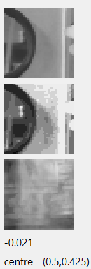
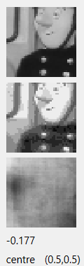
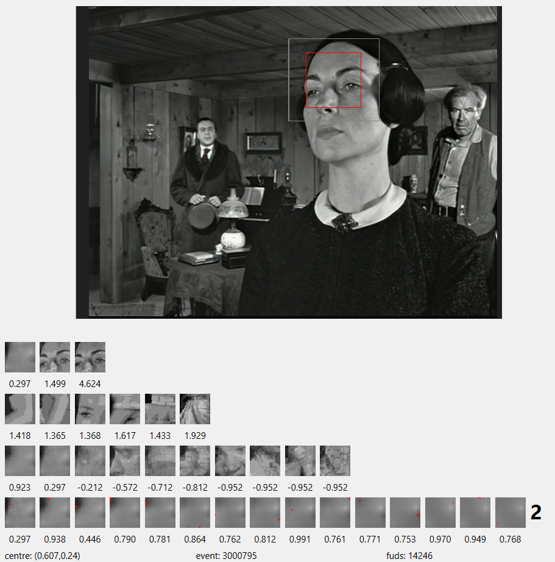
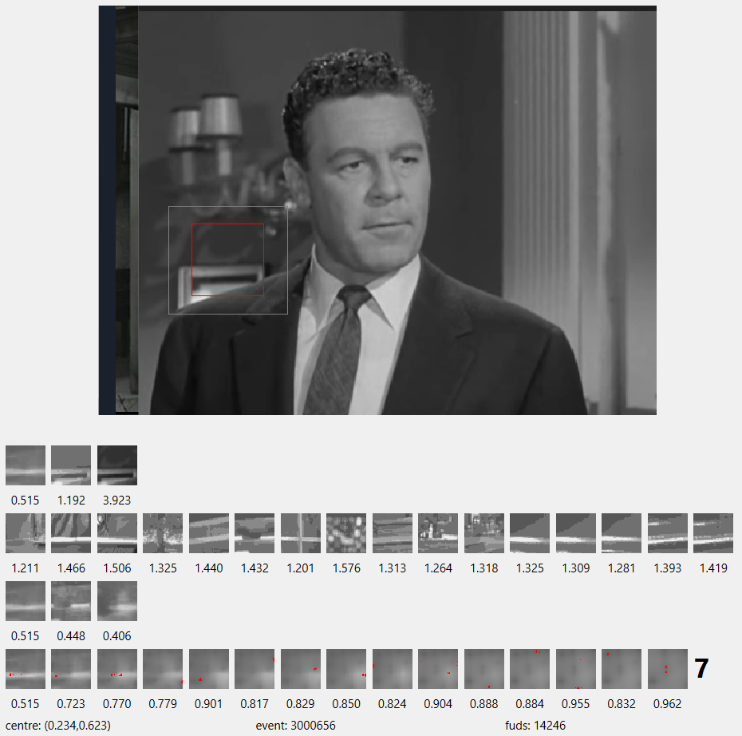
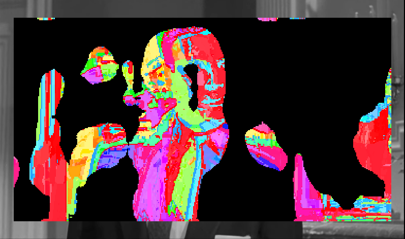
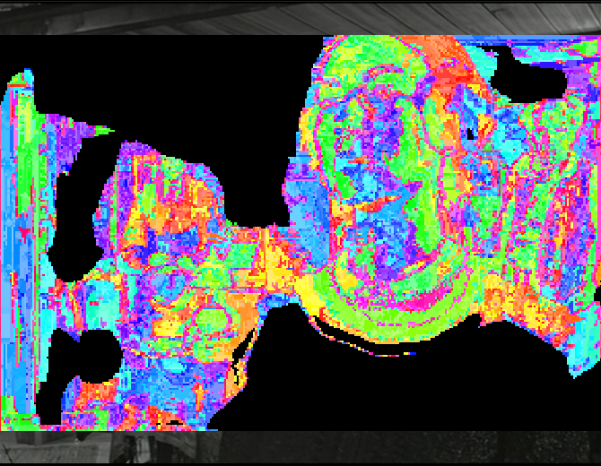
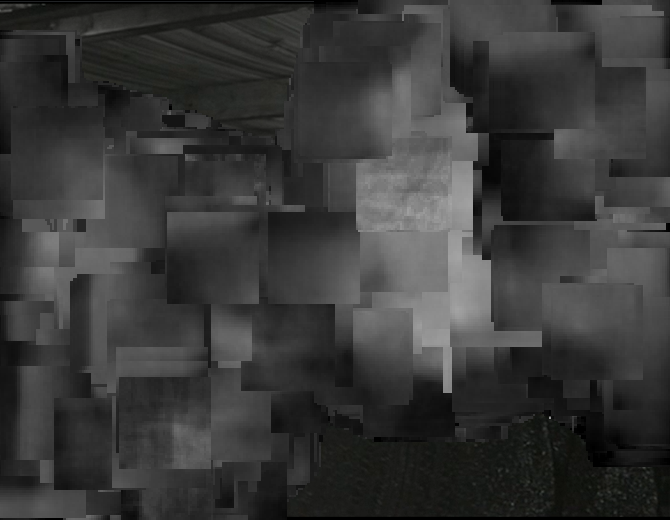
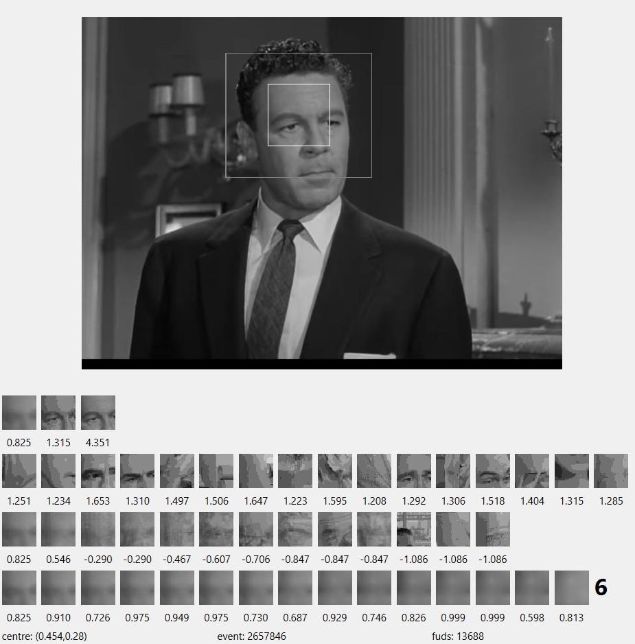
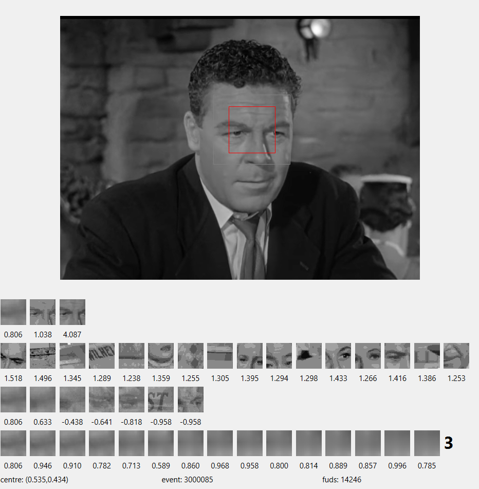

# WBOT02 - Qt WOTBOT 

In [TBOT01](https://github.com/caiks/TBOT01#readme), [TBOT02](https://github.com/caiks/TBOT02#readme) and [TBOT03](https://github.com/caiks/TBOT03#readme) we investigated real-time *modelling* of a Turtlebot, a small wheeled robot with a lidar. We experimented with it by running various controllers in the [turtlebot3 house](http://emanual.robotis.com/docs/en/platform/turtlebot3/simulation/#3-turtlebot3-house) simulated in the [Gazebo](http://gazebosim.org/) virtual environment. Now we shall take a step in a different direction - Wotbot will focus on real-time *modelling* of vision, hearing and speech implemented in a smartphone. That is, Wotbot will be a robot with a head, rather than a body, at least in its initial versions.

`TBOT01` was the semi-static preparatory step - it (1) acquired experience, (2) modelled, and (3) acted in three different stages. The *model* was trained using the *inducers* and *conditioners* implemented in the [AlignmentRepaC repository](https://github.com/caiks/AlignmentRepaC). The AlignmentRepaC repository is a fast C++ implementation of some of the *practicable inducers* described in the paper *The Theory and Practice of Induction by Alignment* at https://greenlake.co.uk/. The AlignmentRepaC repository was tested on the MNIST handwritten digits dataset in  [NISTC](https://github.com/caiks/NISTC#readme). `TBOT01` was able to use its statically learned *model* to find its way around the turtlebot house faster than chance.

In `TBOT02` we implemented fully dynamic *modelling* - instead of acquiring *history*, *modelling*, and *applying model* separately, these tasks are done concurrently. The active functionality was implemented in the [AlignmentActive repository](https://github.com/caiks/AlignmentActive), which depends on the [AlignmentRepaC repository](https://github.com/caiks/AlignmentRepaC). `TBOT02` demonstrated that active *modelling* was no worse than static *induced modelling*, although not as good as static *conditional modelling* (where there is an available label). `TBOT02` also showed that active *modelling* can process *events* in real-time with moderate compute and limited memory requirements, while maintaining high *model likelihoods*. The active framework can concurrently manage multiple active *models* structured in different *levels*. Higher *levels* can include time-wise *underlying* and reflexive *frames*. Active *histories* also allow the temporal analysis of past *events* and *slice* transistions; thus *slice* topologies can provide a mechanism for exploration and control.

In `TBOT03` we sought to improve *modelling* performance by searching for *model likelihood* in the *slice* topology as an indicator of potential new *model*. In 'interest' mode the turtlebot acted to move towards the *slice* with the greatest *size* per parent *slice size* of its surrounding *slices*. That is, it tended to move towards *on-diagonal slices*. In 'unusual' mode the turtlebot acted to move towards the *slice* with the least *size* per parent *slice size*. That is, it moved instead towards far *off-diagonal slices*. 
We were able to demonstrate that deliberately searching for interesting or unusual *slices*, rather than acting to attain a labelled goal, can accelerate *model* growth, at least in the case of limited active *history size*. 

The turtlebot house and other simulated environments are hugely simplified models of the real world, however accurate the physics. In fact, the turtlebot house was so simplified that, even with added furniture to help the turtlebot distinguish between rooms, the lidar sensor did not carry enough *alignments* to remove the location ambiguities. Ironically, the *slice* topology of `TBOT03` was now so complete and connected that it did not accidentally miss any of the wormholes or inconsistent mappings to its physical space. In fact, the navigation performance of `TBOT03` is far worse than chance!

Given these location ambiguities, it seems unlikely that a complex limbed robot with camera vision would have an environment in a simulated virtual world that is rich enough to enable a later transition to real world embodiment. On the other hand, if we attempt to develop active *models* using real robots instead of virtual ones, we are presented with very difficult technical challenges. So, to make progress, we shall move directly to the real world but initially without locomotion or manipulation. To do this we shall use the existing technologies of cameras, microphones and speakers in smartphones and laptops. It will be up to the user to carry wotbot around and point it in the general direction of something interesting.

In this repository, `WBOT02` has a *substrate* derived from images sourced from a camera, a video or a screen-grab. A typical RGB image from one of these sources has thousands to millions of pixels with the colour of each pixel encoded in 24 bits. In order to allow for practicable action *induction*, the wotbot *substrate* has only 40x40 *variables* each with a *valency* of 10 *values*. To reduce the image we choose a centre (a pixel coordinate) and a scale (e.g. 1.0, 0.5, 0.25 ...) so that only a portion of the image is captured - something like the saccades of the human eye. Where a *variable* corresponds to a rectangle of pixels, an average pixel value is calculated. The Red-Green-Blue colour is converted to a 256 grey-scale by taking the maximum of the red, green or blue components (the 'value' of Hue-Saturation-Value). The 256 *valency* is then reduced to 10 by calculating the deciles or by simply dividing into regular intervals. 

We can compare this process of reduction to the case of the MNIST handwritten digits dataset described in [Haskell analysis](https://greenlake.co.uk/pages/dataset_NIST) or [Python analysis](https://greenlake.co.uk/pages/dataset_python_NIST). There the images were already centered and scaled and reduced to 28x28 pixel *variables* of 256 *values*. We then only had to bucket the *variables*; in that case 2 *values* was sufficient.

We can see that, compared to MNIST, wotbot images have a huge potential *volume* (the number of pixels times `2^24`). Reducing them to the *substrate* *reduces* the *volume* (`40x40x10`) but now the wotbot has to choose the centre and the scale of the sample, so the action space goes from nothing to at least the number of pixels times the cardinality of a set of scales. In addition, there are many more *alignments* within the real images than there are within the MNIST handwritten digit images - a randomly chosen focus and scale in a real image is likely to view a random jumble of partially obscured objects, or areas of some object larger than the frame, or objects as if seen from a great distance. If the frame has low entropy, such as a piece of sky or a dark corner of a room, there might not be any identifiable objects at all, only textures or, at the lowest entropies, pure uniformity. In these cases, there will be few *alignments* at this focus and scale. Even with a frame that contains, say, a face that is reasonably centered and cropped, a set of similar faces slightly translated or seen at different distances is likely to yield lower *alignments* because there is no convolution. That is, the same object viewed with slightly different fixation points will produce multiple *slices* and will dilute the *slice sizes* accordingly. Choosing exactly the same point of view for similar images will find a single *slice* much more quickly. This is where we can take advantage of the key idea of *likelihood*-accelerated *model* growth - by selecting the most *likely* foci for attention the active *inducer* can spend its time on the parts and resolutions of the images which will yield the greatest *alignments*. In general, the most *likely* focus will present the object so that it fits the frame nicely, but to some degree the exact choice will be somewhat arbitrary - so long as the same choice is used repeatedly, the *events* will be in the same *slice*. 

In the case of the turtlebot of `TBOT03` we searched the *slice* topology to choose an action which we hoped would transition to a high *likelihood* next *slice*. In the case of wotbot, there may well be a use later on for temporal *likelihoods*, especially in higher *levels*, but to begin with in `WBOT02` we will merely scan the current image to find the best place for the focus - the current *event* will be taken from the scanned frame with the highest *likelihood*. Of course, if the scene is changing rapidly, the new location may no longer be interesting, but it only need provide the starting location for the search in the scan of the next image, not the next *event* itself. If an interesting object is moving across the image slowly, wotbot should be able to track it until something else more interesting appears.

Although wotbot appears to be severely disadvantaged with respect to MNIST because of the need to saccade around the image, it does have an unlimited dataset to learn from - there are only 60,000 samples in MNIST. Active *models* are unlimited in size, so if the wotbot acts to use its compute resources efficiently by concentrating on interesting parts of the images, it has the potential to produce interesting *models*.

The wotbot [WBOT01 repository](https://github.com/caiks/WBOT01) was essentially a copy of the turtlebot [TBOT03 repository](https://github.com/caiks/TBOT03) without the turtlebot specific functionality. It depends on the [Robot Operating System](https://www.ros.org/), but for a robot that is missing locomotion and manipulation at this stage, ROS adds unnecessary complexity.

`WBOT02` is implemented instead with the [Qt](https://www.qt.io) framework. This allows for the same code to be used on multiple platforms and for cross-compilation to develop android apps. Although `WBOT02` does not really require the interface design tools in Qt Creator (because the GUI is relatively simple with little user interaction), Qt is useful in that it encapsulates the camera, video and screen-grab functionality in a single framework, which of course would otherwise require separate development for each platform. The library's [QImage](https://doc.qt.io/qt-6.2/qimage.html), [QPixmap](https://doc.qt.io/qt-6.2/qpixmap.html) and [QPainter](https://doc.qt.io/qt-6.2/qpainter.html) classes make the image manipulation straightforward. Note that the Qt thread functionality will not be used - [AlignmentActive repository](https://github.com/caiks/AlignmentActive) is based on [std::thread](https://en.cppreference.com/w/cpp/thread/thread).

## Sections

[Download, build and run in Windows](#main_Windows)

[Download, build and run in Ubuntu](#main_Ubuntu)

[Discussion](#Discussion)

<a name="main_Windows"></a>

## Download, build and run in Windows

This repository is based on the 6.2.4 version of [Qt](https://www.qt.io). The installation on Windows 11 is as follows. [Download](https://www.qt.io/download) the installer `C:\Qt\MaintenanceTool.exe`, and run it. Install Qt Creator and the `Desktop Qt 6.2.4 MSVC2019 64bit` kit. (Note that the default `Desktop Qt6.2.4 MinGW 64-bit` kit, which is GCC for Windows, may not have camera or screen grab functionality.) Check the various examples build and run ok.

Now install the [AlignmentActive repository](https://github.com/caiks/AlignmentActive), the [AlignmentRepaC repository](https://github.com/caiks/AlignmentRepaC) and the underlying repositories. Create a directory,

```
mkdir C:\caiks

```
Then use use [Github Desktop](https://desktop.github.com/), for example, to clone the following repositories to the `C:\caiks` directory -
```
https://github.com/Tencent/rapidjson.git
https://github.com/caiks/AlignmentC.git
https://github.com/caiks/AlignmentRepaC.git
https://github.com/caiks/AlignmentActive.git
```
Then clone the [WBOT02 repository](https://github.com/caiks/WBOT02) -
```
https://github.com/caiks/WBOT02.git
```
Then clone the [WBOT02 workspace repository](https://github.com/caiks/WBOT02_ws) -
```
https://github.com/caiks/WBOT02_ws.git
```
The WBOT02 executable can be built and run in Qt Creator by opening the `WBOT02` project in `C:\caiks\WBOT02` and building the Release configuration. Then in Qt Creator go to `Projects/WBOT02/Desktop_Qt_6_2_4_MSVC2019_64bit/Run` and set the `Command line arguments` to `hello`. Then run and check that `hello` appears in the `Application Output` window. To test `actor001` can grab the screen, set the `Command line arguments` to `actor001`. The `actor001` window should open on the left hand side of the screen and capture a rectangle on the right hand side of the screen.

The build can also be done from the command line, but in version 6.2.4 of Qt we must first set the necessary environment variables from Qt Creator. In Qt Creator go to `Projects/WBOT02/Desktop_Qt_6_2_4_MSVC2019_64bit/Build/Details` and hit `Open Terminal` to create a shell, then run `cmake` - 
```
"C:\Qt\Tools\CMake_64\bin\cmake.exe" -DCMAKE_PREFIX_PATH=C:\Qt\6.2.4\msvc2019_64 -S C:/caiks/WBOT02 -B C:/caiks/build-WBOT02-Desktop_Qt_6_2_4_MSVC2019_64bit-Release

```
Then the executable can be built -
```
cd /d C:\caiks\build-WBOT02-Desktop_Qt_6_2_4_MSVC2019_64bit-Release
"C:\Qt\Tools\CMake_64\bin\cmake.exe" --build C:/caiks/build-WBOT02-Desktop_Qt_6_2_4_MSVC2019_64bit-Release --target all

```
Finally the executable can be tested -
```
cd /d C:\caiks\WBOT02_ws
"C:\caiks\build-WBOT02-Desktop_Qt_6_2_4_MSVC2019_64bit-Release\WBOT02.exe" hello > WBOT02.txt

```
Note that standard output does not echo to the shell but must be redirected to a file. Check that `C:\caiks\WBOT02_ws\WBOT02.txt` contains the word `hello`.

To test `actor001` can grab the screen, run the following -
```
cd /d C:\caiks\WBOT02_ws
"C:\caiks\build-WBOT02-Desktop_Qt_6_2_4_MSVC2019_64bit-Release\WBOT02.exe" actor001

```
The `actor001` window should open on the left hand side of the screen and capture a rectangle on the right hand side of the screen.


<a name="main_Ubuntu"></a>

## Download, build and run in Ubuntu

This repository is based on the 6.2.4 version of [Qt](https://www.qt.io). The installation on Ubuntu 22.04 is as follows:

First install the developer tools,
```
sudo apt update -y
sudo apt install -y git g++ cmake build-essential xorg libgl1-mesa-dev
sudo apt install -y qt6-base-dev qt6-base-dev-tools qt6-multimedia-dev

```
If running in the cloud, reboot the machine and reconnect, e.g. with `ssh -X`, and then test that the X server is running, e.g. with `xeyes`.

Now install the [AlignmentActive repository](https://github.com/caiks/AlignmentActive), the [AlignmentRepaC repository](https://github.com/caiks/AlignmentRepaC) and the underlying repositories, 
```
git clone https://github.com/Tencent/rapidjson.git
git clone https://github.com/caiks/AlignmentC.git
git clone https://github.com/caiks/AlignmentRepaC.git
git clone https://github.com/caiks/AlignmentActive.git

```
Then clone the [WBOT02 repository](https://github.com/caiks/WBOT02) and the [WBOT02 workspace repository](https://github.com/caiks/WBOT02_ws) -
```
git clone https://github.com/caiks/WBOT02.git
git clone https://github.com/caiks/WBOT02_ws.git

```
Then make the release build,
```
mkdir AlignmentC_build AlignmentRepaC_build AlignmentActive_build WBOT02_build
cd WBOT02_build
cmake -DCMAKE_BUILD_TYPE=RELEASE ../WBOT02
make
cd ~/WBOT02_ws
ln -s ../WBOT02_build/WBOT02 WBOT02

```
Then test the executable runs,
```
cd ~/WBOT02_ws
./WBOT02 hello

```
To test `actor001` can grab the screen, run the following,
```
cd ~/WBOT02_ws
./WBOT02 actor001

```
This [tool](https://nicolargo.github.io/glances/) is useful for monitoring the system during *modelling* runs -
```
sudo apt install -y glances

```
To obtain the YouTube videos discussed in connection with `actor003` below, install `yt-dlp`,
```
sudo add-apt-repository ppa:yt-dlp/stable
sudo apt update -y
sudo apt install -y yt-dlp  

```
To test, run the following,
```
yt-dlp https://www.youtube.com/watch?v=Y5dylh2aOiw

```
which should produce something like
```
[download] Destination: Amazing Physics Toys_Gadgets 1 [Y5dylh2aOiw].f303.webm
[download] 100% of 124.60MiB in 00:28
[download] Destination: Amazing Physics Toys_Gadgets 1 [Y5dylh2aOiw].f251.webm
[download] 100% of 7.84MiB in 00:01
[Merger] Merging formats into "Amazing Physics Toys_Gadgets 1 [Y5dylh2aOiw].webm"
```

<a name = "Discussion"></a>

## Discussion

Now let us investigate various wotbot modes and active structures. 

[Actor node](#Actor)

[Conclusion](#Conclusion)


<a name = "Actor"></a>

### Actor node

`WBOT02` has a `main` routine that examines the first command line argument and chooses its procedure accordingly. We discuss each of the procedures in the sections below -

#### screen001 and screen002

In `screen001` we test the screen grab functionality. We check to see how long it takes to (i) grab the pixmap, (ii) convert it to an image and (iii) read every pixel of the image. This is the typical output -
```
09:05:05: Starting C:\caiks\build-WBOT02-Desktop_Qt_6_2_4_MSVC2019_64bit-Release\WBOT02.exe screen001...
auto pixmap = screen->grabWindow(0)	0.0549396s
auto image = pixmap.toImage()	6e-07s
image.format(): 4
image.depth(): 32
image.width(): 1920
image.height(): 1080
image.dotsPerMeterX(): 3780
image.dotsPerMeterY(): 3780
auto colour = image.pixel(QPoint(0,0))
colour: ff033db8
qAlpha(colour): 255
qRed(colour): 3
qGreen(colour): 61
qBlue(colour): 184
qGray(colour): 60
(qRed(colour)+qGreen(colour)+qBlue(colour))/3: 82
total: 1214020541
average per pixel:195	0.0014735s
09:05:05: C:\caiks\build-WBOT02-Desktop_Qt_6_2_4_MSVC2019_64bit-Release\WBOT02.exe exited with code 0
```
On a Windows 11 laptop, the grab of the entire screen typically takes 30-50 ms, which limits the FPS to a maximum of 20. The processing of the image is much faster, around 1-2 ms.

In `screen002` we demonstrate that grabbing a rectangle rather than the entire screen is quicker. Here we open a Qt application, `Win002`. At fixed intervals the application grabs a rectangle, displays the captured imaged, calculates the average intensity, `(R + G + B)/3`, and produces some statistics -  


The command line is parsed as `screen002 <interval in ms> <x coord> <y coord> <width> <height>`. This example has a rectangle of `800x600` -
```
10:35:37: Starting C:\caiks\build-WBOT02-Desktop_Qt_6_2_4_MSVC2019_64bit-Release\WBOT02.exe screen002 250 700 50 800 600...
application.exec(): pixmap.devicePixelRatio(): 1.25
captured	0.0598737s
image.format(): 4
image.depth(): 32
image.width(): 1000
image.height(): 750
image.dotsPerMeterX(): 3780
image.dotsPerMeterY(): 3780
auto colour = image.pixel(QPoint(0,0))
colour: ff034abf
qAlpha(colour): 255
qRed(colour): 3
qGreen(colour): 74
qBlue(colour): 191
qGray(colour): 67
(qRed(colour)+qGreen(colour)+qBlue(colour))/3: 89
average:220	0.0015486s
imaged	0.0063075s
captured	0.0337352s
average:212	0.0014052s
imaged	0.0023709s
captured	0.0215182s
average:212	0.00143s
imaged	0.0023704s
captured	0.0215584s
average:212	0.0011383s
imaged	0.0022505s
...
captured	0.0279223s
average:246	0.0008471s
imaged	0.0024594s
0
10:35:47: C:\caiks\build-WBOT02-Desktop_Qt_6_2_4_MSVC2019_64bit-Release\WBOT02.exe exited with code 0
```
Capturing the smaller image of around a quarter of the area takes around half of the time, around 20 -25 ms.

#### camera001

`camera001` is similar to `screen002`, except that a camera image is captured instead of a rectangle of the screen. Also the process is asynchronous - the `capture` method of a `QImageCapture` is called and when the image is available the `imageCaptured` callback processes the image -


```
09:10:56: Starting C:\caiks\build-WBOT02-Desktop_Qt_6_2_4_MSVC2019_64bit-Release\WBOT02.exe camera001 250...
QMediaDevices::videoInputs().count(): 1
application.exec(): capturing ...
captured	0.0100075s
image.format(): 4
image.depth(): 32
image.width(): 1280
image.height(): 720
image.dotsPerMeterX(): 3780
image.dotsPerMeterY(): 3780
auto colour = image.pixel(QPoint(0,0))
colour: ffa6a6a2
qAlpha(colour): 255
qRed(colour): 166
qGreen(colour): 166
qBlue(colour): 162
qGray(colour): 165
(qRed(colour)+qGreen(colour)+qBlue(colour))/3: 164
average:148	0.0012667s
imaged	0.0047368s
capturing ...
captured	0.023265s
average:147	0.0008s
imaged	0.0008467s
capturing ...
captured	0.0116363s
average:154	0.000817s
imaged	0.0007428s
capturing ...
captured	0.0165489s
average:161	0.0007532s
imaged	0.0007316s
...
capturing ...
captured	0.012549s
average:149	0.0007616s
imaged	0.0006978s
capturing ...
captured	0.0283564s
average:162	0.000711s
imaged	0.000911s
0
09:11:03: C:\caiks\build-WBOT02-Desktop_Qt_6_2_4_MSVC2019_64bit-Release\WBOT02.exe exited with code 0
```
In this case the capture takes around 10 -30 ms.

#### video001 and video002

We made a couple of experiments with capturing frames from videos, `video001` and `video002`. The intention was to use the playlist of youtube videos from the [Kinetics dataset](https://www.deepmind.com/open-source/kinetics), which are a set of categorised videos of activities. Many of the videos, however, were filmed with quite a low resolution and so it is difficult to ensure that low scale frames are such that the cells are not all highly interpolated in any particular video. That is, many of the videos are very blurry at smaller scales. The capture process itself and automating a playlist were both difficult tasks too. For `actor001` and `actor002` we concentrated on grabbing videos from the screen and obtaining the videos from high resolution sources. Later on, in `actor003`, we successfully automated learning from a playlist of videos to allow headless *modelling* in the cloud.

<a name="Records_and_representations"></a>

#### Records and representations

Now let us consider scaled and centered average brightness records and their representations. The `Record` class is defined in `dev.h`. It represents a rectangular frame of a part or the whole of an image. It is defined by horizontal and vertical lengths or scales (real numbers between zero and one) and a centre coordinate (a pair of real numbers between zero and one). It consists of a two dimensional array of cells of integral brightness value between 0 (dark) and 255 (light). It has persistence methods and a method to convert it to an *event*, i.e. a `HistoryRepa` of *size* 1 of a *substrate* consisting of (i) *variables* for each cell of a given cell *valency*, plus (ii) a scale *variable* of a given scale *valency*. 

`Record` has a constructor that creates a zeroed (black) array of cells. Another constructor creates a greyscale array of cells from a rectangular frame within a given image. Where an individual cell corresponds to a rectangle of pixels, an average pixel value is calculated. The value of the cell is the Hue-Saturation-Value calculation of brightness, i.e. the maximum of the red, green and blue values. 

The `valent` method reduces the *valency* of a record by sorting the *values* and calculating quantiles, with special handling of 0 (black) to deal with the case of a frame that overlaps with the boundaries of the given image. The `valentFixed` method reduces the *valency* of a record by simply dividing cell brightness into regular intervals. A variation of the fixed method, called balanced *valency*, is to calculate the average brightness of the record and then add the difference between the mid point of the brightness (127) and the average brightness to each cell's brightness before dividing it into regular intervals. Note that this may reduce the entropy of the record because of possible loss of information at the extremes.

The `image` method converts the record to an image with each cell generating a square of size `multiplier` pixels in the resultant image. The pixels are coloured grey with a lightness that depends on the cell's *value* as a proportion of the *valency*.

The following is a test of the `Record` persistence -
```
09:25:52: Starting C:\caiks\build-WBOT02-Desktop_Qt_6_2_4_MSVC2019_64bit-Release\WBOT02.exe records...
rr
(0.9,0.8,0.7,0.7,3,2,[0,1,2,3,4,5])
(0.1,0.2,0.3,0.3,2,1,[6,7])

recordListsPersistent(rr, out)
rr2 = persistentsRecordList(in)
rr2
(0.9,0.8,0.7,0.7,3,2,[0,1,2,3,4,5])
(0.1,0.2,0.3,0.3,2,1,[6,7])

(0.9,0.8,0.7,0.7,3,2,[0,1,2,3,4,5])
(0.1,0.2,0.3,0.3,2,1,[6,7])

09:25:52: C:\caiks\build-WBOT02-Desktop_Qt_6_2_4_MSVC2019_64bit-Release\WBOT02.exe exited with code 0
```

The `Representation` class is also defined in `dev.h`. It represents the summation of a number of records, so it has a count of the number of records added, along with the array of integral cells. It also has an `image` method which converts the representation to an image with each cell generating a square of size `multiplier` pixels in the resultant image. This time the pixels are coloured grey with a lightness that depends on the average *value* as a proportion of the *valency*. So a representation can image a *slice* of *events*.

`Representation` also has persistence methods. These are needed to persist the map between *slices* and representations that is needed to visualise a *model*. The following is a test of the `Representation` persistence -
```
15:46:25: Starting C:\caiks\build-WBOT02-Desktop_Qt_6_2_4_MSVC2019_64bit-Release\WBOT02.exe representations...
r1: (0.9,0.8,3,2,[0,1,2,3,4,5])
r2: (0.1,0.2,2,1,[6,7])
rr
(1,(0.9,0.8,3,2,[0,1,2,3,4,5]))
(2,(0.1,0.2,2,1,[6,7]))

sliceRepresentationUMapsPersistent(rr, out)
rr2 = persistentsSliceRepresentationUMap(in)
rr2
(1,(0.9,0.8,3,2,[0,1,2,3,4,5]))
(2,(0.1,0.2,2,1,[6,7]))

15:46:25: C:\caiks\build-WBOT02-Desktop_Qt_6_2_4_MSVC2019_64bit-Release\WBOT02.exe exited with code 0
```

#### screen003 and screen004

`screen003` is similar to `screen002` but adds records. The `screen003` capture procedure grabs the screen rectangle in the same way as `screen002`, but then creates records from the image. There is a record for each of 5 scales, which default to `[1.0, 0.5, 0.25, 0.125, 0.0625]`, all sharing the same centre. Each of these records has a *valency* of 256. For each of these greyscale records we create another bucketed record using the `valent` method, defaulting to a *valency* of 10. These two sets of records are converted to images with a `multiplier` of 3 and then arranged in two rows of descending scales below the grabbed image. The bottom row has the lower *valency* and these are what the wotbot will eventually see. Here is an example -

```
15:51:41: Starting C:\caiks\build-WBOT02-Desktop_Qt_6_2_4_MSVC2019_64bit-Release\WBOT02.exe screen003 250 791 244 728 410...
application.exec(): 0
15:58:51: C:\caiks\build-WBOT02-Desktop_Qt_6_2_4_MSVC2019_64bit-Release\WBOT02.exe exited with code 0
```


The user can use the mouse to change the centre -


Notice that frames that exceed the grabbed image's boundary are filled in with black. This can be seen in the full scale image on the left.

`screen003` and `screen004` differ merely in how they are parameterised. Underneath they both use `Win005`. `screen003` expects its arguments on the command line, e.g.
```
screen003 250 791 244 728 410
```
`screen004` parses a JSON file in the manner of `TBOT03`, e.g.
```
screen004 actor.json
```
where actor.json is, for example,
```
{
	"interval" : 250,
	"scales" : [1.0, 0.5, 0.25, 0.125]
}
```

<a name = "actor001"></a>

#### actor001 description

`actor001` is the first version of the wotbot that uses the [active framework](https://github.com/caiks/AlignmentActive) to do dynamic *modelling*. Initially the focus is at fixed positions within the image; later we add a certain amount of randomisation. These experiments are similar to those of the random modes of [`TBOT03`](https://github.com/caiks/TBOT03#Random_modes_10_12).

`actor001` is implemented in `Win006`. The GUI is similar to `Win005`, except that there is now an additional row of images at the bottom. These are the representations of the *slices* to which the records of the second row belong. The *slices* *likelihoods* are shown below the *slice* representations. For example, `model001`, which has scales `[1.0, 0.5, 0.25, 0.125]`, produces the following -


The user can use the mouse to change the centre, or use the arrow keys (and space to return to the middle) -


In addition to the active, `Win006` has a *slice*-representation map which enables the third row of images. This map is persistent - when the window is destroyed the map is written along with the active.

The `Win006` constructor begins by parsing the given JSON file. Most of the parameters configure the active structure or logging; these are copied from turtlebot. The rest are specific to wotbot. In addition to the interval, screen grab, centre and scale list parameters of `screen004`, there is an offset list. These are relative offsets from the centre applied to each frame. We can then take multiple frames of the same scale from each act cycle image. In this example we have five quarter scale frames, one at the centre and the others arranged at the points of the compass -
```
{
...
	"scales" : [0.25, 0.25, 0.25, 0.25, 0.25],
	"offsets" : [[-0.125,0.0],[0.0,-0.125],[0.0,0.0],[0.0,0.125],[0.125,0.0]],
...
}
```

The constructor then creates the dynamic parts of the GUI. There are four `QLabel`s for each scale/offset - three are for the images of the *event* records and *slice* representations, and the fourth is for the *likelihood* statistic.

The constructor then creates the active structure. In this case, the structure consists of a single active with cumulative *slice size* and topology. The active has a single underlying `HistoryRepa`, which is updated by *events* generated from the frame records. That is, the *substrate* is just the record cells and a scale *variable*.

If `model_initial` is set, the *slice*-representation map and the active are loaded from their respective files.

Having constructed the actor a separate thread is started to run the active induce at regular intervals, if the `no_induce` flag is not set. Lastly, the constructor starts a `QTimer` to run the `Win006::act` callback.

The `Win006` destructor is called when the user closes the window. It writes the *slice*-representation map to a `.rep` file. It then signals the induce to terminate and waits for the induce thread to finish. It then dumps the active. After deleting the widgets it quits.

`Win006::act` is called at regular intervals according to the `interval` parameter. In the example *models* below, the interval is usually 40 ms, or 25 FPS. The act time is calculated and subtracted from the next pause so that there are regular intervals; the actors can then be considered continuous when we later come to consider temporal *levels* and *slice* topologies. If the act time exceeds the interval, the act is run again immediately with an optional warning. If the number of records taken (the length of the scale list) is four or more, i.e. over 100 records per second, then we often see act warnings and lagging induce, depending on the available compute. So, to prevent the induction lags, later versions of the actor will have to consider either having fewer *events* per second, or introducing discontinuities, i.e. having occasional large pauses between consecutive acts.

`Win006::act` first checks to see if the terminate flag is set. Then, if `event_maximum` if set, it checks to see if the event id exceeds it. In either case, it stops acting.

Next, `act` grabs the screen rectangle in the same way as defined in `Win005`. The records are then created from the image in the same way too, except that now we can optionally define a random offset which is applied to the centre before the frame offsets are added. In this case the parameterisation would be, for example,
```
{
...
	"scales" : [0.25, 0.25, 0.25, 0.25, 0.25],
	"offsets" : [[-0.125,0.0],[0.0,-0.125],[0.0,0.0],[0.0,0.125],[0.125,0.0]],
	"random_centreX" : 0.0625,
	"random_centreY" : 0.0625,
...
}
```
If the random offset is not set, the records are always taken from the same fixed points of the image. If we are grabbing images at the rate of 25 FPS and the action in the images is fairly static, then we can expect a lot of duplicated *events*. This will often make the *slice* representations identical or almost identical to frames taken at the same fixed locations when, say, we are browsing the *model* later on. Also, if the images are grabbed from a series of short videos with the same opening and closing sequences, the same *events* may well be additionally scaled by the number of videos in the series. If the random offset is set, however, the *events* are much less likely to be identical and so the *slice* representations are generally much more blurry and generalised, especially near the root of the *model*.

Next, an *event* is generated from each of the bucketed records and the active is updated. After the updates, the *likelihood* potentials of the *slices* of the new *events* are calculated from the *slice size* and the parent *slice size* according to this measure: `(ln(slice_size) - ln(parent_size) + ln(WMAX)) / ln(WMAX)`. Values close to one are highly expectedly *likely* or interesting. Values close to zero have low *likelihood*. Values around minus one or less are highly unexpectedly *likely* or unusual. With wotbot we will be mainly interested in high positive *likelihoods*. The induce threshold defaults to 200 and `WMAX` defaults to 18, so a zero *likelihood* implies around 11 *events* in the *slice*. A *likelihood* of 0.75 implies around 97 *events*. 

If the `no_induce` flag is not set, the representations of the *slices* of the new *events* are then obtained from the *slice*-representation map and the new *events* are added to them. The *model* is then checked to see if any new *fuds* have been added since the last act; if so, the representations of the new children *slices* are calculated. These two procedures should ensure that the leaf *slices* of the *model* always have the correct representations.

The remainder of `Win006::act` is as for `Win005::act` - the labels are updated with their latest images and statistics, and the `QTimer` set for the next act.

#### actor001 models

Now let us consider some of the *models* obtained by `actor001`. In order to make them comparable, we have trained them on the first few hours of the [Fireman Sam videos](https://www.bbc.co.uk/iplayer/episode/p08phyzv/fireman-sam-series-1-1-kite?seriesId=b00kr5w3). Fireman Sam is an animated character for children's television from the BBC. The programmes consists of around 51 episodes of about 10 minutes. In the early series the characters are animated plasticine; in later series CGI is used. The indoor scenes are generally fairly simple, in the early series at least, but outdoor scenes and later indoor scenes are more complex. The lighting is fairly even and primary colours are used a great deal - again, especially in the early series.

The default coordinates and rectangle for the screen grab may be checked by running with the following command line arguments and `actor.json` file -
```
actor001 actor.json
```
where actor.json is, for example,
```
{
	"interval" : 250,
	"scales" : [1.0, 0.5, 0.25, 0.125],
	"summary_active" : true
}
```
The browser's position should be arranged on the right hand side of the screen so that, for example, if the actor is started with the first film paused at 20 seconds, the capture looks like this - 


We can observe *induction* taking place in real-time by restarting the actor and then watching the representations in the third row. The four frames of different scales are recorded from a constant image centered at a single fixed point (0.5,0.5). So there are only four unique *events* during the whole session.

Initially, all *events* are in *slice* 0 and so there is no *likelihood*. The *slice* 0 representation is just an average of the four scales, showing part of the mirror on the left and a faint image of part of Sam on the right from the full scale frame. The `induceThresholdInitial` defaults to 1000 *events*. In this example there are 16 *events* per second, so the first *fud* is *induced* after around a minute, followed shortly after by two or three more. We observe the representations change as the new leaf *slices* are created for each *fud*. This is the screenshot afterwards -


We can see that the representations are now identical to the *event* records for each scale, and each has the same *likelihood* of 0.76. This is because the *model* is complete - each scale is now in a separate leaf *slice*. Although the *likelihood* is high, these leaf *slices* will not produce children *fuds* because all of their *histograms* are *singletons* which have no *alignments*. 

If we examine the logs we can see that the evolution of the *model* is not always exactly the same. In this example there are four *fuds* -
```
05:24:08: Starting C:\caiks\build-WBOT02-Desktop_Qt_6_2_4_MSVC2019_64bit-Release\WBOT02.exe actor001 actor.json...
actor	status: started
application.exec(): model	induce summary	slice: 0	diagonal: 40.4438	fud cardinality: 1	model cardinality: 7	fuds per threshold: 0.189394
model	induce summary	slice: 131072	diagonal: 39.8886	fud cardinality: 2	model cardinality: 41	fuds per threshold: 0.359712
model	induce summary	slice: 131073	diagonal: 39.9336	fud cardinality: 3	model cardinality: 62	fuds per threshold: 0.520833
model	induce summary	slice: 131075	diagonal: 10.2801	fud cardinality: 4	model cardinality: 74	fuds per threshold: 0.671141
0
actor	status: finished
05:25:27: C:\caiks\build-WBOT02-Desktop_Qt_6_2_4_MSVC2019_64bit-Release\WBOT02.exe exited with code 0
```
In this, there are only three *fuds* -
```
05:29:28: Starting C:\caiks\build-WBOT02-Desktop_Qt_6_2_4_MSVC2019_64bit-Release\WBOT02.exe actor001 actor.json...
actor	status: started
application.exec(): model	induce summary	slice: 0	diagonal: 40.4874	fud cardinality: 1	model cardinality: 25	fuds per threshold: 0.185874
model	induce summary	slice: 131072	diagonal: 39.838	fud cardinality: 2	model cardinality: 32	fuds per threshold: 0.364964
model	induce summary	slice: 131073	diagonal: 39.875	fud cardinality: 3	model cardinality: 39	fuds per threshold: 0.535714
0
actor	status: finished
05:31:00: C:\caiks\build-WBOT02-Desktop_Qt_6_2_4_MSVC2019_64bit-Release\WBOT02.exe exited with code 0
```
If we set the `induceThresholdInitial` to 200 and increase the `interval`, we can snapshot the intermediate *models*, 
```
{
	"interval" : 1000,
	"induceThresholdInitial" : 200,
	"scales" : [1.0, 0.5, 0.25, 0.125],
	"summary_active" : true
}
```
For example, after one *fud* the two largest scale frames and the two smallest scale frames have been separated into two *slices* -


Clearly the *induction* has correctly grouped the frames together in two pairs by similarity.

The *diagonal* of the first *fud* is a little lower (38.0 instead of 40.4) because of the smaller initial *slice* -
```
16:08:22: Starting C:\caiks\build-WBOT02-Desktop_Qt_6_2_4_MSVC2019_64bit-Release\WBOT02.exe actor001 actor.json...
actor	status: started
application.exec(): model	induce summary	slice: 0	diagonal: 38.0308	fud cardinality: 1	model cardinality: 10	fuds per threshold: 0.980392
0
actor	status: finished
16:09:35: C:\caiks\build-WBOT02-Desktop_Qt_6_2_4_MSVC2019_64bit-Release\WBOT02.exe exited with code 0
```
Now let us consider *models* created from first two hours of the Fireman Sam videos. In *model* 1 we will run with the same four scales centered at the same fixed point (0.5,0.5), and grabbed at a rate of 25 FPS. This is the definition of [`model001.json`](https://github.com/caiks/WBOT02_ws/blob/main/model001.json) -
```
{
	"model" : "model001",
	"interval" : 40,
	"scales" : [1.0, 0.5, 0.25, 0.125],
	"event_maximum" : 720000,
	"logging_action" : true,
	"logging_action_factor" : 1000,
	"warning_action" : true,
	"summary_active" : true
}
```
Start the films from the beginning of the first episode and run the following -
```
cd /d C:\caiks\WBOT02_ws
"C:\caiks\build-WBOT02-Desktop_Qt_6_2_4_MSVC2019_64bit-Release\WBOT02.exe" actor001 model001.json > model001.log

```
An example of the log is [model001.log](https://github.com/caiks/WBOT02_ws/blob/main/model001.log). The active will stop updating after 720,000 *events*, or approximately 2 hours. Note that the induce may be lagging, so wait until there are no more *fuds* being added by checking the log before quitting the application. When the application closes there are two files written to the `WBOT02_ws` directory - the active file, `model001.ac`, and the *slice*-representation map file, `model001.rep`. Both files are large, which is why we have not added them to the `WBOT02_ws` repository.

Now we can browse *model* 1 by setting the `no_induce` flag in `actor.json` -
```
{
	"model_initial" : "model001",
	"interval" : 1000,
	"scales" : [1.0, 0.5, 0.25, 0.125],
	"no_induce" : true,
	"logging_action_slice" : true
}
```
and then running with the following command line arguments -
```
actor001 actor.json
```
If we pause at 20 seconds of the first film as before, we see that the four representations are no longer exact copies of the records -


The first three representations are close to their corresponding records. All have high *likelihoods*. 

We can navigate around using the mouse or the arrow keys. The space bar will re-center the focus. We can easily navigate to areas of low *likelihoods*, for example if we hit the up arrow several times to (0.5,0.425) we have -


Of course, having a low *likelihood*, by the measure given above, does not mean that a *slice's fud* is *unlikely* - the representations still show the areas of light and dark to some degree - but only that the *slice* has perhaps less potential for future *model* than *on-diagonal slices*.

We may wonder why a small shift to the focus pushes us off the *diagonal*. The reason is probably that the place where we stopped is in the opening sequence of the Fireman Sam episodes, at least in the first series, so the *events* obtained are duplicated ten or so times. In addition, the scene pauses briefly while Sam looks at himself in the mirror, increasing the number of identical *events*. The frames that we have manually selected just a few pixels away from the fixed point of (0.5,0.5) are unlikely to have occurred at any other time during the two hours of running, and so their *slices* consist of just a few similar, but not identical, *events*. The smaller *counts* decrease the chances of the *slices* being on the *diagonal*. Although the scenes are only slightly translated, the *events* are completely different. This is because there is no notion of locality or convolution in the *substrate* - the 'distance' between any two *variables* has no meaning except to our eyes.

This reminds us of the vastness of the *volume* of the *substrate* compared to the compute resources available - we will have to manage the focus to go to exactly the same few hotspots relative to common scenes such as, say, faces or hands. We will also have to find the correct scale so that the object in question is always seen such that the *alignments* are maximised. That is, we must adjust for the  perspectival projection of a three dimensional object onto a plane. By scanning the image or searching the *slice* topology for the most *likely* foci and scales, we can accelerate *model* growth. The aim of the remaining `actor001` *models* is to examine the difference between fixed points of view and randomised points of view, for various scales, before we go on to consider *likelihood* based searches in `actor002`.

This table summarises the results from the `actor001` *models* -

model|scales|frame position|events|fuds|fuds per size per thrshld|median diagonal|max diagonal|lagging fuds
---|---|---|---|---|---|---|---|---
model001|1.0, 0.5, 0.25, 0.125|centred|720,000|2817|0.7825|31.8063|41.4185|66
model005|1.0|1 centred|180,000|684|0.761591|33.4245|41.2544|0
model006|0.5|1 centred|180,000|697|0.775099|31.6855|41.1768|0
model007|0.25|1 centred|180,000|698|0.776233|31.458|40.8568|0
model003|0.5|1 centred, 4 offset|720,000|2762|0.767222|31.5374|41.7331|602
model004|0.5|1 centred, 4 offset, randomised|720,000|2951|0.819722|25.9151|41.3706|413
model002|0.25|1 centred, 4 offset|720,000|2807|0.779722|30.9492|41.6394|630
model008|0.25|1 centred, 4 offset, randomised|720,000|2730|0.758333|25.8088|38.3436|305

*Model* 1 is the only *model* with varying scales. In order to determine which scale had the most *alignments* we ran the first three scales separately, in *models* 5, 6 and 7. We can see that no scale has any noticeable advantage, with the *fuds* per *size* per threshold fairly constant amongst all of them at around 0.77. The median and maximum *diagonals* are similar too. 

The configuration for these three *models* is very similar. For example, `model005.json` -
```
{
	"model" : "model005",
	"interval" : 40,
	"scales" : [1.0],
	"event_maximum" : 180000,
	"logging_action" : true,
	"logging_action_factor" : 1000,
	"warning_action" : true,
	"summary_active" : true
}
```
And -
```
cd /d C:\caiks\WBOT02_ws
"C:\caiks\build-WBOT02-Desktop_Qt_6_2_4_MSVC2019_64bit-Release\WBOT02.exe" actor001 model005.json > model005.log

```
The remaining *models* have five frames, each with the same scale - a central frame and four frames at the points of the compass. In *models* 3 and 4 we compare the effect of fixed centres to randomised ones for half scale frames. In *models* 2 and 8 we do the same for quarter scale frames. We can see that for half scale the randomisation appears to increase the *model* a little (0.82 versus 0.77), but for quarter scale the randomisation appears to decrease the *model* a little (0.76 versus 0.78). There does not seem to be any very large quantitative differences.

Let us consider if there are qualitative differences between fixed and randomised for the half scale by comparing *models* 3 and 4. This is the configuration of `model003.json` -
```
{
	"model" : "model003",
	"interval" : 40,
	"scales" : [0.5, 0.5, 0.5, 0.5, 0.5],
	"offsets" : [[-0.25,0.0],[0.0,-0.25],[0.0,0.0],[0.0,0.25],[0.25,0.0]],
	"event_maximum" : 720000,
	"logging_action" : true,
	"logging_action_factor" : 1000,
	"warning_action" : true,
	"summary_active" : true
}
```
And -
```
cd /d C:\caiks\WBOT02_ws
"C:\caiks\build-WBOT02-Desktop_Qt_6_2_4_MSVC2019_64bit-Release\WBOT02.exe" actor001 model003.json > model003.log

```
We can browse the *model* by pausing the first film at 20 seconds and running `actor001 actor.json` with `actor.json` -
```
{
	"model_initial" : "model003",
	"interval" : 100,
	"scales" : [0.5],
	"no_induce" : true
}
```
At the centre we see an image very similar to that of the half scale frame from *model* 1, as we would expect -


If we display *model* 3 and *model* 1 side by side, we can easily see this -

  

The *likelihoods* are both high as we would expect. 

If we move upwards by the same short distance as before to (0.5,0.425) we obtain the following -

  

Here both *model* 3 and *model* 1 have low *likelihoods*. They are both far *off-diagonal* because they have seen few similar *events* at their fixed points.

The configuration of *model* 4 is very similar to *model* 3, but additionally has the random parameters; `model004.json` -
```
{
	"model" : "model004",
	"interval" : 40,
	"scales" : [0.5, 0.5, 0.5, 0.5, 0.5],
	"offsets" : [[-0.25,0.0],[0.0,-0.25],[0.0,0.0],[0.0,0.25],[0.25,0.0]],
	"random_centreX" : 0.125,
	"random_centreY" : 0.125,
	"event_maximum" : 720000,
	"logging_action" : true,
	"logging_action_factor" : 1000,
	"warning_action" : true,
	"summary_active" : true
}
```
And -
```
cd /d C:\caiks\WBOT02_ws
"C:\caiks\build-WBOT02-Desktop_Qt_6_2_4_MSVC2019_64bit-Release\WBOT02.exe" actor001 model004.json > model004.log

```
Now let us browse *model* 4 with `actor.json` -
```
{
	"model_initial" : "model004",
	"interval" : 100,
	"scales" : [0.5],
	"no_induce" : true
}
```
Let us compare all three *models* at (0.5,0.5) -

   

The randomised case has a very low *likelihood* when compared to the fixed cases. This is as we would expect since there will be few, if any, identical *events* in the randomised case where the centre is not a fixed point.

Compare the randomised case to the fixed for the translated centre (0.5,0.425) -

   

In this case it so happens that the randomised *likelihood* is very high. The representation is blurry, but the light and dark areas resemble the record fairly closely. Note that it is just chance that this happens to be a hotspot in the randomised *model* - if we navigate elsewhere, there are plenty of low  *likelihood* places nearby.

Neither the randomised nor the fixed methods perform very well where the frame is rarely seen. Let us see if frequently seen objects, such as Sam's face, improve things.

If we pause the first episode at 4 minutes 20 seconds, long after the opening sequence, *model* 4 does not have a hotspot at (0.5,0.5) -

 

If we navigate around Sam's face with *model* 4 we find that all of the representations consist of blurry areas of light and dark when they have high *likelihoods*. For example,

 

None of the representations look very much like his face. This suggests that randomised *modelling* would need much longer runs to attain, say, two darker areas for the pupils of the eyes. A limited active *history* is likely to preclude ever obtaining even a basic *model* of faces, unless special methods are used to accelerate *model* growth.

If we repeat for *model* 3 we have a high *likelihood* hotspot at (0.5,0.5) -

 

The representation is possibly less blurry than for the *model* 4 hotspot, but still does not look like a face.

We can perhaps tentatively conclude that frequently seen frames are more likely to have high *likelihood* hotspots nearby, in varying degrees of *decomposition*, than frames containing the intervals between objects (such as the edge of the mirror above), or with jumbles of rarely seen objects. To find out, `actor002` will actively scan for hotspots and will show the siblings and ancestor *slice* representations. 

None of the *models* with only one frame (5, 6 and 7) have induce lags. There is a small lag in *model* 1 with four frames, and large lags in *models* 3, 4, 2 and 8 with five frames. The *models* that lagged the most may have slightly better *models* because of the larger *slices*. The lagging is mainly a problem, however, because the *model* is out of date, and so it will be important to avoid lags when we come to *likelihood* search in `actor002`. Eventually  in `actor003` we will run the image capture from video, and the active update and induce will be done synchronously, thus avoiding lags altogether.

Note that the `actor001` *models* were all subject to a bug in the record `valent` bucketing which meant that the first *value* was too infrequent and the last *value* was too frequent. Thus the *valency* was more like 9 than 10.  Qualitatively, however, the *models* still seem to work quite well. The `actor002` *models* were all corrected nonetheless.

#### actor002 and actor003 description

In `actor001` the fixed position *models* had many identical *events* in a *slice* from the repetition of the opening introduction sequence and the closing credit sequence, and from pauses in the action. Some *slices* might even be identical to a single *event*. We would like to compare these *models* to those created in random or other modes. To see what is going on in a *model*, the `actor002` GUI displays the representations and *likelihoods* of the ancestors and siblings of the current centre's *slice*. It can also optionally display some example *events* from the *slice*.

This ability to 'browse' the *model* enables us to make qualitative estimates of how generic the *model* is. Of course we do not want it to be too generic - the *model* would never become large enough to be useful in the compute time available without a solution to the problem of *model* duplication due to translation. So we need to explore modes that focus the search on hot spots and hot scales. These are rather like the fixed points, in that the *slices* will be more specialised, but also like the random points because the hotspots initially have a certain degree of arbitrariness about them.

`actor002` was developed to both create *models* and browse them, but the event loop architecture of a GUI means that the callbacks must remain short and so the active induce must be done in a separate thread. This can cause the *model* to lag behind the *events* depending on the act mode and the active induce parameterisation. Dealing with the lags and interruptions tends to make it difficult to reproduce experiments - especially as the *event* capture is by screen grab. In addition, occasional prompts to continue from the BBC website used for the Fireman Sam videos meant that a motion detector was required to pause the active when the action stops. The Windows O/S that was used for development was a desktop O/S rather than a server O/S so there there were problems arising from the operating system's scheduling of long running processes. Ultimately wotbot will comprise a client-server architecture with the sensors and actuators on the client, e.g. a mobile phone, and the active system running on a server machine. 
 
To that end `actor003` dispenses with the interactive *model* browser parts of the GUI. In fact, it can be run without a GUI at all, if monitoring is not needed. The *models* generated by `actor003` can be browsed in `actor002` because the active structure is the same. Also, `actor003` captures the *events* from a list of videos on the local filesystem, rather than requiring a user to start and stop the streaming videos in the grabbed screen area. The capture, act, update and induce all are designed to run synchronously, i.e. the media is paused so that the captures are regular regardless of the induce time. (Although, depending on whether the underlying video library can seek within a video, Qt sometimes runs the media player ayschronously in a separate thread. In that case, the intervals between *events* will be less regular. Even so, we can expect the *model* to be more reproducible with this method.)  Also, `actor003` can run on a server O/S and so the compute intensive scanning modes described below can be implemented on a much larger machine than is typical for a desktop.

`actor002` uses `actor001` as a template and much of it has not changed. `actor002` is implemented in `Win007`.  As in `actor001`, the GUI shows the captured image in the top half of the window. Depending on mode, it overlays bounding boxes around the areas of the records selected for active update. 
 
Note that in the examples below we often use mode 4. In this mode we scan the area within the largest box (in grey) and choose the frame with the longest *slice* path (which is also called 'actual *likelihood*'). This frame, highlighted in white or red, is where the centre is set. The other frames shown, if any, are the frames with the next longest *slice* paths. They are highlighted in grey or magenta. This mode, which will be described in detail in the discussion of *models* below, snaps the focus to the best hotspot within the scan area and so it generally produces a *slice* with many ancestors and in which the examples are very similar.
 
Also, many of the images are from *models* generated in `actor003` which relies on a list of videos. The videos we used were a selection of black and white videos downloaded from YouTube. In general we used Film Noir videos. These have many scenes of characters talking, and so faces, heads and shoulders are very frequent. Note that the actors in these films were usually white which means that  *models* that depend on brightness and not edge detection will perform poorly in cases where there is a more diverse range of ethnicities. 
 
The bottom part of the GUI is now given over to browsing. To enable it, set `interactive` in the configuration. For example, run the following -

```
actor002 actor.json

```
with `actor.json` -

```
{
	"interval" : 250,
	"x" : 870,
	"width" : 560,
	"model_initial" : "model013",
	"mode" : "mode004",
	"event_size" : 5,
	"threads" : 6,
	"valency_factor" : 3,
	"scale" : 0.177,
	"range_centreX" : 0.236,
	"range_centreY" :0.177,
	"interactive" : true,
	"disable_update" : true,
	"summary_active" : false,
	"logging_action" : false,
	"warning_action" : false
}
```
(Note that if there is no description here of a configuration parameter, the code can be examined in `win007.cpp` and `win008.cpp`.) Here is an example from Fireman Sam captured in the opening sequence of the first episode -
 
 

Now `actor002` differs from `actor001`; instead of the array of representations for all of the scales that we see in `actor001`, we are able to see more details of the position that the current fixed scale *slice* has within the *model*. 

The first row shows, from right to left, (i) the greyscale record of the frame at the current centre and scale (highlighted in a white bounding box above), (ii) the bucketed or regular interval *valency* record, and (iii) the representation and *likelihood* of the record's *slice*. In general, depending on the length of its *model* path and its *likelihood*, the representation of the *slice* will resemble the greyscale record in terms of its light and dark regions. 

In the second row the sibling *slice* representations and their *likelihoods* are shown in descending order of *likelihood* or, equivalently, *slice size*. If there are too many siblings, the number of missing siblings is shown at the right. Note that the current *slice* is not necessarily the most *likely*  of the siblings, so it might not be the first in the sequence. Note also, that there are usually two or more siblings that are *on-diagonal* (i.e. with high *likelihoods*), with the others far *off-diagonal*  (i.e. with low *likelihoods*). If the mode is scanning for potential *likelihood*, the *slice* will usually be at the beginning of the siblings. 

The third row shows the ancestor *slices*, with the current *slice* shown first, then its parent, grandparent, great-grandparent, et cetera to the root *slice*. If there are too many ancestors the number of missing ancestors is shown at the right.  If all of the ancestors are visible, the sequence shows from right to left the increasing specialisation of the *slice* along its path through the *model*, from the most general at the root, which is the average of all *events*, to the *slice* itself at the leaf.

The user can limit the path lengths of the *slices* by adding `length_maximum` parameter. This allows browsing near the root *fud*. For example, in this case the parameter is set to 1 -

 

<a name="model013"></a>
 
To show a selection of example *events* from the current *slice*, set `interactive_examples` in the configuration. (We can also set `multiplier` to 1 to show smaller images of the example *events*.) For example, `actor.json` -
```
{
	"interval" : 250,
	"x" : 870,
	"width" : 560,
	"model_initial" : "model013",
	"mode" : "mode004",
	"event_size" : 5,
	"threads" : 6,
	"valency_factor" : 3,
	"scale" : 0.177,
	"range_centreX" : 0.236,
	"range_centreY" :0.177,
	"interactive" : true,
	"interactive_examples" : true,
	"multiplier" : 1,
	"label_size" : 16,
	"disable_update" : true,
	"summary_active" : false,
	"logging_action" : false,
	"warning_action" : false
}
```
 

The examples row is inserted between the top row and the siblings row. There are as many example representations as can be fitted in the available images (defined by `label_size` in the configuration). If the *slice* has more *events* than the available images, they are taken at regular intervals from the *slice*.

In the Fireman Sam example above we can see the *slice* representation matches the greyscale record only very roughly.

There are two *on-diagonal* siblings in this case, with a third somewhat off the *diagonal*. The current *slice* has the largest *likelihood*. *On-diagonal* siblings usually resemble each other except for where the *derived alignment* of their *fud* forks the divergence. The *on-diagonal* siblings are usually still very generalised, depending on the length of their path, while the *off-diagonal* siblings look like the ghostly mixtures of the few *events* they contain.

In the Fireman Sam example above we can see that the examples vary a lot, but they all have darker areas at the top right. Only two look like eyes but neither are at quite the correct position.
 
We can examine the same image with the same *model* but using the `valentFixed` algorithm instead. For example, `actor.json` -
```
{
	"interval" : 250,
	"x" : 870,
	"width" : 560,
	"model_initial" : "model013",
	"event_size" : 1,
	"threads" : 6,
	"valency_fixed" : true,
	"scale" : 0.177,
	"interactive" : true,
	"interactive_examples" : true,
	"multiplier" : 1,
	"label_size" : 16,
	"disable_update" : true,
	"summary_active" : false,
	"logging_action" : false,
	"warning_action" : false
}
```
 

We introduced the `valentFixed` algorithm when we switched from Fireman Sam to Film Noir (see *model* 25 and after, below). The *slice* path length is now somewhat shorter. We can see from that the examples above that the *slice* has matched the darker area in the top right correctly, although not as well as the `valent` algorithm on which this *model* was trained.

In this scene from 'Citizen Kane' the mode 4 focus has found a hotspot just above the woman's left eye using *model* 41 -

 

Some of the examples also look like foreheads just above an eye, and the *slice* path length is 20, so the classification is quite specialised and finds a lot of similar images. (Note that the very high *likelihoods* of some of the ancestor *slices* may be because of a side-effect of mode 4 that ignores *on-diagonal* siblings. This behaviour is altered in modes 6 and 7, described below, in order to restore the balance of the *models*.)

The fixed intervals of the `valentFixed` algorithm produce better results with Film Noir videos because of the high contrast used by the cinematographers. The bucketing of the `valent` method tended to magnify small variations in low contrast areas of background or textures. This caused the *modelling* to be distracted away from interesting foreground objects.

<a name="interactive_entropies"></a>

The `valentFixed` algorithm was a step forward but we found that the *models* were still tending to be very interested in the infinite variations of black that are a feature of Film Noir. Later *models* (47 onward) set a minimum value for the entropy of the record in order to exclude slightly varying areas of background, especially dark corners of interiors or light areas of sky. In order to judge what entropy level to use we can show the entropy of the record in the GUI by setting `interactive_entropies` in the configuration, e.g.

 

Here we have added the entropy below the second and third records in the top row, and below each of the example records in the second row. The entropies are not to be confused with the *likelihoods* underneath the representations elsewhere. In this example, the entropies are all quite high. The highest is grey-scale record (third in the top row) at 4.188. This is as expected because of its *valency* of 256, which is much greater than the 10-*valent* *substrate*. The entropies also help us distinguish between very similar but not identical *events*, such as the five examples on the right.

<a name="highlight_underlying"></a>

To highlight the *underlying variables* in the ancestor representations, set `highlight_underlying` in the configuration. The *underlying* of the *fud* of the parent *slice* will be highlighted in red. For example, `actor.json` -
```
{
	"model_initial" : "model052",
	"interval" : 250,
	"x" : 870,
	"width" : 560,
	"valency_fixed" : true,
	"event_size" : 1,
	"scale" : 0.177,
	"range_centreX" : 0.0295,
	"range_centreY" :0.022,
	"gui" : true,
	"red_frame" : true,
	"interactive" : true,
	"interactive_examples" : false,
	"interactive_entropies" : false,
	"highlight_underlying" : true,
	"disable_update" : true,
	"summary_active" : false,
	"logging_action" : false
}
```
 

We can set `"multiplier" : 1` and `"label_size" : 16` to see a longer sequence. For example, *model* 61 -

 

and

 

We can see that the *underlying variables*, of which there are usually only 3-14, are swamped by the *substrate* of 1600 *variables*. The *underlying* appear to concentrate in clusters or short spans around boundaries between large areas of light and dark, often around the edges of the frame, in much the same way as  we saw them around the outlines of digits in the [NIST experiments](https://greenlake.co.uk/pages/dataset_NIST_properties_sample#All_pixels). The clusters are much smaller than intermediate scale features such as eyes, so the *model* tends to require long *slice* paths to classify these features.

The `actor002` browser can operate without snapping to a hotspot by not specifying a mode in the configuration. For example, `actor.json` -
```
{
	"interval" : 250,
	"x" : 870,
	"width" : 560,
	"model_initial" : "model036",
	"mode" : "mode004",
	"event_size" : 1,
	"threads" : 6,
	"valency_fixed" : true,
	"scale" : 0.177,
	"range_centreX" : 0.04425,
	"range_centreY" :0.04425,
	"interactive" : true,
	"interactive_examples" : true,
	"multiplier" : 1,
	"label_size" : 16,
	"disable_update" : true,
	"summary_active" : false,
	"logging_action" : false,
	"warning_action" : false
}
```
 

As in `actor001`, the user can use the mouse to change the centre, or use the arrow keys (and space to return to the middle). The frame at the centre is highlighted with a red or white rectangle. In the example above, which uses *model* 55, we show a *slice* with a *decomposition* path of length 20, but we can easily move off the hotspot. For example, to the left the next *slice* is 

 

Now the path length is only 6. The *slice* is *off-diagonal* with only 2 examples which bear little resemblence to each other.

To the right it is 

 

Here the path is longer at 8 and the *slice* is *on-diagonal* with plenty of examples, some of which include faces. This *slice* and the one to the left share the same 5 ancestors from the root. So they are quite closely related to each other in the *model*.

Above it is 

 

It shares 4 ancestors with the previous two *slices*. It is *off-diagonal* with no examples.

And below it is

 

The final *slice* shares only 2 ancestors with the previous *slices*. So it is least related. It is *off-diagonal* with only one example.

Clearly in this case the browser allows us to demonstrate that the hotspot is quite isolated and the surrounding *model* far less developed. By searching for hotspots, the *model* has a higher growth rate and longer paths to the point at which features are beginning to be classified together. By browsing we can judge how well classified the *slices* are, and whether the configuration of the current *substrate*, active and mode is in practice reducing the *volume*. 

There are numerous snapshots of the `actor002` browser in various modes for different *models* in the `images` subdirectory of the [WBOT02 repository](https://github.com/caiks/WBOT02/tree/main/images).

Most of the *models* discussed in this section have been created using `actor003` in non-interactive mode (`"gui" : false`). Let us consider *model* 55 for example. The configuration file is 
`model055.json` -
```
{
	"model" : "model055",
	"video_sources" : [
		"videos/No Man's Woman (1955) [oLiwhrvkMEU].webm",
...
		"videos/Twelve O'Clock High 1949  Gregory Peck, Hugh Marlowe & Dean Jagger [OMh4h2_ts68].webm"],
	"interval" : 250,
	"playback_rate" : 3.0,
	"retry_media" : true,
	"checkpointing" : true,
	"mode" : "mode006",
	"unique_records" : 333,
	"entropy_minimum" : 1.2,
	"valency_fixed" : true,
	"event_size" : 5,
	"threads" : 7,
	"activeSize" : 1000000,
	"induceThreadCount" : 7,
	"induceParameters.diagonalMin" : 12.0,
	"scale" : 0.177,
	"range_centreX" : 0.236,
	"range_centreY" :0.177,
	"event_maximum" : 3000000,
	"gui" : false,
	"logging_event" : true,
	"logging_event_factor" : 1000,
	"summary_active" : true,
	"logging_action" : true,
	"logging_action_factor" : 10000000
}
```
The command line runs `actor003` with the `model055.json` configuration file. The output is directed into a log file `model055.log` -
```
cd ~/WBOT02_ws
./WBOT02 actor003 model055.json >>model055.log 2>&1

```
We can tail the log file to monitor progress -
```
cd ~/WBOT02_ws
tail -f model055.log

```
In the cases where the active *history* was 1m *events* or less, the *models* were usually run on a Windows laptop with 8 logical processors and 8GB of memory running Ubuntu 22 under WSL. For active configurations requiring more *history* the *models* were usually run in the cloud.

If the *history* is too large to run in the `actor002` browser it can be *resized*, for example -
```
cd ~/WBOT02_ws
./WBOT02 resize_tidy model048 model048c 1000000
model: model048
model_new: model048c
tidy: true
size: 1000000
model048        load    file name: model048.ac  time 569.765s
stage: 1
ok: true
stage: 2
ok: true
stage: 3
ok: true
model048c       dump    file name: model048c.ac time 2.10195s
stage: 4
ok: true
```
Note that the *resize* assumes no overflow and only the initial *events* are copied. Of course, many of the example *events* will be lost in the cut and so the browser occasionally has no examples at all for some *slices* while browsing.

`actor002` is implemented in `Win007` and `actor003` is implemented in `Win008`. Both are similar to `actor001` which is implemented in `Win006`.

Like the `Win006` constructor, the `Win007` and `Win008` constructors begin by parsing the given JSON file. Most of the parameters of `Win006` are included and are described in [actor001 description](#actor001) above. There are new parameters for (i) checkpointing, (ii) video and media, (iii) tiling and scanning, and (iv) motion detection, unique records and minimum entropy.
 
The constructor then creates the dynamic parts of the GUI, but for `Win008` these consist only of labels for the the centre, event id, the *fud* cardinality and the failed *slice* count. 
 
The constructor then creates the active structure and the *slice*-representation map. This is the same as for `Win006`. In `Win008` if there is an initial *model* it is induced so that *slices* over the threshold are brought up to date.

After this point `Win007` and `Win008` diverge somewhat.

As in `Win006`, the `Win007` constructor then starts a separate active induce thread. Lastly the constructor sets a timer for `Win007::act`. The main thread will call `Win007::act` at regular intervals. `Win007::act` runs the mode and active update. This means that sometimes the active induce thread can lag behind the updates with more than one *slice* over the threshold ready for *induction*. The number of lagging *slices* is shown in the GUI.

`Win007::act` itself is similar to the `Win006::act` method described in [actor001 description](#actor001) above. In addition it has a motion detector, e.g. `"motion_detection_threshold" : 25`. If there is no change in the image after `motion_detection_threshold` images then the image is rejected.

`Win007::act` also differs from `Win006::act` in that `Win006::act` has a single mode whereas `Win007::act` has several. The `mode001` of `Win007::act` is the same as `Win006::act`. After processing the modes, if the update is not disabled (`disable_update`),  `Win007::act` updates the active and the representations. Finally `Win007::act` updates the logs.

The `Win007` destructor is the same as for `Win006`. It writes the *slice*-representation map to a `.rep` file. It then signals the induce to terminate and waits for the induce thread to finish. It then dumps the active. After deleting the widgets it quits.

Having constructed the active, the `Win008` constructor starts the `QMediaPlayer` if a video or video list is specified. Eventually the sequence of callbacks calls `Win008::capture`. If no video or video list is specified, a timer is set to call `Win008::capture` directly. 

Usually `actor003` runs with a video or video list. A single video can be specified, e.g. `"video_source" : "videos/pp--33Lscn6sk.mp4"`. Alternatively a list of videos can be specified, e.g.
```
	"video_sources" : [
		"videos/No Man's Woman (1955) [oLiwhrvkMEU].webm",
		"videos/Pickup On South Street 1953 .E ab bn cr cs e f k sp tk [AmgEytYLH7A].webm",
		"videos/Scarlet Street  (1945) Edward G. Robinson [RRLwI2xk__c].webm",
		"videos/Temptation (1946) [A8yruBUND0Y].webm",
		"videos/The 27th Day REMASTERED _ Full Movie _ Gene Barry _ Valerie French _ George Voskovec [YMmUzchdAtk].webm",
		"videos/The Alfred Hitchcock Hour - 'One of the Family' (1965) Lilia Skala, Kathryn Hays, Jeremy Slate [sMCedRBOYbQ].webm",
		"videos/THE ALFRED HITCHCOCK HOUR - 'WHAT REALLY HAPPENED' Anne Francis Guest Stars 1-11-1963. [YT PREMIER]. [kdIQAXvSr4Q].webm",
		"videos/The Flame (1947) [-89gDgAed7k].webm",
		"videos/The Stranger (1946)  Edward G. Robinson [yGShhuuuiJ0].webm",
		"videos/The Woman In The Window 1944 [wOQeqcPocsQ].webm"],
```
If the actor reaches the end of the video list, it starts again from the beginning.

The `Win008` destructor is called when the user closes the window or, more usually, when the maximum event has been exceeded. The destructor calls the `dump` method which writes the *slice*-representation map to a `.rep` file and then dumps the active. 

The `Win008::capture` method first obtains either the media player's current image or the screen grab image. It then calls the `Win008::act` method which processes the image according to the mode. The `capture` then updates the GUI and sets a timer with the the interval specified in the parameters, e.g. `"interval" : 250`. If the act mode is quick the interval is usually 40ms i.e. 25 FPS. For the long running scan modes the interval is usually 250ms i.e. 4 FPS.

The `Win008::act` method's task is to process the image with the mode and to choose the next centre (the 'action') accordingly. Having checked that the actor is not terminating and that the maximum event (`event_maximum`) is not exceeded, `act` runs the mode logic, if a mode is specified. The modes will be discussed in the [*model* discussion below](#actor003_models). Then, if the update is not disabled (`disable_update`), the active is first updated and then induced. `actor003` is synchronous and so there are no lags. The `act`, however, can sometimes take several seconds if it induces, so `actor003` is not suitable for realtime processing unless the update is disabled.

Next, the `Win008::act` method updates the representations. Then, if `checkpointing` is set and the `checkpoint_interval` (default: 100,000 *events*) is exceeded, a representations and active dump is done by calling `Win008::dump`. Finally `Win008::act` updates the logs.

The `QMediaPlayer` wraps various different video decoder implementations and sometimes it hangs or crashes. Hence the need for checkpointing intermediate dumps. If the media player fails before the normal termination, then actor can be restarted with the same JSON configuration plus an initial *model*, e.g. `"model_initial" : "model059"` and optionally an index for the place to start at in the video list, e.g. `"video_index" : 4`. The next video index is written to the log whenever a new video starts. Look for the `next video index` before the last successful checkpoint, e.g.
```
actor	source	file:videos/Shield For Murder (1954) [5NGRKhD2A_Y].webm
actor	next video index: 4
actor	seekable: false	duration: 4897761
actor	event id: 2845797	time 0.0739202s
...
model059	induce summary	slice: 324776	diagonal: 31.447	fud cardinality: 16365	model cardinality: 304905	fuds per threshold: 3.273
actor	checkpointing
model059	dump	file name: model059.ac	time 46.3447s
actor	dump	file name: model059.rep	time 81.7794s
actor	event id: 2900046
```

#### Model analysis tools

<a name="view_active_concise"></a>

##### view_active_concise

We can dump some of the statistics of an active given a *model*, for example 

```
cd ~/WBOT02_ws
./WBOT02 view_active_concise model055

model055        load    file name: model055.ac  time 34.8591s
ok: true
activeA.name: model055
activeA.underlyingEventUpdateds: {3000000}
activeA.historySize: 1000000
activeA.historyOverflow: true
activeA.historyEvent: 1
sizeA: 1000000
activeA.historyEvent: 1
activeA.continousIs: true
activeA.continousHistoryEventsEvent: {(1,2000001)}
activeA.historySliceCachingIs: true
activeA.historySliceCumulativeIs: true
activeA.historySlicesSize.size(): 121515
activeA.historySlicesLength.size(): 136555
activeA.historySlicesSlicesSizeNext.size(): 100697
activeA.historySlicesSliceSetPrev.size(): 100823
lengthsDist: {(2,18),(3,38),(4,117),(5,226),(6,425),(7,799),(8,1400),(9,2462),(10,3947),(11,6201),(12,9102),(13,12446),(14,15461),(15,17272),(16,16489),(17,13755),(18,10150),(19,6317),(20,3282),(21,1282),(22,238),(23,42),(24,36)}
lengthsCount: 121505
lengthsMean: 14.7936
lengthsDeviation: 2.9219
lengthsSkewness: -0.397247
lengthsKurtosisExcess: 0.274909
lengthsHyperSkewness: -4.06495
hr->dimension: 1601
hr->size: 1000000
activeA.underlyingSlicesParent.size(): 0
activeA.bits: 16
activeA.var: 340480
activeA.varSlice: 398718
activeA.induceThreshold: 200
activeA.induceVarExclusions: {}
activeA.historySparse->size: 1000000
activeA.underlyingSlicesParent.size(): 0
activeA.historySlicesSetEvent.size(): 38337
activeA.induceSlices: {}
activeA.induceSliceFailsSize: {}
activeA.frameUnderlyings: []
activeA.frameHistorys: []
activeA.decomp->fuds.size(): 15050
activeA.decomp->fudRepasSize: 280416
(double)activeA.decomp->fuds.size() * activeA.induceThreshold / sizeA: 3.01
activeA.decomp: true
undsDist: {(3,2),(4,460),(5,6949),(6,1813),(7,2511),(8,2029),(9,871),(10,297),(11,89),(12,26),(13,3)}
undsCount: 15050
undsMean: 6.20711
undsDeviation: 1.51821
undsSkewness: 0.886213
undsKurtosisExcess: 0.063683
undsHyperSkewness: 6.7151
```
In this case the `activeA.historySize` is 1m, but the latest *event* id (`activeA.underlyingEventUpdateds`) is 3m, so the active is well into overflow.

`activeA.decomp->fuds.size()` shows the number of *fuds* in the *model*. The growth rate `activeA.decomp->fuds.size() * activeA.induceThreshold / sizeA` is shown as 3.01 here, but of course, this is a fraction of the *history size* so the growth rate is really only 1.00 when calculated per *event*. See the discussion below on *model* logs for analysis of growth rates before and after overflow.

The path length statistics of the *model* itself are summarised in this section -
```
lengthsDist: {(2,18),(3,38),(4,117),(5,226),(6,425),(7,799),(8,1400),(9,2462),(10,3947),(11,6201),(12,9102),(13,12446),(14,15461),(15,17272),(16,16489),(17,13755),(18,10150),(19,6317),(20,3282),(21,1282),(22,238),(23,42),(24,36)}
lengthsCount: 121505
lengthsMean: 14.7936
lengthsDeviation: 2.9219
lengthsSkewness: -0.397247
lengthsKurtosisExcess: 0.274909
lengthsHyperSkewness: -4.06495
```
`lengthsCount` is the number of leaf *slices*, including *slices* with no *events*. It is equal to the *model partition* cardinality. (`activeA.historySlicesSetEvent.size()` is the number of leaf *slices* with *events* in the active *history*.)

`lengthsDist` shows the distribution of the lengths of the paths of the leaf *slices*. The modal length is 15 for *model* 55 above. The maximum length is 24.

`lengthsMean` is mean path length. In this case it is 14.8, very similar to the modal length. The `lengthsDeviation` is the standard deviation and the remaining statistics are the higher moments. In the example above, the hyper-skew is quite high suggesting a slight preponderance of short paths, but otherwise the path length distribution is fairly normal.

The statistics for the *decomposition's fuds' underlying* cardinalities are also shown -
```
undsDist: {(3,2),(4,460),(5,6949),(6,1813),(7,2511),(8,2029),(9,871),(10,297),(11,89),(12,26),(13,3)}
undsCount: 15050
undsMean: 6.20711
undsDeviation: 1.51821
undsSkewness: 0.886213
undsKurtosisExcess: 0.063683
undsHyperSkewness: 6.7151
```
These vary very little between *models* because the *induction* parameters do not change very much. In general, the *underlying* cardinalities range between 3 and 18 with a mean of around 6 and a mode at 6 or 7.

<a name="view_event_lengths_by_scale"></a>

##### view_event_lengths_by_scale

We can also view the distribution of *slice* path lengths over *events* grouped by scale given a *model*, for example 

```
cd ~/WBOT02_ws
./WBOT02 view_event_lengths_by_scale model066
model: model066
model066        load    file name: model066.ac  time 1.59813s
ok: true
activeA.name: model066
scale: 0
total: 118662
lengthsDist: {(2,1088),(3,8001),(4,15274),(5,26401),(6,28671),(7,17884),(8,13338),(9,6264),(10,1613),(11,128)}
mean: 5.87477
scale: 1
total: 106578
lengthsDist: {(2,812),(3,6507),(4,12754),(5,22941),(6,25478),(7,16426),(8,13262),(9,6373),(10,1908),(11,117)}
mean: 5.99126
scale: 2
total: 90802
lengthsDist: {(2,572),(3,4405),(4,8942),(5,17895),(6,21486),(7,15122),(8,13252),(9,6781),(10,2193),(11,154)}
mean: 6.22278
scale: 3
total: 74859
lengthsDist: {(2,341),(3,2938),(4,6300),(5,13577),(6,17257),(7,13060),(8,12577),(9,6498),(10,2132),(11,179)}
mean: 6.41112
scale: 4
total: 61174
lengthsDist: {(2,214),(3,1979),(4,4378),(5,10104),(6,13547),(7,11136),(8,11371),(9,6115),(10,2149),(11,181)}
mean: 6.58965
scale: 5
total: 47925
lengthsDist: {(2,141),(3,1158),(4,2859),(5,7118),(6,10064),(7,8878),(8,10107),(9,5503),(10,1894),(11,203)}
mean: 6.77868
```
In the example above for *model* 66 the scales were defined as `"scales" : [0.5, 0.354, 0.25, 0.177, 0.125, 0.088]`. The scale index is zero-based, so '0' corresponds to 0.5 in this case. We can see that, in this example, the mean path length increases with decreasing scale.

<a name="view_decomp"></a>

##### Decomposition tools

We desire that *model decompositions* are well balanced so that they are good *classifications* with the maximium degree of abstraction along the *slice* paths, i.e. such that each *fud* is highly *diagonalised*. We also wish to be sure that *alignments* do not simply disappear with additional *history*, i.e. they are not temporary. We can check both by looking at the *likelihoods* or, equivalently in this case, *sizes* of sibling *slices* in descending order. If the children are unbalanced there will be a single large *slice* followed by small *slices*. If the *alignment* has disappeared, all of the children *slices* will have similar *sizes* and *likelihoods* around zero. We can get the information we need using `view_decomp`, for example -

```
cd ~/WBOT02_ws
./WBOT02 view_decomp model055 5 18

model055	load	file name: model055.ac	time 4.9587s
stage: 1
ok: true
stage: 2
ok: true
0, 0, 0, 4	(0.809, 131074)		(0.632, 131072)		(0.0692, 131073)		(-0.563, 131075)	
1, 1, 131074, 8	(0.74, 131078)		(0.545, 131076)		(0.533, 131082)		(-3.73, 131077)		(-3.97, 131081)		(-3.97, 131080)		(-3.97, 131079)		(-inf, 131083)	
2, 2, 131082, 4	(0.877, 131085)		(0.524, 131086)		(-0.0562, 131084)		(-inf, 131087)	
3, 3, 131086, 6	(0.831, 131091)		(0.67, 131089)		(-1.21, 131088)		(-2.65, 131092)		(-3.03, 131090)		(-inf, 131093)	
4, 4, 131091, 5	(0.805, 131094)		(0.708, 131097)		(-2.62, 131096)		(-2.62, 131095)		(-inf, 131098)	
...
13876, 3, 141020, 5	(0.502, 322316)		(0.369, 322318)		(0.285, 322319)		(-0.861, 322317)		(-inf, 322320)	
14936, 4, 285028, 7	(0.628, 397678)		(0.456, 397683)		(-0.309, 397680)		(-0.472, 397679)		(-0.649, 397682)		(-1.03, 397681)		(-inf, 397684)	
stage: 3
ok: true
```
Here we dump the children *slice likelihoods* of all *fuds* where the child *slice* path length is less than or equal to 5. The *likelihood* is calculated with a `wmax` of 18 in this case. (If no `wmax` parameter is set the children cardinality is used.) The details of each *fud* is output on a single line. The first field is the *fud* id. The second is the parent *slice* path length. The third is the parent *slice* id. The fourth is the children cardinality. Then the *slice*-*likelihood* pairs are output in descending order of *likelihood*. In the example above for *model* 55 the root *fud* has two *on-diagonal* children *slices* with the remainder *off-diagonal*. So the root remains highly *aligned*. In fact most *fuds* are highly *aligned*.

To simplify the examination, the following inserts an extra initial field with the first sibling's *likelihood* -
```
cd ~/WBOT02_ws
./WBOT02 view_decomp model055 5 18 flip

model055        load    file name: model055.ac  time 12.4087s
stage: 1
ok: true
stage: 2
ok: true
0.809; 0, 0, 0, 4       (0.809, 131074)         (0.632, 131072)         (0.0692, 131073)                (-0.563, 131075)
0.74; 1, 1, 131074, 8   (0.74, 131078)          (0.545, 131076)         (0.533, 131082)         (-3.73, 131077)         (-3.97, 131081)         (-3.97, 131080)         (-3.97, 131079)             (-inf, 131083)
0.877; 2, 2, 131082, 4  (0.877, 131085)         (0.524, 131086)         (-0.0562, 131084)               (-inf, 131087)
0.831; 3, 3, 131086, 6  (0.831, 131091)         (0.67, 131089)          (-1.21, 131088)         (-2.65, 131092)         (-3.03, 131090)         (-inf, 131093)
0.805; 4, 4, 131091, 5  (0.805, 131094)         (0.708, 131097)         (-2.62, 131096)         (-2.62, 131095)         (-inf, 131098)
...
```
The lines can then be sorted numerically using an editor such as `notepad++`. Sort the lines descending to find lopsided -

```
1; 173, 1, 131073, 8    (1, 132563)             (-1.62, 132557)         (-2.85, 132561)         (-2.85, 132559)         (-2.99, 132560)         (-3.23, 132562)         (-3.23, 132558)             (-inf, 132564)
0.999; 3643, 4, 156792, 9       (0.999, 163093)         (-1.48, 163095)         (-1.57, 163097)         (-1.65, 163100)         (-2.42, 163094)         (-2.9, 163099)          (-2.9, 163098)              (-2.9, 163096)          (-inf, 163101)
0.998; 104, 4, 131735, 7        (0.998, 131946)         (-0.904, 131951)                (-1.64, 131950)         (-1.75, 131947)         (-2.37, 131948)         (-2.85, 131949)    (-inf, 131952)
0.998; 770, 3, 131084, 11       (0.998, 137901)         (-0.793, 137892)                (-1.97, 137898)         (-2.21, 137894)         (-2.45, 137900)         (-2.45, 137899)    (-2.45, 137897)          (-2.45, 137896)         (-2.45, 137895)         (-2.45, 137893)         (-inf, 137902)
...
```
In this example, around a quarter of *fuds* are quite lopsided. (In this case the mode used, `size-potential tiled actual-potential` (6), might well be unbalanced near the root because of the hotspot search.)

Sort ascending to find disappearing *alignments* -
```
0.502; 13876, 3, 141020, 5      (0.502, 322316)         (0.369, 322318)         (0.285, 322319)         (-0.861, 322317)                (-inf, 322320)
0.628; 14936, 4, 285028, 7      (0.628, 397678)         (0.456, 397683)         (-0.309, 397680)                (-0.472, 397679)                (-0.649, 397682)                (-1.03, 397681)             (-inf, 397684)
0.705; 7, 1, 131072, 5  (0.705, 131119)         (0.608, 131121)         (0.524, 131122)         (-2.81, 131120)         (-inf, 131123)
0.74; 1, 1, 131074, 8   (0.74, 131078)          (0.545, 131076)         (0.533, 131082)         (-3.73, 131077)         (-3.97, 131081)         (-3.97, 131080)         (-3.97, 131079)             (-inf, 131083)
...
```
In this case the *alignments* seem to be persistent. There are only rare cases where the trailing sibling is not empty. 

There are a couple of variations. `view_sizes` dumps the accumulated *sizes* of the *slices* rather than *likelihoods* -

```
cd ~/WBOT02_ws
./WBOT02 view_sizes model061 10
...
14091, 9, 276, 201, fail        99              72              11              4               3               3               3               3               1               1  0
...
```
`view_fractions` dumps the percentage of the *slice size* per parent *size*, accumulating along the siblings -

```
cd ~/WBOT02_ws
./WBOT02 view_fractions model061 10
...
14091, 9, 276, 201, fail        49.3            85.1            90.5            92.5            94              95.5            97              98.5            99              99.100              100
...
```
The aim of `view_fractions` is to distinguish between *on-diagonal* and *off-diagonal slices*.

Note that if the active is overflowing, a parent *slice* sometimes has rolled off *events* before it reaches the induce threshold. In this case the sum of the children *slice sizes* will be less than the parent's accumulated *size*. This is indicated by `ok` or `fail` in the output. `view_fractions` uses the sum of the children *slice sizes* as the denominator to avoid this.

##### Model logs

The logs of the *models* of the `actor003` runs can be analysed too. For example, *model* 55 -

`model055.log` -
```
qt.qpa.plugin: Could not find the Qt platform plugin "wayland" in ""
actor	status: initialised
actor	source	file:videos/No Man's Woman (1955) [oLiwhrvkMEU].webm
actor	next video index: 1
actor	seekable: false	duration: 4206721
actor	position	120075
actor	captured	0.005404s
actor	updated	0.026004s
model055	induce summary	slice: 0	diagonal: 35.7622	fud cardinality: 1	model cardinality: 19	fuds per threshold: 1
model055	induce summary	slice: 131074	diagonal: 33.121	fud cardinality: 2	model cardinality: 36	fuds per threshold: 1.25
model055	induce summary	slice: 131082	diagonal: 35.1616	fud cardinality: 3	model cardinality: 51	fuds per threshold: 1.34831
model055	induce summary	slice: 131086	diagonal: 33.5801	fud cardinality: 4	model cardinality: 75	fuds per threshold: 1.35593
model055	induce summary	slice: 131091	diagonal: 33.2048	fud cardinality: 5	model cardinality: 90	fuds per threshold: 1.38889
...
```
Depending on the JSON configuration, the log file can record the *fud diagonals*. If we do some regular expression manipulation and sort by *diagonal* we can obtain the minimum, median and maximum -
```
14.9695	fud cardinality: 8696	model cardinality: 159563	fuds per threshold: 1.7392
15.2501	fud cardinality: 12652	model cardinality: 234991	fuds per threshold: 2.5304
...
27.5866	fud cardinality: 717	model cardinality: 12803	fuds per threshold: 1.50505
...
40.7378	fud cardinality: 14011	model cardinality: 260910	fuds per threshold: 2.8022
41.1601	fud cardinality: 16	model cardinality: 269	fuds per threshold: 1.39373
```
<a name="growth_rates"></a>
Also, the log file can give us the *model* growth rates (in *fuds* per *size* per threshold) at different stages -
```
actor	event id: 999216	time 0.0880728s
model055	induce summary	slice: 194695	diagonal: 21.6981	fud cardinality: 7444	model cardinality: 136041	fuds per threshold: 1.48942
model055	induce summary	slice: 166348	diagonal: 34.4661	fud cardinality: 7445	model cardinality: 136067	fuds per threshold: 1.48938
actor	checkpointing
model055	dump	file name: model055.ac	time 114.645s
actor	dump	file name: model055.rep	time 64.1691s
actor	event id: 1000031
...
actor	event id: 1499006	time 0.0705724s
model055	induce summary	slice: 268220	diagonal: 27.9756	fud cardinality: 10138	model cardinality: 187385	fuds per threshold: 2.0276
model055	induce summary	slice: 192568	diagonal: 20.7197	fud cardinality: 10139	model cardinality: 187404	fuds per threshold: 2.0278
model055	induce summary	slice: 171878	diagonal: 29.8202	fud cardinality: 10140	model cardinality: 187422	fuds per threshold: 2.028
actor	event id: 1500009	time 0.0624675s
actor	checkpointing
model055	dump	file name: model055.ac	time 117.756s
actor	dump	file name: model055.rep	time 11.6039s
actor	event id: 1500039
...
```
In this case overflow occurs after 1m *events*. If we assume that the number of *slices* at or near the *induce* threshold decreases in inverse proportion to the *event* cardinality after overflow, the expected *fud* cardinality will be proportional to the integral, i.e. the natural logarithm, of the *event* cardinality. In this case the growth runs slightly behind -

million-events|actual fuds|1+ln(million-events)|expected fuds|difference|difference percent
---|---|---|---|---|---
1|7445|1.000|7445|0|0.00%
1.5|10140|1.405|10464|-324|-3.09%
2|12145|1.693|12605|-460|-3.65%
2.5|13711|1.916|14267|-556|-3.90%
3|15050|2.099|15624|-574|-3.67%

<a name="generate_contour"></a>

##### generate_contour

Useful though it is to compare the statistics of different *models* it is also desirable to have qualitative comparisons. One way to do this is to *apply* a *model* to test images. The `generate_contour009` tool scans an image to obtain the *slice* at each pixel step. From this we can generate further images to obtain information about how the *model* is behaving at each location of the given image.

For example, we ran `generate_contour009` configured with `contour.json`,
```
cd ~/WBOT02_ws
./WBOT02 generate_contour009 contour.json

```
where `contour.json` is
```
{
	"model" : "model055",
	"threads" : 8,
	"valency_fixed" : true,
	"entropy_minimum" : 1.2,
	"scale" : 0.177,
	"range_centreX" : 0.786,
	"range_centreY" :0.425,
	"input_file" : "contour005.png",
	"length_file" : "contour005_055_minent_length.png",
	"likelihood_file" : "contour005_055_minent_likelihood.png",
	"position_file" : "contour005_055_minent_position.png",
	"length_position_file" : "contour005_055_minent_len_position.png",
	"representation_file" : "contour005_055_minent_representation.png"
}
```
The input images and contour images for many of the *models* is in the [WBOT02_ws repository](https://github.com/caiks/WBOT02_ws).

In this example, the input image is 

 

First let us examine the `length_file` -

 

Here we show the lengths of the *slice* path in the *decomposition* at each point with the brightness of the pixel in proportion to the length as a fraction of the maximum length. So the bright locations may be thought of as hotspots where the *model* is particularly specialised. In this case we can see hotspots around the edges of the man's face and shoulders. In the example above we restrict the generated image only to those regions where the frame entropy is not less than the minimim of 1.2. We can generate the image without the minimum entropy -

 

We can still see hotspots around the face, but these are less prominent than hotspots in low entropy regions. (In this case *model* 55 was run with the minimum entropy restriction in place to increase the frequency of more interesting images such as facial features, which would otherwise be ignored in favour of dark corners or cloudy skies.) 

The *likelihoods* at each point are also generated in the `likelihood_file` -

 

This image is less useful in characterising the *model*, but indicates where the *model* could develop next if *modelling* were to continue.

In order to see how closely related the *slices* are in the *decomposition* tree, we ordered the *slice* paths by *size-slice* pair and generated a colour depending on where the current *slice* appears in the ordered list. *Slices* that are closely related have similar colours using this method. The degree of similarity varies with the distance between hues. In this example the generated `position_file` is 

 

This image clearly shows the parts which the *model* considers similar. For example, the areas around the eyes, nose and mouth are closely related. The path lengths and positions can be combined into a joint image in the `length_position_file` -

 

Without the minimum entropy restriction the `length_position_file` is 

 

Finally the `generate_contour009` tool can generate a new image based on the *slice* representations in `representation_file` -

 

The representations overlap, so they are displayed with the representations of *slices* with the longest paths and *likelihoods* shown last. In this way the representations image is the closest to how the *model* 'sees' the given image.

We can compare the representations image to one for *model* 58 which at half the scale of *model* 55 -

 

Clearly the smaller scale *model* captures smaller features more closely.

<a name="actor003_models"></a>

#### actor002 and actor003 models

Now let us consider some of the *models* obtained by `actor002` and `actor003`. Unlike the `actor001` *models* we have varied both the training data and the *modelling* modes and configurations. Later on we will be experimenting with different *substrates* and active structures. There is a gradual accumulation of understanding with each new experiment. So the order of the *models*, which is roughly given by the *model* number, is not necessarily the order in which the issues are presented below. Later information raised questions about earlier experiments and suggested refinements thereof. This also means that it is sometimes difficult to make hard and fast conclusions, even if there is a definite sense of progress.

Note that a selection of screenshots and contour maps are included in the discussion below, but this is only a subset of the images available in the [WBOT02 repository images subdirectory](images) and the [WBOT02 workspace repository](https://github.com/caiks/WBOT02_ws).

##### Scales

The scales in `actor001` were integral powers of a half, `(1/2)^x`, i.e. 1.0, 0.5, 0.25 and 0.125. In the following we expand the set of scales to half-integral powers of a half, i.e. 1.0, 0.707, 0.5, 0.354, 0.25, 0.177, 0.125, 0.088 and 0.0625 (= 1/16). At the smallest scale of 1/16th, a 30 pixel frame size corresponds to a 480 pixel image height. 

We considered a set of scales based on perspectival ratios at fixed distances. The length of the image on the retina of the height of a distant object would be proportional to the inverse tangent of the inverse distance, `atan(1/x)`. (For large distances, the inverse distance, `1/x`, is a close approximation.) When compared to powers of a half, `(1/2)^x`, however, the two measures diverge at larger distances. The complexity of a scene might be said to be in proportion to the area of a frame, rather than the length of its side, so directors of films perhaps do not place the actors at random distances, but have larger intervals at further distances. Also, to represent a uniform coverage of random distances would require many more intervals, and therefore proportionally more compute. For these reasons, we use scales of powers of a half. This table shows the distances equivalent to the half-integral powers of a half measure -

scale|2^(-x/2)|1/tan(2^(-x/2))
---|---|---
1|0.7071|1.2
2|0.5000|1.8
3|0.3536|2.7
4|0.2500|3.9
5|0.1768|5.6
6|0.1250|8.0
7|0.0884|11.3
8|0.0625|16.0

<a name="Model_table"></a>

##### Model table

This summarises the *model* results for both `actor002` and `actor003` -

model|scales|mode|mode id|valency|domain|events|fuds|fuds per event per thrshld (at 1m)|mean length|std dev length|max length|skew|kurtosis|hyperskew|multiplier|notes
---|---|---|---|---|---|---|---|---|---|---|---|---|---|---|---|---
model010|0.5|4 randomised|1|bucketed|Fireman Sam|720,000|2,567|0.713|6.8|1.8|12|0.1|-0.4|0.7|3.16|25 FPS
model011|0.354|4 randomised|1|bucketed|Fireman Sam|720,000|2,699|0.75|7.2|1.9|12|-0.1|-0.5|-0.8|2.99|
model012|0.25|4 randomised|1|bucketed|Fireman Sam|720,000|2,664|0.74|7.2|1.9|12|0.0|-0.7|0.1|2.98|
model014|0.25|4 randomised|1|bucketed|Fireman Sam|720,000|492|0.683|5.4|1.6|9|0.0|-0.9|0.1|3.15|1000 threshold
model013|0.177|4 randomised|1|bucketed|Fireman Sam|720,000|2,719|0.755|7.2|1.9|13|0.0|-0.5|0.0|3.00|
model036|0.177|4 randomised|1|fixed|12 B&W videos|500,000|1,931|0.772|7.2|2.0|17|0.2|0.1|3.8|2.86|
model052|0.177|4 randomised|1|fixed|48 B&W videos|500,000|1,887|0.753|6.7|1.6|11|0.1|-0.6|0.7|3.08|30s unique, 12.0 min diagonal, 1.2 min entropy
model053|0.177|4 randomised|1|fixed|48 B&W videos|500,000|1,910|0.764|6.6|1.6|11|0.0|-0.5|0.0|3.14|30s unique, 12.0 min diagonal, 1.2 min entropy
model064|0.177|4 randomised|1|balanced|48 B&W videos|500,000|1,837|0.735|6.6|1.6|11|0.0|-0.6|0.0|3.13|30s unique, 12.0 min diagonal, 1.2 min entropy
model066|0.5, 0.354, 0.25, 0.177, 0.125, 0.088|4 randomised|9|balanced|48 B&W videos|500,000|1,822|0.7288|6.4|1.7|11|0.1|-0.5|0.6|3.24|30s unique, 12.0 min diagonal, 1.2 min entropy
model015|0.177|4 potential|2|bucketed|Fireman Sam|720,000|4,131|1.148|9.5|1.7|14|-0.6|0.6|-6.5|2.40|20 randomised
model019|0.177|4 potential|2|bucketed|Fireman Sam|1,000,000|5,738|1.148|9.8|1.8|15|-0.6|0.6|-6.3|2.42|20 randomised
model038|0.177|4 potential|2|fixed|12 B&W videos|500,000|2,488|0.995|9.0|2.1|18|-0.1|0.3|-0.1|2.37|20 randomised
model016|0.177|4 actual-potential|3|bucketed|Fireman Sam|720,000|3,014|0.838|10.1|1.9|14|-0.7|0.7|-7.5|2.21|20 randomised
model018|0.177|4 actual-potential|3|bucketed|Fireman Sam|1,000,000|4,194|0.839|10.5|1.9|15|-0.6|0.7|-7.2|2.22|20 randomised
model060|0.177|5 actual-potential|3|fixed|48 B&W videos|1,000,000|4,550|0.91|16.0|2.9|22|-1.1|1.8|-13.5|1.69|2000 randomised, 30s unique, 12.0 min diagonal, 1.2 min entropy
model017|0.177|10 scanned actual-potential|3,4|bucketed|Fireman Sam|1,000,000|4,397|0.88|11.6|2.8|20|0.2|-0.1|0.4|2.06|4 FPS
model020|0.177|10 scanned actual-potential|2,4|bucketed|Fireman Sam|1,000,000|5,526|1.106|10.8|2.8|19|0.4|-0.1|2.0|2.23|
model021|0.177|10 scanned actual-potential|4|bucketed|Fireman Sam|720,000|3,389|0.942|13.8|2.8|21|-0.5|0.4|-4.9|1.80|
model022|0.177|10 scanned actual-potential|4|bucketed|Fireman Sam|1,000,000|4,729|0.946|14.4|2.9|22|-0.5|0.5|-5.3|1.80|
model023|0.177|10 scanned actual-potential|4|bucketed|Fireman Sam|1,300,000|5,488|0.845 (0.946)|14.7|2.9|22|-0.5|0.4|-5.4|1.80|
model024|0.177|10 scanned actual-potential|4|bucketed|Fireman Sam|1,700,000|6,172|0.726 (0.946)|14.8|2.9|22|-0.5|0.4|-5.2|1.80|
model027|0.177|10 scanned actual-potential|4|bucketed|Film Noir|759,760|3,757|0.989|14.1|3.1|24|-0.2|0.4|-2.4|1.79|
model028|0.177|10 scanned actual-potential|4|bucketed|Film Noir|659,550|3,203|0.971|14.8|3.1|27|-0.1|0.7|-1.6|1.72|
model025|0.177|10 scanned actual-potential|4|fixed|Film Noir|865,170|5,283|1.221|18.7|7.4|50|0.8|0.3|6.1|1.58|
model065|0.177|5 scanned actual-potential|4|fixed|48 B&W videos|1,000,000|4,959|0.992|15.1|3.1|24|-0.5|0.9|-6.1|1.76|30s unique, 12.0 min diagonal, 1.2 min entropy
model029|0.177|5 scanned potential tiled actual-potential|5|bucketed|Film Noir|526,345|3,386|1.287|13.5|2.6|23|-0.4|0.8|-5.0|1.83|
model030|0.177|5 scanned potential tiled actual-potential|5|fixed|Film Noir|527,045|3,816|1.448|15.6|3.7|31|0.3|1.0|4.0|1.70|
model031|0.177|5 scanned potential tiled actual-potential|5|fixed|Film Noir|452,255|3,197|1.414|14.6|3.7|32|0.4|0.8|4.5|1.74|12.0 min diagonal
model034|0.177|5 scanned potential tiled actual-potential|5|fixed|10 B&W videos|527,045|3,846|1.459|15.2|4.4|35|0.7|1.2|7.4|1.72|first actor003 model
model035|0.177|5 scanned potential tiled actual-potential|5|fixed|14 B&W videos|1,000,000|7,069|1.414|15.9|3.5|35|0.2|1.1|4.0|1.74|
model037|0.177|5 scanned potential tiled actual-potential|1,5|fixed|12 B&W videos|1,000,000|6,033|1.207|12.6|5.1|35|0.4|0.1|5.0|2.00|initial *model* 36
model039|0.177|5 scanned potential tiled actual-potential|5|fixed|12 B&W videos|1,000,000|7,214|1.443|16.4|5.4|46|1.8|5.6|32.3|1.72|30s unique
model040|0.177|5 scanned potential tiled actual-potential|5|fixed|12 B&W videos|2,000,000|12,262|1.226 (1.443)|17.8|6.0|54|1.9|5.2|29.4|1.70|30s unique
model041|0.177|5 scanned potential tiled actual-potential|5|fixed|12 B&W videos|2,656,962|14,079|1.060 (1.443)|18.3|6.6|62|2.1|6.3|36.3|1.69|30s unique
model045|0.177|5 scanned potential tiled actual-potential|5|fixed 5-valent|48 B&W videos|2,656,963|34,557|1.300 (1.643)|20.2|5.1|44|0.7|0.7|5.9|1.68|30s unique, 12.0 min diagonal, 100 threshold
model046|0.177|5 scanned potential tiled actual-potential|5|fixed|48 B&W videos|2,656,965|13,432|1.011 (1.406)|16.8|4.5|36|0.8|1.1|7.4|1.76|30s unique, 12.0 min diagonal
model047|0.177|5 scanned potential tiled actual-potential|5|fixed|48 B&W videos|2,656,963|13,688|1.030 (1.364)|15.9|3.1|25|-0.4|0.2|-3.9|1.82|30s unique, 12.0 min diagonal, 1.2 min entropy
model048|0.177|5 scanned potential tiled actual-potential|5|fixed 5-valent|48 B&W videos|2,656,965|38,124|1.434|18.9|3.4|30|-0.4|0.3|-4.3|1.75|30s unique, 12.0 min diagonal, 100 threshold, 0.8 min entropy, no overflow
model049|0.177|5 scanned potential tiled actual-potential|5|fixed|48 B&W videos|2,656,964|36,146|1.36|16.7|2.9|28|-0.4|0.5|-4.8|1.87|30s unique, 12.0 min diagonal, 100 threshold, 1.2 min entropy, no overflow
model050|0.177|5 scanned potential tiled actual-potential|5|fixed|48 B&W videos|2,656,962|16,980|1.278|15.3|2.8|23|-0.5|0.4|-5.2|1.89|30s unique, 12.0 min diagonal, 1.2 min entropy, no overflow
model051|0.177|5 scanned potential tiled actual-potential|5|fixed|48 B&W videos|2,656,963|8,079|1.216|15.1|2.9|23|-0.5|0.4|-5.6|1.81|30s unique, 12.0 min diagonal, 400 threshold, 1.2 min entropy, no overflow
model054|0.177|5 scanned potential tiled actual-potential|5|fixed|48 B&W videos|3,000,065|12,390|0.826 (1.294)|15.5|2.9|24|-0.4|0.5|-5.0|1.84|30s unique, 12.0 min diagonal, 1.2 min entropy
model055|0.177|5 scanned size-potential tiled actual-potential|6|fixed|48 B&W videos|3,000,000|15,050|1.003 (1.489)|14.8|2.9|24|-0.4|0.3|-4.1|1.92|30s unique, 12.0 min diagonal, 1.2 min entropy
model056|0.177|5 scanned size-potential tiled actual-potential|6|fixed 5-valent|48 B&W videos|3,000,000|34,859|1.162 (1.643)|19.7|4.0|32|-0.4|0.0|-3.5|1.70|30s unique, 12.0 min diagonal,  100 threshold, 0.8 min entropy
model057|0.354|5 scanned size-potential tiled actual-potential|6|fixed|48 B&W videos|3,000,000|15,433|1.003 (1.480)|15.5|3.2|25|-0.2|0.2|-2.4|1.86|30s unique, 12.0 min diagonal, 1.2 min entropy
model058|0.088|5 scanned size-potential tiled actual-potential|6|fixed|48 B&W videos|3,000,000|13,999|0.933 (1.447)|15.4|3.0|25|-0.5|0.3|-4.9|1.86|30s unique, 12.0 min diagonal, 1.2 min entropy
model059|0.177|5 scanned active-size-potential tiled actual-potential|8|fixed|48 B&W videos|3,000,000|16,735|1.116 (1.501)|15.2|2.8|23|-0.6|0.6|-6.2|1.90|30s unique, 12.0 min diagonal, 1.2 min entropy
model061|0.177|5 scanned size-potential tiled actual-potential|6|balanced|48 B&W videos|3,000,000|14,246|0.950 (1.457)|14.6|2.8|22|-0.5|0.3|-4.9|1.93|30s unique, 12.0 min diagonal, 1.2 min entropy
model062|0.177|5 scanned size-potential tiled actual-potential|6|balanced 5-valent|48 B&W videos|3,000,000|33,612|1.120 (1.634)|18.4|3.7|31|-0.2|0.2|-2.1|1.76|30s unique, 12.0 min diagonal, 0.8 min entropy
model063|0.177|5 scanned size-potential tiled actual-potential|6|balanced|48 B&W videos|3,000,000|15,013|1.001 (1.494)|15.7|3.0|24|-0.4|0.3|-4.4|1.84|30s unique, 12.0 min diagonal, 1.0 min entropy
model067|0.5, 0.354, 0.25, 0.177, 0.125, 0.088|4 randomised scanned actual-potential|10|balanced|48 B&W videos|1,000,000|6,815|0.454 (0.910118)|14.1|2.6|21|-0.7|0.7|-7.3|1.87|30s unique, 12.0 min diagonal, 1.2 min entropy
model068|0.25, 0.21, 0.177, 0.149, 0.125, 0.105|4 randomised scanned actual-potential|10|balanced|48 B&W videos|1,000,000|7,303|0.487 (0.947)|14.0|2.5|20|-0.7|0.7|-8.1|1.89|30s unique, 12.0 min diagonal, 1.2 min entropy

The table above does not show the median and maximum *diagonals*. The median *diagonals* for the actor 2 and actor 3 *models* were consistently around 23-27, and the maximum *diagonals* were consistently around 37-39.

In general, the *model* growth rate (*fuds* per *event* per threshold) is the quantitative guide for development, but other *model* statistics - path length mean, standard deviation and higher moments, and path length maximum - help us to judge whether the *model* is well balanced or distorted. See the *model* tool [view_active_concise](#view_active_concise) above. 

In addition, we have also added a 'multiplier' measure. If we consider the *model* size `s` to vary exponentially with the path length `l`, we can solve for the base multiplier `m` at each step such that `m = exp(ln(s*ln(m))/l)`, which, for the sizes we are interested in, can be approximated `m = exp(ln(s)/l)`. *Models* with low multiplier tend to be long and narrow - their modes tend to add *events* to *on-diagonal slices*, meaning that there are fewer children *fuds*.

We can also gain some understanding of the structure using *model* tool [view_decomp](#view_decomp). 

Qualitative measures such as how well the *slices* capture, say, eyes or mouths, are harder to judge. In the examples below we include screenshots of the browser, but the selection is always vulnerable to subjective biases. 

Intermediate between the quantitative and qualitative are the contour images. See [generate_contour](#generate_contour) above.

<a name="Random_models"></a>

##### Random models

*Models* 10-14 run in `mode001` which is equivalent to the pure random mode of [`actor001`](#actor001). `event_size` *events* are taken from each image with the frame centres randomly chosen in a area +/- `random_centreX` and  +/- `random_centreY` about the centre of the image `(0.5,0.5)`. The frame's scale is fixed by the `scale` parameter, which defaults to 0.5. The *model* scales used are successive half-integral powers of half from *model* 10 with a scale of 0.5 to *model* 13 with a scale of 0.177. A record is constructed and bucketed by decile for the frame. See [Records and representations](#Records_and_representations) above for details. 

*Models* 10-14 all ran until the `event_maximum` of 720,000 *events* was reached so that the *model* growth rates could be compared. 

*Model* 10 runs in `actor002` grabbing the screen from first 2 hours of 
[Fireman Sam](https://www.bbc.co.uk/iplayer/episode/p08phyzv/fireman-sam-series-1-1-kite?seriesId=b00kr5w3) with configuration `model010.json` -
```
{
	"model" : "model010",
	"interval" : 40,
	"mode" : "mode001",
	"event_size" : 4,
	"random_centreX" : 0.41,
	"random_centreY" : 0.25,
	"event_maximum" : 720000,
	"lag_threshold" : 5,
	"motion_detection_threshold" : 25,
	"logging_event" : true,
	"logging_event_factor" : 1000,
	"warning_action" : false,
	"summary_active" : true
}
```
We can browse in `actor002` with the following `actor.json` -
```
{
	"interval" : 250,
	"x" : 870,
	"width" : 560,
	"model_initial" : "model010",
	"interactive" : true,
	"interactive_examples" : true,
	"multiplier" : 1,
	"label_size" : 16,
	"disable_update" : true
}
```
 

The *slices* do not yet capture features. The examples are only related by their areas of light and dark. Browsing around suggests that near the root *slices* the representations mainly have a light centre and tend to be *classified* by the arrangement of brightness around the periphery of the frame.

This is the configuration for *model* 13, `model013.json` -
```
{
	"model" : "model013",
	"interval" : 40,
	"mode" : "mode001",
	"scale" : 0.177,
	"event_size" : 4,
	"random_centreX" : 0.549,
	"random_centreY" : 0.412,
	"event_maximum" : 720000,
	"lag_threshold" : 5,
	"motion_detection_threshold" : 25,
	"logging_event" : true,
	"logging_event_factor" : 1000,
	"warning_action" : false,
	"summary_active" : true
}
```
Screenshots from *model* 13 are included in the discussion of [interactive browsing](#model013), above, for example -

 

As can be seen in the [table](#Model_table) above, *models* 10, 11, 12 and 13 differ in their scales but all have similar growth rates, means and deviations. All have small skew and small negative kurtosis. So it seems that, from a statistical point of view, these small *models*, of mean *decomposition* path length of only around 7, are fairly scale-invariant. Possibly this is because common foreground features are at varying distances, but a more likely reason is that the *models* are still at an early stage of distinguishing between only very general distributions of light and dark. 

The path length statistics of *model* 13, for example, show that the random mode *model* path lengths are almost normally distributed -
```
lengthsDist: {(2,42),(3,498),(4,1431),(5,2634),(6,4336),(7,4216),(8,4247),(9,3352),(10,2037),(11,733),(12,119),(13,12)}
lengthsCount: 23657
lengthsMean: 7.19284
lengthsDeviation: 1.91787
lengthsSkewness: -0.00739362
lengthsKurtosisExcess: -0.50628
lengthsHyperSkewness: -0.0498156
```

*Model* 14 has the same scale and configuration as *model* 12 except for a higher threshold of 1000 instead of the default of 200, `model014.json` -
```
{
	"model" : "model014",
	"interval" : 40,
	"mode" : "mode001",
	"induceThreshold" : 1000,
	"scale" : 0.25,
	"event_size" : 4,
	"random_centreX" : 0.5,
	"random_centreY" : 0.375,
	"event_maximum" : 720000,
	"lag_threshold" : 5,
	"motion_detection_threshold" : 25,
	"logging_event" : true,
	"logging_event_factor" : 1000,
	"warning_action" : false,
	"summary_active" : true
}
```
The growth rate declines slightly from 0.740 to 0.683 and the multiplier has increased a little from 2.98 to 3.15, so we proceeded with the default threshold.

In order to see if there is some qualitative difference between *models* 10 to 13, we would like to try to judge if *likely* locations are clustered for different images. That is, we want to show the various measures of *likelihood* density over an image. See [generate_contour](#generate_contour) above for a description of how we did this.

Given this image -

 

The path length, or actual *likelihood*, image for *model* 10 is rather random looking -

 

The *likelihood*, which is also called potential *likelihood*, image for *model* 10 is no less random looking - 

 

The path length image for *model* 11 shows signs of structure -

 

*Model* 12 has more structure still -

 

<a name="contour001_013_length"></a>

The path length image for *model* 13 is beginning to show the outline of Sam's hat and of the mirror behind -

 

This is the *likelihood* image for *model* 13 - 

 

The combined path length and *slice* position image for *model* 13 clearly shows that a *model* is forming -

 

(Note that the complex *modelling* of some rather uniform background areas is probably exaggerated by the bucketing done by the `Record::valent` function.)

We can clearly see that the actual *likelihoods*, which are the *decomposition* path lengths, are beginning to cluster into hotspots. Presumably these clusters are where there is an increase of the concentration of *alignments*. That is, there are certain locations where the *model* is most developed. It is these areas that we should focus on, literally and metaphorically. Most of the *models* that follow are at the same scale of 0.177. 

It seems, however, that the *likelihood* landscape is fragmented and discrete rather than smooth. So the term 'contour map', which suggests gradients and local maxima and minima, may be something of a misnomer. This suggests that iterative 'golf ball' optima searches are unlikely to be very useful and that a brute force scanning approach will be necessary. Whatever the local behaviour, the *likelihood* maps above do give a qualitative clue as to the direction we should take.

The implied representation for *model* 13, by contrast, shows that the *model* is still at a very general stage -

 

Note that the *slice* representations do not merge very smoothly. This is probably because the `Record::valent` method, which buckets brightnesses into quantiles, tends to exaggerate contrasts.

To examine the difference between the `Record::valent` quantile method and the  `Record::valentFixed` regular interval method, *model* 36 was run in random mode 1 in `actor003` with 12 Film Noir videos using the following configuration, `model036.json` -
```
{
	"model" : "model036",
	"video_sources" : [
		"videos/No Man's Woman (1955) [oLiwhrvkMEU].webm",
...
		"videos/The Woman In The Window 1944 [wOQeqcPocsQ].webm"],
	"interval" : 250,
	"playback_rate" : 3.0,
	"mode" : "mode001",
	"valency_fixed" : true,
	"event_size" : 4,
	"threads" : 7,
	"induceThreadCount" : 7,
	"scale" : 0.177,
	"random_centreX" : 0.549,
	"random_centreY" : 0.412,
	"event_maximum" : 500000,
	"gui" : false,
	"logging_event" : true,
	"logging_event_factor" : 1000,
	"summary_active" : true,
	"logging_action" : true,
	"logging_action_factor" : 20
}
```
The growth rate of 0.772 is a little higher than *model* 13. The mean path length and deviation happen to be very similar, but there are only 500,000 *events* instead of 720,000 *events*. The multiplier at each step is 3.00 for *model* 13 but reduces a little to 2.86 for *model* 36. These are the statistics -
```
lengthsDist: {(2,30),(3,298),(4,962),(5,1887),(6,2469),(7,2607),(8,2616),(9,2328),(10,1177),(11,386),(12,78),(13,53),(14,23),(15,22),(16,4),(17,5)}
lengthsCount: 14945
lengthsMean: 7.2012
lengthsDeviation: 1.99541
lengthsSkewness: 0.1987
lengthsKurtosisExcess: 0.14558
lengthsHyperSkewness: 3.80436
```
The hyper-skew is considerably higher and the maximum path length is also higher. These statistics, along with the lower multiplier, suggest that the *model* is narrower and longer than *model* 13. This difference is possibly because of the higher frequency of low entropy frames and especially very dark frames. These are more likely to be in *on-diagonal slices* in fairly specialised parts of the *model*. We can see this qualitatively if we examine how this image from Citizen Kane,

 

appears to *model* 36 -

<a name="contour004_036_len_position"></a>

 

We can see that darker areas of the original image are *modelled* together in the areas coloured yellow in this case. Also these dark areas are brighter in the contour map signifying longer paths.

*Model* 52 has mostly the same configuration as *model* 36, but in addition we added some constraints on the selection of *events*.

If `unique_records` is set to an non-zero integer, e.g. `"unique_records" : 333`, the list of previous records are compared for uniqueness. That is, in this example the current record must be unique amongst the previous 333 records in order for it not to be rejected. The idea is to prevent pauses in the action or relatively still areas of background from causing the *slices* to fill up with only a few distinct *events*. 

If `entropy_minimum` is set to some non-zero positive real number, e.g. `"entropy_minimum" : 1.2`, records with lower entropies will be rejected. See also the discussion about [browsing entropies](#interactive_entropies) above. Note that the `entropy_minimum` functionality is only used after *model* 47, when it was noticed that interesting features such as faces were being ignored in favour of the dark corners so common in Film Noir. After minimum entropy was added no *model* had induce failures. That is, the *models* remained incomplete everywhere with all leaf *slices* having potential *alignments*.

*Model* 52 also constrains the minimum *diagonal* to be 12.0. This number was choosen to be at the minimum of the distribution of *diagonals*. The idea is to avoid the mostly small *alignments* that are caused purely by the *shuffled histogram*. Note that minimum entropy may obviate the need for minimum *diagonal*.

*Model* 52 was run in random mode 1 in `actor003` with 48 Film Noir videos using the following configuration, `model052.json` -
```
{
	"model" : "model052",
	"video_sources" : [
		"videos/No Man's Woman (1955) [oLiwhrvkMEU].webm",
...
		"videos/Twelve O'Clock High 1949  Gregory Peck, Hugh Marlowe & Dean Jagger [OMh4h2_ts68].webm"],
	"interval" : 250,
	"playback_rate" : 3.0,
	"retry_media" : true,
	"checkpointing" : true,
	"mode" : "mode001",
	"unique_records" : 333,
	"entropy_minimum" : 1.2,
	"valency_fixed" : true,
	"event_size" : 4,
	"threads" : 7,
	"activeSize" : 500000,
	"induceThreadCount" : 7,
	"induceParameters.diagonalMin" : 12.0,
	"scale" : 0.177,
	"random_centreX" : 0.548,
	"random_centreY" : 0.411,
	"event_maximum" : 500000,
	"gui" : false,
	"logging_event" : true,
	"logging_event_factor" : 1000,
	"summary_active" : true,
	"logging_action" : true,
	"logging_action_factor" : 100
}
```
These are the path length statistics -
```
lengthsDist: {(2,1),(3,229),(4,935),(5,2844),(6,3238),(7,3214),(8,2549),(9,1720),(10,585),(11,76)}
lengthsCount: 15391
lengthsMean: 6.70086
lengthsDeviation: 1.63718
lengthsSkewness: 0.124128
lengthsKurtosisExcess: -0.572394
lengthsHyperSkewness: 0.68236
```
The growth rate of 0.753 is more in line with *model* 13 which was trained on the Fireman Sam videos rather than the Film Noir videos. The *slice* step multiplier is now 3.08, also close to *model* 13. The hyper-skew is smaller than that of *model* 36, suggesting that the *model* is now much more normal. The darker areas are still *modelled* together (in blue and turquoise in this case), but the brightness of the contour map is more even. This suggests that there are fewer very long *slice* paths - 

 

*Model* 53 is a re-run to *model* 52 to see how sensitive the *model* is to randomness. The growth rate is slightly higher, but the mean path length is slightly lower, so the multiplier is highly higher at 3.13. These are the statistics -
```
lengthsDist: {(2,20),(3,227),(4,1131),(5,2560),(6,3530),(7,3284),(8,2702),(9,1665),(10,328),(11,44)}
lengthsCount: 15491
lengthsMean: 6.62178
lengthsDeviation: 1.58436
lengthsSkewness: 0.0174681
lengthsKurtosisExcess: -0.522234
lengthsHyperSkewness: 0.0158004
```
We can see that the hyper-skew is very small now suggesting that *model* 53 is even more normal than *model* 52. This is the contour map -

 

The colouring of the *model* in the position map is different from *model* 52, but these two *models* are certainly more similar to each other than they are to *model* 36, so clearly the extra constraints are important for the Film Noir fixed *valency* experiments. 

We can also see this if we browse the two *models* at the root with the added configuration `"length_maximum" : 1` in `actor002` - the initial randomness has produced somewhat different outcomes. In *model* 52, there are three *on-diagonal* siblings -

<a name="root_fud_browse"></a>

 

In *model* 53, there are four *on-diagonal* siblings, with more lopsidedness -
 
 

If we browse *model* 36, however, we can see that without the minimum entropy constraint there are much greater contrasts between its three *on-diagonal* siblings -

 

That is, even at the root of the *decomposition*, we can see that the minimum entropy *models* resemble each other more than they resemble *model* 36.

The position maps for *models* 52 and 52 show a certain amount of repetition or echoing of the head and neck *modelling* with translations of the same order of magnitude as the frame. This is probably due to *slices* on different sides of a feature being only distantly related to each other, i.e. the shared common ancestor is near the root. Gradual transitions of relatedness give way to a sudden distancing at a certain boundary as can be seen in the change in hue. This is probably because the common ancestor's children *slices* have differing gross brightness distribution. 

Browsing the root *fud* children *slices* also gives us a clue as to what might explain the quite sharp dull outlines that formed in the length map when we came to the scale used by *model* 13 [above](#contour001_013_length). We can conjecture that the lines occur where the coincidence of the point-like concentration of the root *fud's* *underlying*, which is so evident in some of the *off-diagonal* sibling representations, push the *model* briefly *off-diagonal* into *slices* with low *size*. That is, the root *fud* does not appear to have its *underlying* scattered throughout the frame (see the discussion [above](#highlight_underlying)), but concentrated at the highest *alignments*,

<a name="actor002_model036_Film_Noir_001_extract"></a>

 

So, as we move across the boundaries between highly related *slices* we sometimes come across these *off-diagonal slices* which are likely to be in shorter paths. The infrequency of *events* in these *slices* means that the gradients of the map are steep and only briefly discontinuous. 

Note that a two *level model* would be less likely to have its ultimate *underlying* concentrated in one region. Its *alignments* would be more global - distributed between regions across the frame. We will consider two *level models* later in the discussion.

Although our experiments with scales, bucketing of *values* and minimum entropy, etc, are making some progress, we are still far short of a perfect *model* as can be seen by the representation of *model* 53 -

<a name="contour004_053_representation"></a>

 

*Model* 64 is a copy of *models* 52/53 except that the balanced *valency* variation of the `valentFixed` method is used, i.e. `"valency_balanced" : true`. (See [Records and representations](#Records_and_representations) above.) That is, the record cell brightnesses are adjusted so that the cell average is moved to the mid-point of the range.

The growth rate, statistics and multiplier for *model* 64 are all very similar to those of *models* 52 and 53. To gain a sense of qualitative differences we first compare *model* 52's path lengths in the contour map for the Citizen Kane image -

 

to that of *model* 64 -

 

The hotspots seem to be less prominent in the balanced *valency* case, especially around the face. That is, there is less evidence of clustering of long paths. That suggests, perhaps, a more even representation of *slices* within the *model*, at least for faces. If we now compare the position of the *slices* within the *model*, first for *model* 52 -

 

and then for *model* 64 -

 

Now it seems that *model* 64 is a little more detailed around the face and neck. The implied representation is similar -

<a name="contour004_064_minent_representation"></a>

 

<a name="model066"></a>

Let us now consider adding multiple scales to the random mode. To implement this we created a new mode 9 with a modified configuration. This is the configuration for *model* 66,  `model066.json` -
```
{
	"model" : "model066",
	"video_sources" : [
		"videos/No Man's Woman (1955) [oLiwhrvkMEU].webm",
...
		"videos/Twelve O'Clock High 1949  Gregory Peck, Hugh Marlowe & Dean Jagger [OMh4h2_ts68].webm"],
	"interval" : 250,
	"playback_rate" : 3.0,
	"retry_media" : true,
	"checkpointing" : true,
	"mode" : "mode009",
	"unique_records" : 333,
	"entropy_minimum" : 1.2,
	"valency_balanced" : true,
	"event_size" : 4,
	"threads" : 7,
	"activeSize" : 500000,
	"induceThreadCount" : 7,
	"induceParameters.diagonalMin" : 12.0,
	"scales" : [0.5, 0.354, 0.25, 0.177, 0.125, 0.088],
	"event_maximum" : 500000,
	"gui" : false,
	"logging_event" : true,
	"logging_event_factor" : 1000,
	"summary_active" : true,
	"logging_action" : true,
	"logging_action_factor" : 100
}
```
It is similar to the configuration for *model* 64 except that it has 6 scales - `"scales" : [0.5, 0.354, 0.25, 0.177, 0.125, 0.088]`. Quantitatively, *model* 66 is very similar to *models* 52, 53 and 64. The growth rate is a little lower and the multiplier is a little higher, which suggests that the *alignments* have been diluted slightly by the multi-scale. If we look at the distribution of *slice* path lengths over *events* grouped by scale, [above](#view_event_lengths_by_scale), we can see that the largest scale of 0.5 has the most *events* (118,662) and the shortest mean path length (5.875), while the smallest scale of 0.088 has the fewest *events* (47,925) and the longest mean path length (6.779) - confirming the dilution. The difference is because the minimum entropy restriction is less onerous at larger scales - biasing the *model* in favour of them and so reducing overall mean path length.

Qualitatively, we can show length-position maps for 3 scales, first for a scale of 0.354 -

 

Then for a scale of 0.177, which is the same scale as the other random mode *models* -

 

Finally at the smallest scale of 0.088 -

 

The head is clearly outlined in each case, and the positions within the *model* of the various parts of the head appear to map equivalently across the scales. The outlines are offset in proportion to the scale, from which we surmise that the interesting frames are around the edge of the head.

Finally, these are the representations for the three example scales -

 

 

 

The middle representation, for scale 0.177, seems slightly inferior to that of *model* 64 [above](#contour004_064_minent_representation), again presumably because of the dilution.

We can see that we are not yet capturing features, but only areas of light and dark, if we examine two screenshots of `actor002` at scale 0.177 -

 

 

One frame has captured an eye, and the other a cheek, but both are in the same *slice*. The *slice* representation is only a blurry arrangement of light and dark and does not look like an identifiable feature.

We would hope to use multi-scale to help us find *alignments* associated with foreground features, which we conjecture are fairly scale-invariant because film directors use various shots of heads and bodies, but at this stage the path lengths are far too short to *classify* features. Indeed, if we examine the arrangement of the *underlying*, we can see that very little attention is given to the middle of the frame, where, presumably, a *classification* would discriminate between different features -

 

The growth rate of around 0.75 *fuds* per *size* per threshold of all of these random mode *models* is well below the theoretical maximum of 2.0 for a perfectly efficient *classification* of *events* over a *bivalent diagonalised decomposition*. So, as well as larger *models*, we would like modes with higher growth rates. 

In addition to higher growth rates, we would like to avoid duplication within the *model* of slightly translated but fairly similar regions around hotspots. That is, we would like to see very localised hotspots with very long path lengths at the hotspot itself and very short path lengths nearby and in-between. In this way we will avoid 'wasting' *history* on endlessly duplicated but poorly resolved features. In the path length maps for the random mode *models* above, the brightness is fairly uniform with small variations. We would like to see more of a constellation of point-like instensities. In a sense, this is the opposite to convolution - instead of weighting every location equally, we focus on a handful of places that carry the most information, thereby shrinking the vast *substrate volume*.

Before going on to see how we might obtain these improvements, we will consider for a moment the distribution of path lengths. As we have seen above, *models* 52, 53, 64 and 66 are very normal with low higher moments. If we approximate the progression along a path as a binary choice between high frequency *on-diagonal slices* and low frequency *off-diagonal slices*, it is reasonable to assume that a path terminates either because it has hit an *off-diagonal slice* or because the path has exhausted its *alignments* and there are no more *on-diagonal slices*. That is, we can model the distribution of path lengths as roughly binomial. For *model* 52 with a maximum path length `n` of 11, the probability `p` of an *on-diagonal slice* implied by a mean, `n*p`, of 6.7 is 61%. The binomial deviation, `sqrt(n*p*(1-p))`, is 1.62, which is very close to the actual deviation of 1.64. The binomial skew, however, is -0.13, which is in the opposite direction to the actual skew of 0.12. 

In addition, the probability, `p`, of an *on-diagonal slice* seems too low at 61%. In discussion of the [*decomposition* tool](#view_decomp), above, we describe how to use `view_fractions` to examine the transition from *on-diagonal* to *off-diagonal* sibling *slices* -

```
cd ~/WBOT02_ws
./WBOT02 view_fractions model052 10

```
In the case of *model* 52, which has a multiplier of around 3, only around 15% of the *slices* have not reached 85% by the third sibling. That suggests that `p` is at least 85%. This, however, would imply that `n` is only 8, not 11. Worse, the binomial deviation is only 1.04 and the skew decreases to -0.65. This mismatch with the statistics suggests that a binomial distribution based on the *on-diagonal* to *off-diagonal* ratio is not a good model of the path length distribution while the *model* is very incomplete. 

A binomial distribution of path lengths implies that the *models* will become more normal with longer mean paths. If we take `p` to be 85%, the binomial skew falls below 0.3 where `n` is greater than 42. For `p` equal to 90%, `n` must be greater than 79. So, as we move to larger *histories* and non-random modes, we can confirm that the *model* has been properly explored by checking that the higher moments are low.

<a name="Potential_filtered_random_models"></a>

##### Potential filtered random models

In order to focus the growth in hotspots, one option is to take a large set of frames from random locations and filter them for high *likelihood* before adding them as *events*. In `mode002`, for each record of a `scan_size` set of random frames we *apply* the current *model* to determine the *slice*. Then we calculate the potential *likelihood* from the *slice size* and the parent *slice size* according to this measure: `(ln(slice_size) - ln(parent_size) + ln(WMAX)) / ln(WMAX)`. The top `event_size` records then become *events*. 

*Model* 15 runs in `actor002` grabbing the screen from first 2 hours of 
[Fireman Sam](https://www.bbc.co.uk/iplayer/episode/p08phyzv/fireman-sam-series-1-1-kite?seriesId=b00kr5w3) with configuration `model015.json` -
```
{
	"model" : "model015",
	"interval" : 40,
	"mode" : "mode002",
	"scale" : 0.177,
	"event_size" : 4,
	"scan_size" : 20,
	"random_centreX" : 0.549,
	"random_centreY" : 0.412,
	"event_maximum" : 720001,
	"lag_threshold" : 5,
	"motion_detection_threshold" : 25,
	"logging_event" : true,
	"logging_event_factor" : 1005,
	"warning_action" : true,
	"summary_active" : true
}
```
The configuration is the same as for *model* 13 apart from the mode. The growth rate, as can been seen in the [table](#Model_table) above, has increased considerably from 0.755 to 1.148 *fuds* per *size* per threshold. The mean path length has increased from 7.19 to 9.49 *slices*. The multiplier at each step is 2.40 for *model* 15 compared to 3.00 for *model* 13. This reduction is becase the preferential selection of larger *slices* in the potential *likelihood* mode tends to choose *on-diagonal slices*, thus producing fewer children *fuds*.

The path length statistics for *model* 15 are as follows -
```
lengthsCount: 35184
lengthsMean: 9.49196
lengthsDeviation: 1.72428
lengthsSkewness: -0.588466
lengthsKurtosisExcess: 0.62416
lengthsHyperSkewness: -6.49092
```
*Model* 15 is no longer normal. Compared to *model* 13, the kurtosis has turned positive, suggesting fatter tails. There is also a large negative shew and hyper-skew, which suggests that the overall longer mean is partly at the expense of more very short paths.

Qualitatively, the path length image appears to have sharpened contrasts -

 

This is the combined length and position image -

 

We can also look at another image,

 

and compare *model* 13,

 

to *model* 15,

 

Here again the contour contrasts have increased. Parts that were dull seem to be duller still - even completely ignored. Similarly, parts that were bright are now brighter still. That is, mode 2 potential *likelihood* appears to increase the path length in certain interesting places. Given that the overall *model* is larger, these increases do not necessarily come at a cost of decreases elsewhere, but the dull areas and the hyper-skew statistic suggest that there are relative decreases at least.

*Model* 19 starts with initial *model* 15 and carries on until 1 million *events*,  `model019.json` -
```
{
	"model" : "model019",
	"interval" : 40,
	"model_initial" : "model015",
	"mode" : "mode002",
	"scale" : 0.177,
	"event_size" : 4,
	"scan_size" : 20,
	"random_centreX" : 0.549,
	"random_centreY" : 0.412,
	"event_maximum" : 1000000,
	"lag_threshold" : 5,
	"motion_detection_threshold" : 25,
	"interactive" : false,
	"logging_event" : true,
	"logging_event_factor" : 1000,
	"summary_active" : true,
	"logging_action" : false,
	"warning_action" : false
}
```
As can be seen from the [table](#Model_table) above, the growth rate remains the same with the *fuds* increasing from 4131 to 5738. The mean path length increases from 9.49 to 9.81 *slices*. The multiplier at each step for *model* 15 is 2.40. If this were to continue for *model* 19 the expected path length would be 9.86. The actual increase is to 9.81, which implies the multiplier has increased to 2.42 overall. This increase in the multiplier would suggest that the *alignments* of later *slices* have decreased slightly. The median *diagonal* of *model* 15 is 25.75, but the median *diagonal* of *model* 19 is actually slightly larger at 25.85, so rather than the *alignments* decreasing it may be that the *model* has become slightly more normally distributed with fewer very short paths. This is suggested by the slighlty higher hyper-skew -
```
lengthsCount: 48730
lengthsMean: 9.81016
lengthsDeviation: 1.76252
lengthsSkewness: -0.580769
lengthsKurtosisExcess: 0.568218
lengthsHyperSkewness: -6.29521
```

In the same way that we ran *model* 36 to see the effect of the `Record::valentFixed` regular interval method compared to the quantile `Record::valent` method of random mode *model* 13, we ran *model* 38 in potential *likelihood* mode 2 with fixed *valency* to see the effect compared to *model* 15. It was run in `actor003` with 12 Film Noir videos using the following configuration, `model038.json` -
```
{
	"model" : "model038",
	"video_sources" : [
		"videos/No Man's Woman (1955) [oLiwhrvkMEU].webm",
...
		"videos/The Woman In The Window 1944 [wOQeqcPocsQ].webm"],
	"interval" : 250,
	"playback_rate" : 3.0,
	"mode" : "mode002",
	"valency_fixed" : true,
	"event_size" : 4,
	"scan_size" : 20,
	"threads" : 7,
	"induceThreadCount" : 7,
	"scale" : 0.177,
	"random_centreX" : 0.549,
	"random_centreY" : 0.412,
	"event_maximum" : 500000,
	"gui" : false,
	"logging_event" : true,
	"logging_event_factor" : 1000,
	"summary_active" : true,
	"logging_action" : true,
	"logging_action_factor" : 20
}
```
The growth rate of 0.995 is a lower than *model* 15, but the multiplier at 2.37 is very similar. The path length statistics for *model* 38 are as follows -
```
lengthsDist: {(1,4),(2,28),(3,95),(4,274),(5,545),(6,1095),(7,2139),(8,3213),(9,3518),(10,3326),(11,2406),(12,1338),(13,536),(14,181),(15,63),(16,17),(17,8),(18,12)}
lengthsCount: 18798
lengthsMean: 9.03969
lengthsDeviation: 2.12513
lengthsSkewness: -0.0742126
lengthsKurtosisExcess: 0.337508
lengthsHyperSkewness: -0.0980822
```
The *model* appears to be much more normal than *model* 15, resembling the nearly normal random mode *models* 52 and 53, which were also fixed *valency* but required extra constraints. It seems that the filtering of *events* in the potential *likelihood* mode is less susceptible to low entropy frames when using the fixed *valency* method, while still increasing the concentration of hotspots. The similar multiplier, at least, suggests that we can expect the hotspots to be more concentrated than [random mode *model* 36](#contour004_036_len_position) - 

<a name="Actual-contour004_038_len_position"></a>

 

This does seem to be the case. The smaller range of hues suggests that the concentration is narrowing and lengthening the *model* by removing *off-diagonal* siblings.

<a name="Actual-potential_filtered_random_models"></a>

##### Actual-potential filtered random models

`mode003` is very similar to `mode002`. Instead of sorting the randomly chosen records by *likelihood* alone, they are sorted first by *slice* path length and then by *likelihood*. This is called actual-potential *likelihood*. We expect that the *model* will be smaller, but that the average path lengths will be longer and possibly the contour map will have more contrast and better resolved hotspots.

*Model* 16 runs in `actor002` grabbing the screen from first 2 hours of 
[Fireman Sam](https://www.bbc.co.uk/iplayer/episode/p08phyzv/fireman-sam-series-1-1-kite?seriesId=b00kr5w3) with configuration `model016.json` -
```
{
	"model" : "model016",
	"interval" : 40,
	"mode" : "mode003",
	"scale" : 0.177,
	"event_size" : 4,
	"scan_size" : 20,
	"random_centreX" : 0.549,
	"random_centreY" : 0.412,
	"event_maximum" : 720001,
	"lag_threshold" : 5,
	"motion_detection_threshold" : 25,
	"logging_event" : true,
	"logging_event_factor" : 999,
	"warning_action" : false,
	"summary_active" : true
}
```
The configuration is identical to *model* 15 except for the mode. The growth rate, as can been seen in the [table](#Model_table) above, has decreased, relative to potential *likelihood* *model* 15, to 0.838 *fuds* per *size* per threshold, but is is still higher than the 0.755 of random mode *model* 13. The mean path length, however, has increased to 10.13 *slices*, which implies a multiplier of 2.21, considerably less than the 2.40 of *model* 15. This, and the higher standard deviation and more negative hyper-skew, suggests that the *model* is narrower and longer -
```
lengthsCount: 25801
lengthsMean: 10.1378
lengthsDeviation: 1.86794
lengthsSkewness: -0.669883
lengthsKurtosisExcess: 0.677749
lengthsHyperSkewness: -7.46805
```
Qualitatively, the contrasts in the path length image have increased again -

 

and

 

It seems that selecting for longer paths does concentrate the *model* into hotspots, especially along edges such as around Sam's ear. The improvement, however, is partly at the cost of smaller *models* because of the reduced growth rate.

*Model* 18 starts with initial *model* 16 and carries on until 1 million *events*,  `model018.json` -
```
{
	"model" : "model018",
	"interval" : 40,
	"model_initial" : "model016",
	"mode" : "mode003",
	"scale" : 0.177,
	"event_size" : 4,
	"scan_size" : 20,
	"random_centreX" : 0.549,
	"random_centreY" : 0.412,
	"event_maximum" : 1000000,
	"lag_threshold" : 5,
	"motion_detection_threshold" : 25,
	"interactive" : false,
	"logging_event" : true,
	"logging_event_factor" : 1000,
	"summary_active" : true,
	"logging_action" : false,
	"warning_action" : false
}
```
The growth rate and multiplier are almost the same as for *model* 16. Again, the statistics show that *model* 18 is slightly more normal.

Again, to test fixed *valency* we made another experiment in *model* 60 but with the extra constraints of minimum entropy, minimum *diagonal* and unique frames. More importantly than that, we strengthened the filtering from a factor of 5 to 1 to 400 to 1. This was in order to see if actual-potential *likelihood* mode 3 could run as efficiently as the scanning modes, [discussed below](#Scanned_models). It ran with 48 Film Noir videos using the following configuration, `model060.json` -
```
{
	"model" : "model060",
	"video_sources" : [
		"videos/No Man's Woman (1955) [oLiwhrvkMEU].webm",
...
		"videos/Twelve O'Clock High 1949  Gregory Peck, Hugh Marlowe & Dean Jagger [OMh4h2_ts68].webm"],
	"interval" : 100,
	"playback_rate" : 3.0,
	"retry_media" : true,
	"checkpointing" : true,
	"video_index" : 0,
	"mode" : "mode003",
	"unique_records" : 333,
	"entropy_minimum" : 1.2,
	"valency_fixed" : true,
	"activeSize" : 1000000,
	"induceParameters.diagonalMin" : 12.0,
	"scale" : 0.177,
	"event_size" : 5,
	"scan_size" : 2000,
	"random_centreX" : 0.549,
	"random_centreY" : 0.412,
	"event_maximum" : 3000000,
	"gui" : false,
	"logging_event" : true,
	"logging_event_factor" : 1000,
	"summary_active" : true,
	"logging_action" : true,
	"logging_action_factor" : 10000000
}
```
*Model* 60 has a higher growth rate than *model* 16 and has a much lower multiplier of only 1.69. These are the statistics -
```
lengthsDist: {(1,9),(2,10),(3,41),(4,49),(5,80),(6,136),(7,187),(8,227),(9,432),(10,608),(11,864),(12,1510),(13,1979),(14,2933),(15,4189),(16,5364),(17,6043),(18,5798),(19,4369),(20,1911),(21,433),(22,91)}
lengthsCount: 37263
lengthsMean: 16.0253
lengthsDeviation: 2.86887
lengthsSkewness: -1.07932
lengthsKurtosisExcess: 1.79519
lengthsHyperSkewness: -13.4868
```
Kurtosis is higher and both skew and hyper-skew are highly negative. The very low multiplier and the non-normal *model* suggests that we can expect the hotspots to be very concentrated - 

 

This is indeed the case. The representation also looks considerably better than the representation for random *model* 53 [above](#contour004_053_representation) -

 

Even so, the hotspots are now so widely spaced that the *model* is perhaps not rich enough to capture frequent features that are not the topmost frequent. If we compare the *model* position maps without the length brightness, we can see that random mode *model* 53,

 

seems to be somewhat more complex than actual-potential *likelihood* mode *model* 60 -

 

As in the case of potential *likelihood* *model* 38 [above](#Actual-contour004_038_len_position), the smaller range of hues suggests that the concentration is narrowing and lengthening the *model*. In the case of actual-potential *likelihood* mode, some of the removed *model* will be simple spatial translations as well as *off-diagonal* siblings. Perhaps, however, we are going too far and are also beginning to remove some interesting detail.

<a name="Scanned_models"></a>

##### Scanned models

The very high filter ratio of the actual-potential *likelihood* mode (3) *model* 60 of 1 to 400 reduces the *decomposition* path step multiplier to the smallest seen so far (1.69). This suggests that in the limit a complete scan of the all of the frames within the random range would yield us the smallest possible multiplier but still have high *model* growth. In other words, we will systematically search for the best locations for wotbot's attention.

The implementation of the 'scanned actual-potential *likelihood*' mode (4) was based on the implementation of the [generate_contour](#generate_contour) functionality described above. Mode 4 first takes a record equal to the entire scanning area from the given image. Then the current *model* is *applied* to each *substrate* sub-record of the scan record in order to determine the *slice* of that frame and thence the actual-potential *likelihood* pair. Then the list of frames is sorted and the topmost are taken for *events*. To avoid a cluster of frames around the most *likely* hotspot, the selection is constrained such that the centres of the frames are at least a certain fixed fraction of a frame apart from each other. The `separation` parameter defines this distance. It defaults to half of a frame. The set of topmost frames are highlighted if the GUI is visible. The top frame's centre then becomes the centre for the next scan. 

This process is highly compute intensive so the work is split into parallel threads. The time taken depends on the configuration. Larger scans may require processing in the cloud.

*Model* 25 runs in `actor002`, grabbing the screen. It was started around 2 minutes into this [youtube Film Noir video list](https://www.youtube.com/watch?v=wOQeqcPocsQ&list=PLuxkWJnOMvb1idkvh5ovFAopTXu4PhOjV&index=3). This is the configuration for *model* 25 -
```
{
	"model" : "model025",
	"interval" : 125,
	"x" : 870,
	"width" : 560,
	"mode" : "mode004",
	"valency_fixed" : true,
	"event_size" : 10,
	"threads" : 6,
	"scale" : 0.177,
	"range_centreX" : 0.236,
	"range_centreY" :0.177,
	"event_maximum" : 1000000,
	"lag_threshold" : 3,
	"motion_detection_threshold" : 25,
	"interactive" : false,
	"logging_event" : true,
	"logging_event_factor" : 1000,
	"summary_active" : true,
	"logging_action" : false,
	"warning_action" : false
}
```
The scan consists of `106 * 80 = 8,480` *model applications*. Of these, the top 10 actual-potential *likelihood* *slices* are selected for *modelling*. The factor of 848 to 1 is more than twice that of the non-scanned *model* 60, but the scan area is more localised to the centre, so the *model* is more path dependent on the action as the centre moves around.

The results for various configurations can be seen in the [table](#Model_table) above. All of the mode 4 *models* use the quantile *valency* (or 'bucketed') `Record::valent` method except for *models* 25 and 65 which use the fixed *valency*  `Record::valentFixed` method. The bucketed results have multipliers of around 1.8, which is considerably lower than the bucketed non-scanned 'actual-potential *likelihood*' mode (3) *model* multipliers of around 2.2. (Note that *models* 17 and 20 have initial *models* in non-scanned 'actual-potential *likelihood*' mode and potential *likelihood* mode respectively, and so have intermediate multipliers.) The fixed *model* 25 also has a lower multiplier of 1.58 compared to 1.69 for *model* 60, although note that *model* 25 does not have the minimum entropy constraint. 

*Models* 21 to 24 are a series of experiments with bucketed *valency* that were trained on the Fireman Sam videos. Their configurations are all the same apart from increasing `event_maximum`. The active *history size* is 1 million *events*. Neither *models* 21 nor 22 overflow; their growth rates are very similar at 0.942 and 0.946 respectively. Both *models* 23 and 24 overflow; their growth rates decline somewhat faster than expected -

million-events|actual fuds|1+ln(million-events)|expected fuds|difference|difference percent
---|---|---|---|---|---
1|4729|1.000|4729|0|0.00%
1.3|5488|1.262|5970|-482|-8.07%
1.7|6172|1.531|7238|-1066|-14.73%

The [discussion above](#growth_rates) explains the definition of expected growth rate.

<a name="potential_likelihood_issue"></a>

One reason why the growth rates are below expected may be to do with an issue with the measurement of parent *size*. At the end of the discussion of the [*decomposition* tool](#view_decomp), above, we noted that if the active is overflowing, a parent *slice* sometimes has rolled off *events* before it reaches the induce threshold. In this case the sum of the children *slice sizes* will be less than the parent's accumulated *size* and the potential *likelihoods* will be too small. Of course, actual *likelihood* is not affected, so the problem would only arise when comparing *slices* of the same length.

The multipliers of all four *models* remain constant at 1.80. This suggests that there remains more *alignments* still to be found even on the longest paths.

The 'scanned actual-potential *likelihood*' mode (4) growth rates tend to be similar to those of the non-scanned 'actual-potential *likelihood*' mode (3) *models* with the exception of *model* 25 which has the highest growth rate so far of 1.221 as well as the lowest multiplier. These are the *slice* path length statistics -
```
lengthsDist: {(1,6),(2,13),(3,23),(4,42),(5,105),(6,152),(7,285),(8,409),(9,626),(10,994),(11,1306),(12,1673),(13,1963),(14,1948),(15,2081),(16,1991),(17,1829),(18,1579),(19,1483),(20,1332),(21,1131),(22,938),(23,892),(24,782),(25,739),(26,607),(27,585),(28,572),(29,492),(30,428),(31,456),(32,375),(33,301),(34,288),(35,323),(36,260),(37,173),(38,144),(39,95),(40,64),(41,41),(42,60),(43,12),(44,6),(45,8),(46,3),(47,3),(48,7),(49,3),(50,3)}
lengthsCount: 29631
lengthsMean: 18.7286
lengthsDeviation: 7.35214
lengthsSkewness: 0.81324
lengthsKurtosisExcess: 0.306415
lengthsHyperSkewness: 6.05574
```
The mean path length has jumped to 18.7 with a modal length considerably less at 15, but with a maximum length of 50 - by far the highest seen by this stage. These statistics are confirmed by a high deviation and large positive skew. Looking at the length map suggests, however, that much of the *model* is concentrated on the dark regions -

 

Like *model* 60, *model* 25 does not appear to be as detailed in high entropy areas as random mode *models* -

 

*Model* 65 has a similar configuration to *model* 25 but adds the unique frame and minimum entropy constraints. 

If we compare the length contour map for *model* 25 - 

 

to that of *model* 65 -

 

we can see that these extra constraints appear to make the *model* more representative of below maximum frequency features by removing the emphasis on very long paths in the darker areas. The position map of *model* 65 shows that there is more detailing around the eyes -

 

The skew and hyper-skew goes from very positive to very negative, so *model* 65 is no more normal than *model* 25, although it is more normal than *model* 60. The excess of very short paths is probably the result of the actual-potential scanning mode ignoring less frequent, but not infrequent, features.

From *model* 25 onwards the source images came from Film Noir videos instead of Fireman Sam. We can see that there is a small increase in growth and normality between Fireman Sam *model* 21 and Film Noir *model* 27. This is probably because Fireman Sam is in colour and therefore perhaps has fewer brightness contrasts, reducing the available *alignments* for *modelling*. Also, later series of Fireman Sam are CGI and so have even more colours, more detailed backgrounds and more complex rendering in general, distracting from foreground features.

<a name="Tiled_scanned_models"></a>

##### Tiled scanned models

The goal of WBOT02 is to specialise in frequently seen objects at varying distances and with varying backgrounds. The specialisation should be in proportion to the frequency; this will be the case if we use some variation of potential *likelihood* to accelerate *model* growth. In addition, we should leave it to the objects themselves to determine how interesting they are - so long as there is no *model* duplication due to simple translation around the hotspots. 

In order to make a more balanced *model* able to capture fairly frequent features, we introduce the idea of tiling. We will still scan a range much larger than a single frame but, rather than finding the top hotspots in the whole scan area, we will choose a top hotspot per tile where a tile defaults to a square of width equal to a half of a frame. Once we have identified each tile's hotspot we use mode 2 potential *likelihood* to select the topmost of these hotspots for *modelling*. That is, we use local actual-potential *likelihood* and then global potential *likelihood* to avoid filling the *model* with spatially translated near duplicates, but develop the interesting parts as much as we possibly can with the resources available.

In this way we expect the [growth](#Model_table) will be higher than for 'scanned actual-potential *likelihood*' mode (4), but the multiplier will be similar or a little higher and the *model* will be at least as normally distributed. The *bivalent* or *trivalent diagonals* often seen in *induction* (e.g. these [root *fuds*](#root_fud_browse)) suggests an ideal multiplier of around 2, which is below random mode but above scanned potential *likelihood* mode. Too small a multiplier suggests frequent siblings are being ignored. Too high a multiplier will dent growth and so produce smaller *models*. Tiling modes aim to solve the convolution problem but without excessive focus on very frequent features nor excessive negligence of moderately infrequent features.

This desire for a balance between reducing the convolution *volume* and having good representations by regularly spacing hotspots is the reason the tiles default to half a frame - the region around the hotspot will then be of the same magnitude as the scale of the features that can be captured by a frame. 

The experiments in tiled scanned modes carries on the guadualist approach of previous experiments; they usually consist of small changes in the configuration to see what quantitative and qualitative differences there are. The discussion below will largely be comparisons between *models* of similar configurations. Note, however, that there is a degree of uncertainty in the direction of progress due to a degree of non-repeatability of the *model* runs. The runs are path dependent even in `actor003` video list operation because the Ubuntu 20/22 implementations underlying the Qt media library were asynchronous. So, small timing differences lead to initial *history* differences that are magnified by changes in the choice of centres. In fact, given the chaotic sensitivities, it is remarkable how the resultant *models* are nonetheless fairly consistent quantitatively and qualitatively.

*Models* generated in tiled modes can be browsed in mode 4 screen grabbing video or stills. In this way the manually chosen centre will snap to the *slice* with longest path in the scan region. One can choose, say, a scan region of one tile (half a frame height) and so see the *slice* of the local hotspot from where tiled modes would have chosen *events*. In this example a region of a quarter of a frame height is used in `actor002` -

```
{
	"model_initial" : "model050",
	"interval" : 250,
	"x" : 870,
	"width" : 560,
	"mode" : "mode004",
	"valency_fixed" : true,
	"event_size" : 1,
	"threads" : 6,
	"induceThreadCount" : 7,
	"induceParameters.diagonalMin" : 12.0,
	"scale" : 0.177,
	"range_centreX" : 0.0295,
	"range_centreY" :0.022125,
	"gui" : true,
	"interactive" : true,
	"interactive_examples" : true,
	"interactive_entropies" : true,
	"multiplier" : 1,
	"label_size" : 16,
	"disable_update" : true,
	"summary_active" : false,
	"logging_action" : false
}
```
If the scan region is sufficiently small, one can sometimes observe the wotbot tracking foreground objects as they move. Of course, the motion must be slow and without discontinuities and there must be nothing too distracting in the background. 

We can also demonstrate the behaviour of the tiled mode itself by choosing to scan the entire image. Although the motion may be quite jerky, depending on the compute resources, we can often see what is most interesting to the wotbot, e.g. with `actor003` this configuration shows the 10 hotspots with the highest potential *likelihoods* -
```
{
	"model_initial" : "model056",
	"video_sources" : [
		"videos/No Man's Woman (1955) [oLiwhrvkMEU].webm"],
	"interval" : 250,
	"video_start" : 1,
	"playback_rate" : 1.0,
	"mode" : "mode007",
	"unique_records" : 333,
	"entropy_minimum" : 0.8,
	"valency_fixed" : true,
	"valency" : 5,
	"event_size" : 10,
	"threads" : 8,
	"induceThreadCount" : 7,
	"induceParameters.diagonalMin" : 12.0,
	"disable_update" : true,
	"scale" : 0.177,
	"range_centreX" : 0.75,
	"range_centreY" :0.411,
	"gui" : true,
	"red_frame" : true,
	"logging_event" : true,
	"logging_event_factor" : 1000,
	"summary_active" : true,
	"logging_action" : false,
	"logging_action_factor" : 20
}
```
We can often observe stable arrangements of hotspots form during a camera shot, especially if the `unique_records` parameter is removed.

###### Model 29 versus model 27 

model|scales|mode|id|valency|domain|events|fuds|fuds/ev/thrs|mean|dev|max|skew|kurtosis|hyperskew|multiplier|notes
---|---|---|---|---|---|---|---|---|---|---|---|---|---|---|---|---
model027|0.177|10 scanned actual-potential|4|bucketed|Film Noir|759,760|3,757|0.989|14.1|3.1|24|-0.2|0.4|-2.4|1.79|
model029|0.177|5 scanned potential tiled actual-potential|5|bucketed|Film Noir|526,345|3,386|1.287|13.5|2.6|23|-0.4|0.8|-5.0|1.83|

*Model* 29 is the first of the 'scanned potential tiled actual-potential' mode (5) experiments. It differs from *model* 27 in the mode ('scanned actual-potential' mode 4). Both *models* are bucketed *valency* Film Noir. *Model* 29 has highest growth rate so far at 1.287, but the multiplier at 1.83 is similar to the mode 4 *models*. It is less normal than *model* 27. The high growth rate suggests that the balance between global potential and local actual-potential gives an advantage.

###### Model 30 versus model 29

model|scales|mode|id|valency|domain|events|fuds|fuds/ev/thrs|mean|dev|max|skew|kurtosis|hyperskew|multiplier|notes
---|---|---|---|---|---|---|---|---|---|---|---|---|---|---|---|---
model029|0.177|5 scanned potential tiled actual-potential|5|bucketed|Film Noir|526,345|3,386|1.287|13.5|2.6|23|-0.4|0.8|-5.0|1.83|
model030|0.177|5 scanned potential tiled actual-potential|5|fixed|Film Noir|527,045|3,816|1.448|15.6|3.7|31|0.3|1.0|4.0|1.70|

The difference here is that we have moved from bucketed *valency* to fixed *valency*. The growth is considerably higher at 1.448, but the multiplier is lower at 1.74. The skew has flipped from negative to positive, but the *model* is no more normal. Probably more of the *model* is given over to low entropy frames. Growth remains higher in the following *models* which carry on with fixed *valency*. There are indications that features are being captured, for example -

 

###### Model 30 versus model 25

model|scales|mode|id|valency|domain|events|fuds|fuds/ev/thrs|mean|dev|max|skew|kurtosis|hyperskew|multiplier|notes
---|---|---|---|---|---|---|---|---|---|---|---|---|---|---|---|---
model025|0.177|10 scanned actual-potential|4|fixed|Film Noir|865,170|5,283|1.221|18.7|7.4|50|0.8|0.3|6.1|1.58|
model030|0.177|5 scanned potential tiled actual-potential|5|fixed|Film Noir|527,045|3,816|1.448|15.6|3.7|31|0.3|1.0|4.0|1.70|

The difference here is between mode 5 and mode 4. Both *models* are fixed *valency* Film Noir. Both the growth is higher at 1.448 and the multiplier is also higher, although still well below 2. The skew is less positive, although the kurtosis is much higher. We can see that there is much more interest in the face and head and less in the roof beams by comparing the length map for *model* 25 -

 

to *model* 30 -

 

This suggests that the tiling is more uniformly interested in features. The very high maximum path length and positive skew of *model* 25 suggests that the *model* 30 interest in low entropy frames has been reduced by the tiling.

###### Model 31 versus model 30

model|scales|mode|id|valency|domain|events|fuds|fuds/ev/thrs|mean|dev|max|skew|kurtosis|hyperskew|multiplier|notes
---|---|---|---|---|---|---|---|---|---|---|---|---|---|---|---|---
model030|0.177|5 scanned potential tiled actual-potential|5|fixed|Film Noir|527,045|3,816|1.448|15.6|3.7|31|0.3|1.0|4.0|1.70|
model031|0.177|5 scanned potential tiled actual-potential|5|fixed|Film Noir|452,255|3,197|1.414|14.6|3.7|32|0.4|0.8|4.5|1.74|12.0 min diagonal

The only difference is that the *diagonal* is constrained to be at least 12.0. This reduces growth a little to 1.414 and increases the number of failed *slices* from 28 to 32 as would be expected, but otherwise has little effect on the statistics.

###### Model 34 versus model 30

model|scales|mode|id|valency|domain|events|fuds|fuds/ev/thrs|mean|dev|max|skew|kurtosis|hyperskew|multiplier|notes
---|---|---|---|---|---|---|---|---|---|---|---|---|---|---|---|---
model030|0.177|5 scanned potential tiled actual-potential|5|fixed|Film Noir|527,045|3,816|1.448|15.6|3.7|31|0.3|1.0|4.0|1.70|
model034|0.177|5 scanned potential tiled actual-potential|5|fixed|10 B&W videos|527,045|3,846|1.459|15.2|4.4|35|0.7|1.2|7.4|1.72|first actor003 model

*Model* 34 is the first `actor003` *model*, otherwise it has the same configuration as *model* 30. It has similar statistics apart from a longer maximum path length and an increase in higher moments. This could be because of a change in the set of videos.

###### Model 35 versus model 34

model|scales|mode|id|valency|domain|events|fuds|fuds/ev/thrs|mean|dev|max|skew|kurtosis|hyperskew|multiplier|notes
---|---|---|---|---|---|---|---|---|---|---|---|---|---|---|---|---
model030|0.177|5 scanned potential tiled actual-potential|5|fixed|Film Noir|527,045|3,816|1.448|15.6|3.7|31|0.3|1.0|4.0|1.70|
model034|0.177|5 scanned potential tiled actual-potential|5|fixed|10 B&W videos|527,045|3,846|1.459|15.2|4.4|35|0.7|1.2|7.4|1.72|first actor003 model
model035|0.177|5 scanned potential tiled actual-potential|5|fixed|14 B&W videos|1,000,000|7,069|1.414|15.9|3.5|35|0.2|1.1|4.0|1.74|

*Model* 35 is also an `actor003` *model*, but with a larger *history* and an expanded set of videos. It has slightly reduced growth, but similar multiplier. The higher moments are much more like those of *model* 30. 

###### Model 37 versus model 35

model|scales|mode|id|valency|domain|events|fuds|fuds/ev/thrs|mean|dev|max|skew|kurtosis|hyperskew|multiplier|notes
---|---|---|---|---|---|---|---|---|---|---|---|---|---|---|---|---
model036|0.177|4 randomised|1|fixed|12 B&W videos|500,000|1,931|0.772|7.2|2.0|17|0.2|0.1|3.8|2.86|
model035|0.177|5 scanned potential tiled actual-potential|5|fixed|14 B&W videos|1,000,000|7,069|1.414|15.9|3.5|35|0.2|1.1|4.0|1.74|
model037|0.177|5 scanned potential tiled actual-potential|1,5|fixed|12 B&W videos|1,000,000|6,033|1.207|12.6|5.1|35|0.4|0.1|5.0|2.00|initial *model* 36

*Model* 37 has a random mode beginning for the first 500,000 *events*, and so has two modal lengths (at 7 and 15). It has a lower mean, and intermediate growth and multiplier. Although it added 4102 *fuds* in the last 500,000 *events*, and so had a better rate (1.641) than *model* 35 in the second half, randomising the beginning merely appears to interpolate between the two modes.

###### Model 39 versus model 35

model|scales|mode|id|valency|domain|events|fuds|fuds/ev/thrs|mean|dev|max|skew|kurtosis|hyperskew|multiplier|notes
---|---|---|---|---|---|---|---|---|---|---|---|---|---|---|---|---
model035|0.177|5 scanned potential tiled actual-potential|5|fixed|14 B&W videos|1,000,000|7,069|1.414|15.9|3.5|35|0.2|1.1|4.0|1.74|
model039|0.177|5 scanned potential tiled actual-potential|5|fixed|12 B&W videos|1,000,000|7,214|1.443|16.4|5.4|46|1.8|5.6|32.3|1.72|30s unique

In *model* 39 we added `"unique_records" : 333` to the configuration compared to *model* 35. This prevents identical records within the previous 20 seconds approximately from being added to the *history*. The list of videos was slightly changed too. The growth and multiplier are around the same. Although we would expect the *model* to be a little more normal, the maximum length and skew have increased greatly. Possibly this is simply because of path dependence and the consequence variation between otherwise identical runs, but we do find that subsequent *models* with the same uniqueness constraint also have very high positive skew and long paths. So the effect appears to be to increase interest in low entropy frames, possibly because without uniqueness there would be very little *alignment* if many of the *events* were identical.

###### Models 40 and 41 versus model 39

model|scales|mode|id|valency|domain|events|fuds|fuds/ev/thrs|mean|dev|max|skew|kurtosis|hyperskew|multiplier|notes
---|---|---|---|---|---|---|---|---|---|---|---|---|---|---|---|---
model039|0.177|5 scanned potential tiled actual-potential|5|fixed|12 B&W videos|1,000,000|7,214|1.443|16.4|5.4|46|1.8|5.6|32.3|1.72|30s unique
model040|0.177|5 scanned potential tiled actual-potential|5|fixed|12 B&W videos|2,000,000|12,262|1.226 (1.443)|17.8|6.0|54|1.9|5.2|29.4|1.70|30s unique
model041|0.177|5 scanned potential tiled actual-potential|5|fixed|12 B&W videos|2,656,962|14,079|1.060 (1.443)|18.3|6.6|62|2.1|6.3|36.3|1.69|30s unique

*Model* 40 loads initial *model* 39 and continues into overflow. *Model* 41 loads initial *model* 41 and carries on further. We can see the actual *model* growth is close to expected -

million-events|actual fuds|1+ln(million-events)|expected fuds|difference|difference percent
---|---|---|---|---|---
1|7214|1.000|7214|0|0.00%
2|12262|1.693|12214|48|0.39%
2.656|14079|1.977|14261|-182|-1.27%

So the potential *likelihood* measurement error caused by the parent's accumulated *size*, described [above](#potential_likelihood_issue), does not seem to be an issue here, perhaps because tiling only uses actual-potential *likelihood* locally, avoiding the diminishing returns if used globally (as in mode 4 *models* 21-24).

There is some evidence of the *modelling* of interesting features. There are many faces in the actor002_model041_Film_Noir [images](images), but it is rare that a frame is classified with a lot of examples that we would recognise as similar, e.g. 

 

Even then, there are many example *events* which are completely unrelated to faces or eyes. In the following image the matched examples have the lips in completely the wrong place -

 

 It is clear that the *classification* is good on broad areas of light and dark, but the *model* would have to be much larger before the facial features would be reliably *classified* together and even then they would probably be spread over *slices* that are far apart in the *model*.

This shows the distribution of path lengths for *model* 41 -
```
lengthsDist: {(1,1),(2,8),(3,16),(4,45),(5,69),(6,158),(7,273),(8,519),(9,950),(10,1614),(11,2714),(12,3957),(13,5455),(14,7500),(15,9098),(16,9961),(17,10533),(18,9193),(19,7325),(20,5452),(21,4091),(22,3260),(23,2292),(24,1746),(25,1371),(26,943),(27,697),(28,489),(29,359),(30,355),(31,374),(32,392),(33,460),(34,438),(35,419),(36,291),(37,286),(38,280),(39,281),(40,299),(41,285),(42,296),(43,277),(44,241),(45,188),(46,150),(47,111),(48,91),(49,96),(50,101),(51,66),(52,53),(53,63),(54,55),(55,10),(56,3),(57,3),(58,2),(59,2),(60,3),(61,2),(62,3)}
lengthsCount: 96065
lengthsMean: 18.2962
lengthsDeviation: 6.61144
lengthsSkewness: 2.12267
lengthsKurtosisExcess: 6.27214
lengthsHyperSkewness: 36.2822
```
The deviation is very large and there are modes at 17, 33, 40, 42, 50, 53, 60 and 62. Qualitatively it appears that the very long paths are usually dark black, but there are plenty of hotspots around medium close up faces that are longer than the first mode of 17. There are lots of body surfaces and edges that have long paths. The face *slices* usually consist of many other non-face *events*. Essentially, the *model* is beginning to recognise features, but they are buried amongst a lot of other *alignments*. 

The lighting of the image is important too - sibling and examples all have the similar brightness. See *model* 61 below for a discussion of balanced *valency*.

###### Models 42 to 45 versus model 41

model|scales|mode|id|valency|domain|events|fuds|fuds/ev/thrs|mean|dev|max|skew|kurtosis|hyperskew|multiplier|notes
---|---|---|---|---|---|---|---|---|---|---|---|---|---|---|---|---
model041|0.177|5 scanned potential tiled actual-potential|5|fixed|12 B&W videos|2,656,962|14,079|1.060 (1.443)|18.3|6.6|62|2.1|6.3|36.3|1.69|30s unique
model045|0.177|5 scanned potential tiled actual-potential|5|fixed 5-valent|48 B&W videos|2,656,963|34,557|1.300 (1.643)|20.2|5.1|44|0.7|0.7|5.9|1.68|30s unique, 12.0 min diagonal, 100 threshold

We ran *models* 42 to 45 in sequence each with the previous *model* as its initial, in order to determine the effect of overflow. First, though, compare *model* 45 to *model* 41. The differences are that *model* 45 is *5-valent*, has an expanded set of videos, has a minimum *diagonal* of 12.0 and an induce threshold reduced to 100 *events*. The lower *valency* has a very high growth rate of 1.643. The multiplier is similar, but the *model* is much more normal and the maximum path length is considerably reduced. *Model* 45 only has one mode at 18, instead of the 8 modes of *model* 41. Probably the lower *valency* reduces the *alignments* in low entropy frames to below the minimum *diagonal*, thus preventing the very long paths. 

The growth in overflow is slightly ahead of expected but compared to *10-valent* it is not significantly different-

million-events|actual fuds|1+ln(million-events)|expected fuds|difference|difference percent
---|---|---|---|---|---
1.000|16,942|1.000|16,942|0|0.00%
1.402|22,659|1.338|22,667|-8|-0.03%
2.224|31,207|1.799|30,484|723|2.37%
2.600|34,069|1.956|33,130|939|2.83%
2.656|34,557|1.977|33,491|1066|3.18%

Qualitatively, *model* 45 is not so interested in dark areas as *model* 41. It does seem to hang around bodies and clothes -

 

The *5-valent* representation is perhaps less resolved than the *10-valent*, in spite of the lower threshold and longer mean paths. This is the representation for *model* 41 -

 

and this is the representation for *model* 45 -

 

Note that at this point we developed checkpointing to handle recovery in case of the occasional crashes that bedevil the video libraries.

###### Model 46 versus models 45 and 41

model|scales|mode|id|valency|domain|events|fuds|fuds/ev/thrs|mean|dev|max|skew|kurtosis|hyperskew|multiplier|notes
---|---|---|---|---|---|---|---|---|---|---|---|---|---|---|---|---
model041|0.177|5 scanned potential tiled actual-potential|5|fixed|12 B&W videos|2,656,962|14,079|1.060 (1.443)|18.3|6.6|62|2.1|6.3|36.3|1.69|30s unique
model045|0.177|5 scanned potential tiled actual-potential|5|fixed 5-valent|48 B&W videos|2,656,963|34,557|1.300 (1.643)|20.2|5.1|44|0.7|0.7|5.9|1.68|30s unique, 12.0 min diagonal, 100 threshold
model046|0.177|5 scanned potential tiled actual-potential|5|fixed|48 B&W videos|2,656,965|13,432|1.011 (1.406)|16.8|4.5|36|0.8|1.1|7.4|1.76|30s unique, 12.0 min diagonal

With *model* 46 we are back to *10-valent*. We have retained the expanded set of videos and minimum *diagonal* of *model* 45. The growth rate is a little below the growth of *model* 41 because of the minimum *diagonal*. The multiplier is similar but now the *model* is much more normal than *model* 41, although not quite as normal as *model* 45. There is only one mode (at 16) and the maximum length is much more moderate. A combination of the larger set of videos and the minimum *diagonal* has improved the normality without much cost to growth.

The growth in overflow is similar to that of *model* 41 -

million-events|actual fuds|1+ln(million-events)|expected fuds|difference|difference percent
---|---|---|---|---|---
1.000|6,995|1.000|6,995|0|0.00%
1.500|9,762|1.405|9,831|-69|-0.70%
2.000|11,721|1.693|11,844|-123|-1.03%
2.500|13,090|1.916|13,404|-314|-2.35%
2.657|13,432|1.977|13,830|-398|-2.88%

Qualitatively, *model* 46 does occasionally spot features but, again, it is rare that a frame is classified with a lot of examples that we would recognise as similar, e.g. 

 

This is the representation for *model* 46 -

 

###### Model 47 versus model 46

model|scales|mode|id|valency|domain|events|fuds|fuds/ev/thrs|mean|dev|max|skew|kurtosis|hyperskew|multiplier|notes
---|---|---|---|---|---|---|---|---|---|---|---|---|---|---|---|---
model046|0.177|5 scanned potential tiled actual-potential|5|fixed|48 B&W videos|2,656,965|13,432|1.011 (1.406)|16.8|4.5|36|0.8|1.1|7.4|1.76|30s unique, 12.0 min diagonal
model047|0.177|5 scanned potential tiled actual-potential|5|fixed|48 B&W videos|2,656,963|13,688|1.030 (1.364)|15.9|3.1|25|-0.4|0.2|-3.9|1.82|30s unique, 12.0 min diagonal, 1.2 min entropy

In *model* 47 we added minimum entropy. The growth is reduced but the multiplier increases slightly. The kurtosis is much smaller and the skew is halved, but is negative rather than positive. The maximum path length has reduced again to only 25. The mean and deviation are reduced, but the mode is unchanged at 16. The statistics suggest that the long paths were mainly low entropy frames, but there is now a small excess of short paths. In addition, there are no fails - implying that the long paths had low *alignments*, which agrees with the our interpretation of the effect of minimum entropy. As well as excluding frames with weak *alignments*, the low entropy frames were poor at resolving hotspots and so increased the duplication of *model* due to small translations.

The length map suggests that there are many hotspots around the face -

 

There is quite a lot of detail in the *model* there too -

 

Qualitatively, *model* 47 seems to be slightly better than *model* 46 -

 

 

 

With this example -

 

the *model* 46 representation is as follows -

 

but *model* 47 fares somewhat better -

 

The *slices* seem to be centred around the higher entropy areas of the image, as we would expect, and so the resolution around the head and shoulders and the loudspeakers is better. The top *slice* at the throat matches the distribution of brightness of the collar and tie fairly well.

The *model* appears to be better for this image too -

 

There is a lot of detail around the head, neck and collar and a hint of a mouth. Again, however, the single *level model* is quite good at capturing all the modes of the distributions of light and dark, but not as good at capturing edges or features.

###### Model 50 versus model 47

model|scales|mode|id|valency|domain|events|fuds|fuds/ev/thrs|mean|dev|max|skew|kurtosis|hyperskew|multiplier|notes
---|---|---|---|---|---|---|---|---|---|---|---|---|---|---|---|---
model047|0.177|5 scanned potential tiled actual-potential|5|fixed|48 B&W videos|2,656,963|13,688|1.030 (1.364)|15.9|3.1|25|-0.4|0.2|-3.9|1.82|30s unique, 12.0 min diagonal, 1.2 min entropy
model050|0.177|5 scanned potential tiled actual-potential|5|fixed|48 B&W videos|2,656,962|16,980|1.278|15.3|2.8|23|-0.5|0.4|-5.2|1.89|30s unique, 12.0 min diagonal, 1.2 min entropy, no overflow

Here the only difference between *models* 50 and 47 is that *model* 50 is run with no overflow. (It was run in the cloud with a *history size* of 3 million *events*.) We can see that the growth of *model* 50 at 1.278 is lower than that of *model* 47 before it went into overflow (1.364), so as the average path length increases the growth slows gradually, presumably because the remaining *alignments* tend to be smaller. Note that the mean path is actually slightly shorter at 15.3. This is explained by the slightly increased negative skew. The multiplier is a little larger too. Possibly these differences are due to the variation between runs rather than because of the absence of overflow.

Qualitatively, *model* 50 is picking up features, for example -

 

<a name="chin_example"></a>

 

 

###### Models 49 and 51 versus model 50

model|scales|mode|id|valency|domain|events|fuds|fuds/ev/thrs|mean|dev|max|skew|kurtosis|hyperskew|multiplier|notes
---|---|---|---|---|---|---|---|---|---|---|---|---|---|---|---|---
model049|0.177|5 scanned potential tiled actual-potential|5|fixed|48 B&W videos|2,656,964|36,146|1.36|16.7|2.9|28|-0.4|0.5|-4.8|1.87|30s unique, 12.0 min diagonal, 100 threshold, 1.2 min entropy, no overflow
model050|0.177|5 scanned potential tiled actual-potential|5|fixed|48 B&W videos|2,656,962|16,980|1.278|15.3|2.8|23|-0.5|0.4|-5.2|1.89|30s unique, 12.0 min diagonal, 1.2 min entropy, no overflow
model051|0.177|5 scanned potential tiled actual-potential|5|fixed|48 B&W videos|2,656,963|8,079|1.216|15.1|2.9|23|-0.5|0.4|-5.6|1.81|30s unique, 12.0 min diagonal, 400 threshold, 1.2 min entropy, no overflow

Here we experimented with the threshold. *Model* 49 has a threshold of 100, *model* 50 has the default threshold of 200, and *model* 51 has a threshold of 400. We can see that the threshold affects growth a little, but does not make much difference to the multiplier. The deviation and higher moments are all very similar. Quantitatively, there does not seem to be much of a cost to using the lower threshold of 100, even though it is only the square of the *valency*. Qualitatively, however, the representation of *model* 49 appears to be worse than that of *model* 50, presumably because of smaller *slices*. 

This is *model* 50 -

 

and this is *model* 49 -

 

###### Model 48 versus model 49

model|scales|mode|id|valency|domain|events|fuds|fuds/ev/thrs|mean|dev|max|skew|kurtosis|hyperskew|multiplier|notes
---|---|---|---|---|---|---|---|---|---|---|---|---|---|---|---|---
model049|0.177|5 scanned potential tiled actual-potential|5|fixed|48 B&W videos|2,656,964|36,146|1.36|16.7|2.9|28|-0.4|0.5|-4.8|1.87|30s unique, 12.0 min diagonal, 100 threshold, 1.2 min entropy, no overflow
model048|0.177|5 scanned potential tiled actual-potential|5|fixed 5-valent|48 B&W videos|2,656,965|38,124|1.434|18.9|3.4|30|-0.4|0.3|-4.3|1.75|30s unique, 12.0 min diagonal, 100 threshold, 0.8 min entropy, no overflow

Here the difference is that *model* 48 is *5-valent* whereas *model* 49 is *10-valent*. The thresholds are the same, but the minimum entropy is set lower at 0.8 instead of 1.2. The growth for the *5-valent model* is higher and the multiplier lower, but the higher moments are very similar.

The representation for *model* 48 is perhaps better than that of *model* 49 -

 

So the larger threshold of 200 is probably better for the higher *valency*.

###### Model 54 versus models 47 and 50

model|scales|mode|id|valency|domain|events|fuds|fuds/ev/thrs|mean|dev|max|skew|kurtosis|hyperskew|multiplier|notes
---|---|---|---|---|---|---|---|---|---|---|---|---|---|---|---|---
model047|0.177|5 scanned potential tiled actual-potential|5|fixed|48 B&W videos|2,656,963|13,688|1.030 (1.364)|15.9|3.1|25|-0.4|0.2|-3.9|1.82|30s unique, 12.0 min diagonal, 1.2 min entropy
model050|0.177|5 scanned potential tiled actual-potential|5|fixed|48 B&W videos|2,656,962|16,980|1.278|15.3|2.8|23|-0.5|0.4|-5.2|1.89|30s unique, 12.0 min diagonal, 1.2 min entropy, no overflow
model054|0.177|5 scanned potential tiled actual-potential|5|fixed|48 B&W videos|3,000,065|12,390|0.826 (1.294)|15.5|2.9|24|-0.4|0.5|-5.0|1.84|30s unique, 12.0 min diagonal, 1.2 min entropy

With *model* 54 we went back to the smaller *history* so it is essentially identical to *model* 47 except that it terminates a little later. *Model* 54 is intermediate between the two earlier *models*, which suggests that the differences between all three are simply due to the variations between runs.

###### Model 55 versus model 54

model|scales|mode|id|valency|domain|events|fuds|fuds/ev/thrs|mean|dev|max|skew|kurtosis|hyperskew|multiplier|notes
---|---|---|---|---|---|---|---|---|---|---|---|---|---|---|---|---
model054|0.177|5 scanned potential tiled actual-potential|5|fixed|48 B&W videos|3,000,065|12,390|0.826 (1.294)|15.5|2.9|24|-0.4|0.5|-5.0|1.84|30s unique, 12.0 min diagonal, 1.2 min entropy
model055|0.177|5 scanned size-potential tiled actual-potential|6|fixed|48 B&W videos|3,000,000|15,050|1.003 (1.489)|14.8|2.9|24|-0.4|0.3|-4.1|1.92|30s unique, 12.0 min diagonal, 1.2 min entropy

*Model* 55 is identical to *model* 54 except for its mode. A problem with calculating the potential *likelihood* in terms of the ratio between a *slice's size* and its parent's *size* is that *on-diagonal* siblings of ancestor *slices* may end up being ignored. This is because the ratio between *slice size* and parent *slice size* is only comparable where the siblings are leaf *slices*. The siblings of ancestor *slices* will probably have larger parents, and so the potential *likelihood* appears to decrease. To fix this in 'scanned size-potential tiled actual-potential' mode (6) we simply use the *slice size* as the measure for potential *likelihood*. 

In *model* 55 the effect of the mode is to increase both the growth and the multiplier. The growth probably increases because the *alignments* of the neglected siblings are probably higher than for *slices* on longer paths. The multiplier would be expected to be higher in this mode; now it is closer to the ideal multiplier of around two. The kurtosis and hyperskew are a little lower, and so the *model* is slightly more normal. *Model* 55 has many more paths (121,505 versus 98,696), so we seem to have solved the lost sibling problem.

The use of *slice size* as the measure for potential *likelihood* can also be applied to non-tiled 'scanned actual-potential' mode 4 to create scanned actual-size-potential mode 7. That is, the scanned *slices* are ordered first by path length and then by *size*. We have not used this mode in any `actor003` runs, but in an interactive `actor002` session where we grab the camera. We ran
```
actor002 actor.json

```
with the following configuration `actor.json` -
```
{
	"model_initial" : "model055",
	"interval" : 250,
	"x" : 870,
	"width" : 560,
	"mode" : "mode007",
	"entropy_minimum" : 1.2,
	"valency_fixed" : true,
	"event_size" : 1,
	"threads" : 6,
	"scale" : 0.177,
	"range_centreX" : 0.0295,
	"range_centreY" :0.022125,
	"gui" : true,
	"red_frame" : true,
	"interactive" : true,
	"interactive_examples" : true,
	"interactive_entropies" : true,
	"multiplier" : 1,
	"label_size" : 16,
	"disable_update" : true,
	"summary_active" : false,
	"logging_action" : false
}
```
Here is a [video](images/actor002_model055_camera_001.mp4?raw=true) made using this mode. The video also demonstrates how scanning modes can track interesting foreground *slices* where the motion is fairly slow and there are not too many background features.

Qualitatively, the *size* potential *likelihood* measure appears to have added *model* in areas that were previously ignored. For example, this is the length-position map for mode 5 *model* 50 -

 

and this is the one for mode 6 *model* 55 -

 

We can see that some areas that were dim around the head and neck, but are not low entropy frames, are now *modelled* in the same locations in *model* 55. These areas were possibly ignored sibling *slices*. In general, the *model* seems to be richer around the head than before. The representation is not necessarily much more improved, however -

 

There does seem some improvement in some cases, however. Compare *model* 50 -

 

to *model* 55 -

 

We made some videos that show where the wotbot is looking with *model* 55. We ran `actor003`
```
cd ~/WBOT02_ws
./WBOT02 actor003 actor.json

```
with this `actor.json` configuration -
```
{
	"model_initial" : "model055",
	"video_sources" : [
		"videos/No Man's Woman (1955) [oLiwhrvkMEU].webm"],
	"interval" : 250,
	"video_start" : 1,
	"playback_rate" : 1.0,
	"mode" : "mode007",
	"unique_records" : 333,
	"entropy_minimum" : 1.2,
	"valency_fixed" : true,
	"event_size" : 10,
	"threads" : 8,
	"induceThreadCount" : 7,
	"induceParameters.diagonalMin" : 12.0,
	"disable_update" : true,
	"scale" : 0.177,
	"range_centreX" : 0.75,
	"range_centreY" :0.411,
	"gui" : true,
	"red_frame" : true,
	"logging_event" : true,
	"logging_event_factor" : 1000,
	"summary_active" : true,
	"logging_action" : false,
	"logging_action_factor" : 20
}
```
This [video](images/actor003_model055_Film_Noir_002.mp4?raw=true) from around 1:45 and this [video](images/actor003_model055_Film_Noir_003.mp4?raw=true) from around 0:17 and 1:28, usually have some frames centered on heads. Of course, this could be simply because of minimum entropy where the backgrounds are dull.

###### Model 56 versus model 55

model|scales|mode|id|valency|domain|events|fuds|fuds/ev/thrs|mean|dev|max|skew|kurtosis|hyperskew|multiplier|notes
---|---|---|---|---|---|---|---|---|---|---|---|---|---|---|---|---
model055|0.177|5 scanned size-potential tiled actual-potential|6|fixed|48 B&W videos|3,000,000|15,050|1.003 (1.489)|14.8|2.9|24|-0.4|0.3|-4.1|1.92|30s unique, 12.0 min diagonal, 1.2 min entropy
model056|0.177|5 scanned size-potential tiled actual-potential|6|fixed 5-valent|48 B&W videos|3,000,000|34,859|1.162 (1.643)|19.7|4.0|32|-0.4|0.0|-3.5|1.70|30s unique, 12.0 min diagonal,  100 threshold, 0.8 min entropy

Here the difference is that *model* 56 is *5-valent* whereas *model* 55 is *10-valent*. A similar comparison was made between *model* 48 and *model* 49, both at non-tiled mode 5 instead of mode 6. The change in both cases is very similar - the growth for the *5-valent model* is higher and the multiplier lower, but the higher moments are similar. Both of the mode 6 *models* grow faster than their corresponding mode 5 *model*.

Here are some qualitative comparisons with *model* 55 on the left and *model* 56 on the right -

 

 

 

 

Possibly faces are slightly less interesting to the *5-valent model* if the features are bucketed into the same *value*. This is suggested by the length maps. *Model* 56 has fewer hotspots around the face and has a large low entropy hole in middle of the face -

 

*Model* 55 has more hotspots and a smaller low entropy hole -

 

The representation of *model* 56 seems to be a little worse -

 

This [video](images/actor003_model056_Film_Noir_003.mp4?raw=true) from around 1:22 shows that *model* 56 usually has some frames centered on heads, but again this could be because of minimum entropy restricting the attention to heads and bodies where the backgrounds are dull.

###### Models 57 and 58 versus model 55

model|scales|mode|id|valency|domain|events|fuds|fuds/ev/thrs|mean|dev|max|skew|kurtosis|hyperskew|multiplier|notes
---|---|---|---|---|---|---|---|---|---|---|---|---|---|---|---|---
model055|0.177|5 scanned size-potential tiled actual-potential|6|fixed|48 B&W videos|3,000,000|15,050|1.003 (1.489)|14.8|2.9|24|-0.4|0.3|-4.1|1.92|30s unique, 12.0 min diagonal, 1.2 min entropy
model057|0.354|5 scanned size-potential tiled actual-potential|6|fixed|48 B&W videos|3,000,000|15,433|1.003 (1.480)|15.5|3.2|25|-0.2|0.2|-2.4|1.86|30s unique, 12.0 min diagonal, 1.2 min entropy
model058|0.088|5 scanned size-potential tiled actual-potential|6|fixed|48 B&W videos|3,000,000|13,999|0.933 (1.447)|15.4|3.0|25|-0.5|0.3|-4.9|1.86|30s unique, 12.0 min diagonal, 1.2 min entropy

Here we test the *model* 55 configuration's sensitivity to scale. *Model* 57 doubles the scale, and *Model* 58 halves the scale. The statistics in both cases are very similar to the statistics of *model* 55, although the growth is a little reduced for the smaller scale.

Let us compare the representations side by side in descending order of scale -

    
 
    

    
 
Clearly the whole image improves with decreasing scale, but this is probably not because of better *modelling* of features.

###### Model 59 versus model 55

model|scales|mode|id|valency|domain|events|fuds|fuds/ev/thrs|mean|dev|max|skew|kurtosis|hyperskew|multiplier|notes
---|---|---|---|---|---|---|---|---|---|---|---|---|---|---|---|---
model055|0.177|5 scanned size-potential tiled actual-potential|6|fixed|48 B&W videos|3,000,000|15,050|1.003 (1.489)|14.8|2.9|24|-0.4|0.3|-4.1|1.92|30s unique, 12.0 min diagonal, 1.2 min entropy
model059|0.177|5 scanned active-size-potential tiled actual-potential|8|fixed|48 B&W videos|3,000,000|16,735|1.116 (1.501)|15.2|2.8|23|-0.6|0.6|-6.2|1.90|30s unique, 12.0 min diagonal, 1.2 min entropy

Here we considered the question of growth in overflow. Mode 'scanned active-size-potential tiled actual-potential' (8) uses the active *history slice size* rather than the accumulated cached *slice size*. Before overflow, mode 8 and mode 6 should be exactly the same. Afterwards, mode 8 should give some advantage for a while, although perhaps there might be a disadvantage later on when there is a preponderance of long paths with few remaining *alignments*. Comparing the *models* above we can see that there is a growth advantage for the active-size-potential mode, but at the cost of a more negatively skewed path length distribution and higher kurtosis. These are the overflow statistics for *model* 55 -

million-events|actual fuds|1+ln(million-events)|expected fuds|difference|difference percent
---|---|---|---|---|---
1|7445|1.000|7445|0|0.00%
1.5|10140|1.405|10464|-324|-3.09%
2|12145|1.693|12605|-460|-3.65%
2.5|13711|1.916|14267|-556|-3.90%
3|15050|2.099|15624|-574|-3.67%

These are the overflow statistics for *model* 59 -

million-events|actual fuds|1+ln(million-events)|expected fuds|difference|difference percent
---|---|---|---|---|---
1|7,505|1.000|7,505|0|0.00%
1.5|10,384|1.405|10,548|-164|-1.55%
2|12,785|1.693|12,707|78|0.61%
2.5|14,834|1.916|14,382|452|3.14%
3|16,735|2.099|15,750|985|6.25%

So the active-size potential mode does have growth advantage in overflow of up to 10%. This advantage does not seem so great, however, compared to the diminishing returns of logarithmic growth in overflow. There may be other smarter methods to manage the rolling of *events* out of the active *history*, but it is probably the case that a passive observer will always eventually end up with a negligible growth rate.

If we compare the length-position map for *model* 55 -


to the map for *model* 59 -


it suggests that perhaps mode 8 produces a less diverse *model* with more prematurely pruned paths, but possibly with more hotspots and some longer paths. This is the effect that we would expect if the mode is biasing attention towards parts of the *model* that happen to be most recent. Whether this increases or decreases feature capture is probably randomly path-dependent.

###### Model 61 versus model 55

model|scales|mode|id|valency|domain|events|fuds|fuds/ev/thrs|mean|dev|max|skew|kurtosis|hyperskew|multiplier|notes
---|---|---|---|---|---|---|---|---|---|---|---|---|---|---|---|---
model055|0.177|5 scanned size-potential tiled actual-potential|6|fixed|48 B&W videos|3,000,000|15,050|1.003 (1.489)|14.8|2.9|24|-0.4|0.3|-4.1|1.92|30s unique, 12.0 min diagonal, 1.2 min entropy
model061|0.177|5 scanned size-potential tiled actual-potential|6|balanced|48 B&W videos|3,000,000|14,246|0.950 (1.457)|14.6|2.8|22|-0.5|0.3|-4.9|1.93|30s unique, 12.0 min diagonal, 1.2 min entropy

In the section on [Records and representations](#Records_and_representations) above we mentioned a variation of the fixed *valency* method, called balanced *valency*, which is to calculate the average brightness of the record and then add the difference between the mid point of the brightness (127) and the average brightness to each cell's brightness before dividing it into regular intervals. This method adjusts the mean brightness, but not the deviation, so there may be a loss of information around the extreme *values*. *Model* 61 has the same configuration as *model* 55 except that it uses balanced *valency*. The quantitative effect seems to be to reduce the growth a little and increase the negative skew a little. Qualitatively, there seems to be a slight improvement in the representations when compared side by side -

   
 
   

    

We can see this in the position maps too, where the balanced *valancy model* appears to have more detail around the face -

  

The fixed *valency* method does not handle lighting levels or skin tones without perhaps creating whole brightness translated copies of *models*. Analogous to multi-scale, we can think of balanced *valency* as 'multi-lighting'. 

*Model* 61 seems to be no worse at capturing features, for example -

 

 

 

 

However, we must bear in mind that it has no sense of global *alignments* - it is really only capturing areas of dullness and brightness. For example, here we can see faces and heads are seen in the example *events* of an abstract frame -

 

###### Model 62 versus model 56

model|scales|mode|id|valency|domain|events|fuds|fuds/ev/thrs|mean|dev|max|skew|kurtosis|hyperskew|multiplier|notes
---|---|---|---|---|---|---|---|---|---|---|---|---|---|---|---|---
model056|0.177|5 scanned size-potential tiled actual-potential|6|fixed 5-valent|48 B&W videos|3,000,000|34,859|1.162 (1.643)|19.7|4.0|32|-0.4|0.0|-3.5|1.70|30s unique, 12.0 min diagonal,  100 threshold, 0.8 min entropy
model062|0.177|5 scanned size-potential tiled actual-potential|6|balanced 5-valent|48 B&W videos|3,000,000|33,612|1.120 (1.634)|18.4|3.7|31|-0.2|0.2|-2.1|1.76|30s unique, 12.0 min diagonal, 0.8 min entropy

In this comparison we test the effect of balanced *valency* in the *5-valent* case. Quantitatively, the statistics are very similar. Qualitatively, the representation is perhaps slightly better, although still inferior to the *10-valent* equivalent, *model* 61 -

  

Of course, we would expect that with a lower granularity the benefit of balanced *valency* would be lower, but it is clear that higher *valency models* are significantly better regardless of the bucketing method. That is, the benefit of lower threshold is outweighed by the extra information in the *variables*. It suggests that we should consider going up to *15-valency* or to introduce linked *variables* (i.e. those that are shuffled together) for higher still.

From the evidence of this and the previous comparison we can also guess that balanced *valency* is probably better than fixed *valency*.

###### Model 63 versus model 61

model|scales|mode|id|valency|domain|events|fuds|fuds/ev/thrs|mean|dev|max|skew|kurtosis|hyperskew|multiplier|notes
---|---|---|---|---|---|---|---|---|---|---|---|---|---|---|---|---
model061|0.177|5 scanned size-potential tiled actual-potential|6|balanced|48 B&W videos|3,000,000|14,246|0.950 (1.457)|14.6|2.8|22|-0.5|0.3|-4.9|1.93|30s unique, 12.0 min diagonal, 1.2 min entropy
model063|0.177|5 scanned size-potential tiled actual-potential|6|balanced|48 B&W videos|3,000,000|15,013|1.001 (1.494)|15.7|3.0|24|-0.4|0.3|-4.4|1.84|30s unique, 12.0 min diagonal, 1.0 min entropy

The balanced *valency* method slightly modifies the areas where the minimum entropy cutoff takes place, but there still remains an entropy hole in the face of the image of the man facing right. In *model* 63 we reduced the minimum entropy from 1.2 to 1.0. The effect is to increase growth a little, but reduce the multiplier. Perhaps lower entropy *events* are making the *diagonals* more lopsided. If we compare the representations,

   

it appears that attention moves away slightly from the face and towards background features. This dilution of facial features is also shown by the length-position maps -
 
   

Although the low entropy hole is smaller, we can see that the *model* is less detailed around the face and there are fewer hotspots. The conclusion is that if we wish to concentrate on foreground features we should retain the higher mimimum entropy.

###### Tiled scanned model conclusion

Having considered the tiled scanning *models*, let us make some concluding remarks. So far, it appears that with the `actor003` configuration of *model* 61 - 'scanned size-potential tiled actual-potential' mode (6) with balanced *valency*, unique frames, minimum *diagonal*, minimum frame entropy, and a large set of Film Noir videos - we are beginning to see interesting features *classified* together. Although we have perhaps made some progress there are some points to consider.

We discussed [above](#highlight_underlying) how to set `highlight_underlying` in the configuration for `actor002` in order to view the *underlying variables* of a *fud* in the *slice* representations. The examples given there, of *model* 52 and *model* 61, showed that the clusters of *underlying* are much smaller than intermediate scale features such as eyes. The average cardinality of *underlying variables* for the *fuds* of *model* 61 is 6.16. If we consider a path length of 21 *fuds*, the maximum coverage of the *substrate* of 1600 *variables* is only 8%. That is, in determining a *slice*, even at a hotspot, only a small fraction of the *substrate* is used. Near the root, the *underlying* clusters tend to be in the periphery of the frame, presumably around the steepest gradients of an average central brightness. Only towards the end of long paths do the clusters appear around features which may or may not be in the middle of the frame. So the *models* can only capture global frame-wide *alignments* indirectly over many *fuds* rather than directly in single *fuds*. In addition, because of the peripheral nature of the root clusters, small offsets to the location or size of a feature are likely to result in duplicated *model*, in spite of scanning for hotspots to handle convolved small translations. We have seen in several examples that *slices* which qualitatively appear to capture a feature, such as a chin, also contain example *events* that do not exhibit the global *alignments* of the feature, and so the representation might have the outline of a chin and nose, but no lips - see [this example](#chin_example).

Spreading feature *events* intermixed with non-feature *events* over many *slices* at the end of long paths means that *models* with large *substrates* which dilute the *underlying* are unlikely to be (a) practicable and accurate feature detectors, or (b) *aligned* with other *underlying models* in higher *level* structures. This conclusion suggests that no amount of adjusting of single *level models*, such as adding minimum entropy constraints or balanced *valency* or edge detection hints, will be sufficient to make progress with a wotbot.

In addition, scanning in any mode is compute intensive for large areas. This is the case for a single scale, so for multi-scale we would have to run our experiments on large servers in the cloud. Scanning the *multi-level models* required to capture global *alignments*, would be slower still and difficult to implement. Furthermore, the timer callbacks inherent in the current architecture means that the entire scanning has to be complete in around 100ms. Therefore we will have to extract records separately from active *modelling*. That is, we will process the *events* in two stages. This means that we will have drop the ability to choose the centre, even though deciding where to look is important to maximise the number of interesting frames. Although minimum entropy will help to keep the attention away from monotonous areas and the use of filtering by potential *likelihood* will increase the *slice size*, we expect that the growth will be lower. This also means that we cannot do a topological search of the *slice* transitions for the moment. 

Another problem is the inherent limit to *model* growth of a passive observer. While the wotbot can direct its gaze it is not in control of the *events* available to it and so does not grow more than expected. Before *history* overflow, *fud* growth per *event* per threshold is limited to a theoretical maximum of around two; *model* growth per second is also limited by the rate at which *events* are obtained. Scanning modes have good *fud* growth but the compute requirements reduce *model* growth per second. In overflow, we have seen above that actual-potential *likelihood* modes tend to be below the theoretical growth rates as *events* roll off. Using active *size* rather than accumulated *size* pushes the rate a little above the expected overflow rate, but not enough to prevent negligible rates after a few multiples of overflow. The way to overcome this limitation is to be able to control the environment. An infant, for example, has agency and can vary the amount of attention given to a toy. Thus a small number of *slices* will receive a concentrated sequence of similar *events* repeatedly passing the threshold for *induction* in a short time. In other words an agent can overcome the overflow problem with 'burstiness'. Perhaps initially unusual *slices* attract attention (or fear) and then the momentum of *event* acquistion (possibly at a safe distance) carries the *slice* from negative *likelihood* through the zero *likelihood* doldrums into positive *likelihood* and then past the induce threshold. In this way, even with limited *history size* and compute resources, *models* could grow at reasonable rates indefinitely, given a suitably rich environment. We will have to give the wotbot locomotion and manipulation eventually. Patient watching of videos, especially the artificial productions of Hollywood, can only take us so far. 

So, while scanning single *level models* has brought us almost to qualitative features with moderate realtime compute, we will focus on using offline processing for *multi-level models* in the short term. Later on, when we come back to realtime vision processing, we may be able to use *slice* topologies as a substitute for scanning. Eventually an embodied wotbot with multi-modal and temporal *multi-level models* that can interact burstily with its environment and other agents will certainly need to decide its actions based on *slice* transition expectations.

<a name="Multi_level_models"></a>

##### Multi-level models

Before going on to consider random centre *multi-level models*, let us first develop a mode that does not require a centre to be chosen in order to allow offline processing. We can do this by selecting random locations, as in modes 1 to 3 and 9. In *model* 66, [above](#model066), we tested the effect of multiple scales in mode 9 where the frames are selected at random but subject to minimum entropy and uniqueness. We found that the *alignments* have been diluted slightly by the multi-scale, but otherwise it looked very much like *models* 52, 53 and 64. That is, the growth is low compared to scanning modes and the multiplier is very high.

In order to detect features, however, we would like to retain the longer paths of scanning modes 4 to 8 by doing local scans for hotspots. In 'randomised scanned actual-potential' mode (10), for each *event* a centre is chosen at random and then a local scan of one tile around the centre is done to find the highest actual-potential *likelihood*. The active is non-cumulative in these experiments, so the scan is ordered by path length and then active *slice size*. The frames are checked for minimum entropy and uniqueness before being added as *events*. 

Here is the configuration for *model* 67 - 
```
{
	"model" : "model067",
	"video_sources" : [
		"videos/No Man's Woman (1955) [oLiwhrvkMEU].webm",
...
		"videos/Twelve O'Clock High 1949  Gregory Peck, Hugh Marlowe & Dean Jagger [OMh4h2_ts68].webm"],
	"interval" : 250,
	"playback_rate" : 3.0,
	"retry_media" : true,
	"checkpointing" : true,
	"mode" : "mode010",
	"unique_records" : 333,
	"entropy_minimum" : 1.2,
	"valency_balanced" : true,
	"event_size" : 12,
	"threads" : 7,
	"cumulative_active" : false,
	"activeSize" : 1000000,
	"induceThreadCount" : 7,
	"induceParameters.diagonalMin" : 12.0,
	"scales" : [0.5, 0.354, 0.25, 0.177, 0.125, 0.088],
	"event_maximum" : 3000000,
	"gui" : false,
	"logging_event" : true,
	"logging_event_factor" : 1000,
	"summary_active" : true,
	"logging_action" : true,
	"logging_action_factor" : 10000000
}
```
It is similar to *model* 66 except that the mode is 10 instead of 9, there are 12 *events* per frame instead of 4, the *model* has 3 million *events*, partly in overflow, instead of 0.5 million *events*, and the active is non-cumulative. Let us compare these two *models* -

model|scales|mode|mode id|valency|domain|events|fuds|fuds per event per thrshld (at 1m)|mean length|std dev length|max length|skew|kurtosis|hyperskew|multiplier|notes
---|---|---|---|---|---|---|---|---|---|---|---|---|---|---|---|---
model066|0.5, 0.354, 0.25, 0.177, 0.125, 0.088|4 randomised|9|balanced|48 B&W videos|500,000|1,822|0.7288|6.4|1.7|11|0.1|-0.5|0.6|3.24|30s unique, 12.0 min diagonal, 1.2 min entropy
model067|0.5, 0.354, 0.25, 0.177, 0.125, 0.088|4 randomised scanned actual-potential|10|balanced|48 B&W videos|1,000,000|6,815|0.454 (0.910118)|14.1|2.6|21|-0.7|0.7|-7.3|1.87|30s unique, 12.0 min diagonal, 1.2 min entropy

We can see that *model* 67 has a higher growth rate, a lower multiplier and is much less normal than *model* 66. In fact, *model* 67 looks much more like *model* 61 -

model|scales|mode|mode id|valency|domain|events|fuds|fuds per event per thrshld (at 1m)|mean length|std dev length|max length|skew|kurtosis|hyperskew|multiplier|notes
---|---|---|---|---|---|---|---|---|---|---|---|---|---|---|---|---
model061|0.177|5 scanned size-potential tiled actual-potential|6|balanced|48 B&W videos|3,000,000|14,246|0.950 (1.457)|14.6|2.8|22|-0.5|0.3|-4.9|1.93|30s unique, 12.0 min diagonal, 1.2 min entropy
model067|0.5, 0.354, 0.25, 0.177, 0.125, 0.088|4 randomised scanned actual-potential|10|balanced|48 B&W videos|1,000,000|6,815|0.454 (0.910118)|14.1|2.6|21|-0.7|0.7|-7.3|1.87|30s unique, 12.0 min diagonal, 1.2 min entropy

The statistics apart from growth are much more similar to 'scanned size-potential tiled actual-potential' mode (6) *model* 61. Clearly the local scanning is the main factor contributing to the longer paths. The growth is lower, however, either because mode 10 does not filter hotspots by potential *likelihood* (*slice size*) or because the centre is not maintained between captures. We can, perhaps, compensate for the lower growth by having larger active *histories* offline, but note that the kurtosis is more than twice the kurtosis of *model* 61, and the skew is much more negative, suggesting either than there are many more short paths or that there are many fewer long paths. In either case, feature detection is probably reduced.

TODO 

We are seeing twice as many events at 0.5 as at 0.088 so the entropy is too high for 0.088 and not high enough for 0.5. Perhaps we have two gross scales - facial features and body features and these are really two separate models - directors are going to use fairly standardised scales. Could go with entropies for each scale, but what is the formula? Or could use a smaller range of scales and a lower entropy.

million-events|actual fuds|1+ln(million-events)|expected fuds|difference|difference percent
---|---|---|---|---|---
1|4,548|1.000|4,548|0|0.00%
1.5|5,578|1.405|6,392|-814|-12.74%
2|6,112|1.693|7,700|-1588|-20.63%
2.5|6,508|1.916|8,715|-2207|-25.33%
3|6,815|2.099|9,544|-2729|-28.60%

Growth in overflow is far below exepected, probably because the random frames have different centres - motor actions should keep the frames similar for longer and so increase burstiness.

model 68 -

model|scales|mode|mode id|valency|domain|events|fuds|fuds per event per thrshld (at 1m)|mean length|std dev length|max length|skew|kurtosis|hyperskew|multiplier|notes
---|---|---|---|---|---|---|---|---|---|---|---|---|---|---|---|---
model067|0.5, 0.354, 0.25, 0.177, 0.125, 0.088|4 randomised scanned actual-potential|10|balanced|48 B&W videos|1,000,000|6,815|0.454 (0.910118)|14.1|2.6|21|-0.7|0.7|-7.3|1.87|30s unique, 12.0 min diagonal, 1.2 min entropy
model068|0.25, 0.21, 0.177, 0.149, 0.125, 0.105|4 randomised scanned actual-potential|10|balanced|48 B&W videos|1,000,000|7,303|0.487 (0.947)|14.0|2.5|20|-0.7|0.7|-8.1|1.89|30s unique, 12.0 min diagonal, 1.2 min entropy

The representations at 0.177 seem slightly better and the position map more detailed as expected.

million-events|actual fuds|1+ln(million-events)|expected fuds|difference|difference percent
---|---|---|---|---|---
1|4,737|1.000|4,737|0|0.00%
1.5|5,785|1.405|6,658|-873|-13.11%
2|6,444|1.693|8,020|-1576|-19.66%
2.5|6,938|1.916|9,077|-2139|-23.57%
3|7,303|2.099|9,941|-2638|-26.54%

Local tiling. Could do hot scale when local tiling. Only scan if not off the edge. When doing random offset, instead of random centre, the offset is different for each scale except for no offset. Then have, say, 9 or 13 or 17 actions scale invariant actions depending on the number of tiles offset in each direction. Will require local tiling at 2 level too to make comparable. Alternative is to tiling in current scale and have scale change actions, ie 15 actions. This is simpler, and possibly better if the scale of the foreground objects changes slowly. Another alternative is combined scale and offset change, but this requires 54 actions, although perhaps we would require only 15 random before going topological in each slice.  Note that we have up to 400 transitions since bidirectional, so 54 actions is probably ok since we are always on diagonal. Some actions will be disallowed anyway if they go off slice. Let's leave hot scale tiling for the moment, separating scale and offset actions has the benefit of less compute and is partly compensated for by topological search. Random local hotspot will probably grow less than hotspot plus hotscale.

Topology Use unique slice and non reverse actions to prevent small loops, but probably doesn't matter if we are just interested in expected size including no change, especially if we use bidirectional.


future developments - 

The conclusion to this stage is that we are beginning to see features classified together with the compute resources so far, but we will need new substrates and structures to make further progress especially because proper classification requires dynamic gradients and ideally temporal agent manipulation to separate objects from background. For example ornaments sitting on shelves are not grouped together as bowls, vases, statuettes, etc regardless of the shelf. Multi-scale will be able to improve this for faces which appear frequently at different distances but objects infrequently seen in film noir would require embodied interactional experience - the sort of knowledge acquired by infants playing with toys.

Do random covered offset/scale plus local scan. Then add topology search. Then 2 level with central underlying local scan and 2 level scan local scan for reference.

See if optical illusions can give us a clue about the substrate. https://www.rd.com/article/optical-illusions/ It seems that many of the illusions are to do with perspective and judging scale. Others are to do with images typically seen when objects are moving (dynamic gradient). Others are to do with judging brightness (spatial gradient). Others to do with judging angles and parallelism. It seems that the large scale peripheral model makes approximations that the small scale foveal model doesn't leading to inconsistencies as the focus saccades.

Some of the illusions depend on fovea versus peripheral. Perhaps we have the foveal central one level model joined with a higher level model of tiles of foveal surrounding. The two level spatial model captures the gross relations and similarities and differences between regions or tiles. The one level model joined with it adds the detail. Could even put the zero level substrate in too. Could add a third level peri-peripheral model. Would this solve the scale problem?

To enable locomotion and manipulation we need the topology working for vision and sound. Probably also need temporal, certainly for conversation and simulation.

Does tracking rely on scanning? Probably but only local.

Perhaps don't spend too long on model growth now that we understand the limits. The volume of the single level structure substrate is so huge that 100k leaf slices or some small multiple is still going to contain a lot of alignments and so the classification is far from a map to animal resolutions. Move on to new substrates and levels. Using both will throw away a lot of uninteresting alignments as we have already done by scanning for hotspots.

Of course, if we train the model with images of heads and shoulders at various angles then scanning for actual-potential would be sure to get the features we are interested in. When applied to the film noir the longest paths would be for frames of heads or similar objects. Still, other objects with similar light and dark distributions would also attract wotbot's attention, but we would probably find that interesting nonetheless. Remember that newborns will see a lot of faces.

Remember that the eventual mobile app will see an environment that might not look very much like Film noir so perhaps we should concentrate less on the substrate and more on the active structure and compute scale, ie we need not have conclusive evidence of face pattern matching before moving on so long as it appears to be doing something interesting.

Also the selection of films might make a difference too - too many dark backgrounds in film noir might make the films unrepresentative of what the mobile app will eventually see. On the other hand films do concentrate the emotional experience which is so important to us. We cannot wait for the years of infant experience even if we could capture it without strapping a camera to an actual child's head.

Another issue that affects model quality is of course that films do not much look like the visual perceptions of infants. That we are interested in objects as much as people when young as is evident when we observe them playing with toys. Later they cooperate in games but, when youngest, objects and how they move and behave (if agents) is very important. In the small restricted substrate models of wotbot we will be lucky to get concrete evidence of interest in the actors' heads and bodies and, to a lesser extent, the objects typical in the sets and backgrounds, but if we do, this should be convincing evidence of the potential of this approach.

Sports might be a good source of video of the human body in motion as well as inanimate objects. Of course this is very similar to the kinetics videos that Google did.

Before going on to websockets perhaps we could try to aim for signs that faces are being modelled. Let's do what we can with parameterisation and film noir. However we cannot have high expectations - we could well need dynamic, audio, temporal, emotional cues and other higher level models and modes 

model growth in overflow - If the modelling rate is declining we could perhaps swap the positions of old events of recently experienced slices with old events of neglected slices before rolling them off. Or roll off the smaller slice of the oldest and next oldest events. Or the slice with the least likelihood. Or shorter path. Note that the sequence will be wrong if continuous 

Perhaps decreasing resolution towards the edge of the frame.

Initial random model - cf 202302170645 view_fractions for 52 versus 61.

Experiment with sizes, scales, valencies and thresholds. 

Do concentric multi-scale within a single substrate.

Could experiment with higher valency, eg 20-valent. But would need threshold and xmax > 400. Probably would require a threshold of 800 or 1600. 

Balanced valency. Perhaps we should also consider deviation and normalise such that the extreme values have a reasonable quantile. The problem is that many images are going to be multi-modal, so the normal distribution would be unrepresentative. Would we use balanced in the underlying of a two level model? Might also wish to standardise the deviation. 

decreasing thresholds, random initial models (Probably fixed valency is not going to be evenly distributed, so start the model with a random before mode 4 to avoid the small absolute variations of texture and background, although view_decomp and limited length browsing suggests that the models are still balanced near the root), tiled driver models

Can have low valency and high valency (computed) variables for the same pixel if the variables are shuffle-linked to prevent tautological alignments.

Experiment with gradually declining thresholds to avoid a lot of useless non-alignments at the start of the path.

Balanced valency compared to edge detection. Easier to implement than edge detection which is also absolute brightness independent. Perhaps we should do the bucketing based on the larger tiled area. Or perhaps we should detect the overall lighting and simply translate the fixed, with the bottom and top values larger or smaller as needed. Of course, films are set at the lighting levels desired by the director, and the light or dark is meaningful. Edge detection, being relative, in addition to surface might well be better.


Remodelling. Driver models. If we remodel by inducing a new model from the history, remember that the sample is only representative for the hotspots of the old model. I suppose, however, the new model will only be a tidying up of weakened alignments and lopsidedness, so the new hotspots will proabably be fine and new samples will still be likely and representative.

Do a border check to make sure the x and y coordinate diffs are both not less than say 4, to avoid expanding hotspots.

actor 4 - performance challenge, image queues, tile checksums and slice caching

multi-scale - Hot spots and hot scales. Foreground objects are seen at different distances more than background. So multi-scale should increase the frequency. the multi-scale model might to better so long as the scales incorporate the range of shots typically used in the B&W films that we have. Measure some heads from the videos for various shots and determine the set of scales necessary.

smaller frame or two level - note that the underlying seems quite localised in the [extract](#actor002_model036_Film_Noir_001_extract) and not necessarily all that centralised. Could also blank out periphery initially to focus in the centre of the frame, but probably best to have small underlying frames in two level. Possibly driven by single level tiled to identify the hot spots and scales. The choice of the substrate size for the underlying can be suggested by the hotspot scale. If we cannot scan the underlyings because of compute resources we want the underlying model to be fairly insensitive to small translations.

gradient - spatial. Film noir tells us that bucketing picks up far too many fine details. Perhaps we should focus on spatial gradient of brightness rather than absolute brightness. This is different from temporal gradients of dynamics and would be more like edge detection. Could have both the absolute brightness and gradient variables, but these would be weakly aligned. The gradients would have a direction or could choose the maximum gradient. The gradients could be on a smaller scale and so would not be so aligned with the absolute. Or they could be at a higher resolution than the brightness variables. Perhaps we should stick closely to what we know about animal eyes, that is a wide range of brightness detection (after scaling adjustment by the pupil, which is already done for us in films to a large degree) and edge detection. https://en.m.wikipedia.org/wiki/Edge_detection Eye seems to have horizontal and vertical gradient detectors. https://www.quora.com/What-cells-in-the-eye-are-responsible-for-edge-detection Temporal and spatial gradients could be at a larger scale than the brightness and hue (and saturation). The outline of an object does not have to be exact. The delta can be at a smaller scale than the pixel scale. Edge detection might be too aligned with the corresponding brightness variables - we must link the variables? Edge detection will probably have to be at a high resolution or small scale while brightness and colour should be at larger scales to avoid or at least reduce unwanted alignments because linking won't work - the dependencies are too interconnected. Edge detection should also detect colour gradients and perhaps saturation gradients, or there should be separate edges for these. Switch from brightness to gradient using the Sobel method. The gradient (edge detection) can operate with a smaller valency. Apart from edge detection, check to see if there are other neurological processes that we might emulate. Perhaps have a larger substrate for gradient if using a smaller valency Eg 60x60x4 < 40x40x10, not that volume is really comparable. The gradient record will be 2 rows and 2 columns less than the brightness record.

Consider how camouflage works to prevent edge detection, colour and brightness contrasts.

It may be that a two level model would avoid the requirement for edge detection or gradient substrates if the first level is quite small scale. But perhaps the first level would have to overlap and so there would be a large number of them. I think we should try edge detection, however, in any case because it takes place in the eye - and so we know it benefits in some way.

We will have to focus on using *slice* topologies instead of scanning to maintain high growth rates and moderate multipliers. We can, however, still do local scans of *substrate models*, such as the centre *underlying* of a two *level model*, to find the local hotspots.

Higher level. Single level does not have any localisation or connectivity between regions. We can see many examples of unrelated foreground objects or backgrounds classified together simply because of the distribution of brightness. What we want is global scale information that distinguishes between ovals and the letter X offset to one side. Nevertheless the single level models, especially those with a minimum entropy, do seem to have hotspots in the same places that we find interesting. The focus seems to follow interesting objects around as the objects move.

We can avoid the underlying dilution problem by adjusting the substrate so that an average path of, say, 15 produces a decent coverage, i.e a substrate of around 90-100 or 9x10, 10x9 or 10x10. But our higher level underlying was planned to be around 8x8 anyway, so there is not much difference and the local resolution would not pick up anything particularly feature-like cf NIST of 26x26.

Higher level. Highlighted underlying. Making the underlying visible shows that there is a large disparity between the substrate cardinality (1600) and the underlying cardinality (4-10). The clusters tend to be around the edges of the frame, rather than in the centre, which suggests the substrate is far too large. We saw something similar in NIST when we saw that the underlying were concentrated along the boundaries of the digits. The underlying is clustered and has short spans only because of the alignments not because there is any given knowledge of region or distance between variables. For this reason edge detection, while a useful hint, will probably not be enough to identify features which are intermediate between the two scales. We will have to experiment with various 2 level models to bring in the regional alignments. Single level models require very long paths to have sufficient coverage of the substrate, even with hotspots and hotscales and other workarounds. We might still need hotspots, although this is more difficult with 2 level, at least for microsaccades on the scale of the underlying level 1 tiles. Probably we will move to the slice topology to do level 2 scale movements relying on multi-scale to handle larger jumps.

Higher level. Use a combination of a higher level model with peripheral underlying regions and a single level central region substrate. If the central region is equal to the underlying, use the central underlying model as the driver. Otherwise have a separate model for the single level central region as well that is used for driving the scan. Or could simply have a 2 level model and use the central underlying for driving. Or could have a 3-level with 2-level as underlying and the central region as substrate. Then would have the global and local cross alignments, although with some weak overlap. Run several structures in parallel each with its own topology and choose the action for the slice-transition with the most likelihood over all of them.

Multi-level modelling. If we have a 2 level model that runs out of alignments then can switch to single level to pick out detail contingent on the parent model slice. In this way the multi-level model could detect faces or persons and the single level model could recognise individuals . Perhaps this is how the peripheral and foveal neurons are arranged. This effectively shortens the model paths with the near end slices restricted to global alignments and the far end slices interested in the detail. Note that the single level substrate is not just the local substrates of the underlying level but the entire global substrate or at least a large central area. Could implement by including the substrate at the first level. Would be interesting to see where the substrate is used.

Multi-modal higher level. We can join shared or separate brightness models of different valencies, levels, tiles and scales with colour models and spatial delta models and even dynamic delta models into a higher level model. In that way we don't care about the overlapping variables say between different scales if they were all joined in a single substrate. We synthesise all the different modalities into a single stream of consciousness with a single actor. Of course the underlying models can still grow and have their own topologies which may be taken account of by the top level actor. The high level actor may still be subject to micro-saccades of a scaled brightness hotspot snap.

Higher temporal level should probably have several fixed scale actives for background objects and tableau, as well as a scale-invariant model for foreground objects. Multiply by each type of substrate, although some substrates are perhaps better just for foreground. Having multiple fixed scale will have better resolution at their scales and helps with directing the focus since the action has the correct scale.

Can share the same underlying across multiple scales in the same way we share the underlying convolutional level in a multi-level spatial. This accounts for perspectival translations.

In our multi-modal structure we may not want multiple underlying scales, but simply to snap underlying to the local scale hotspot. Or could have each of the underlying snap to their own separate hotspots ie near the common centre but not all with the same common centre.

If we do 2 level do we need gradient detection if the lower level has the glyphs? The eye definitely has edge detection but I don't think that vision ANNs always have it. In ANNs the glyphs appear at intermediate layers anyway. Perhaps edge detection in the eye is a hint for performance. Perhaps if we add it we could stay with large single level substrates. Would be interesting to experiment with both. Could have a gradient substrate level underlying the second level along with the underlying spatial convolution.

Comparing the contour maps for models 45 and 46 suggests that we need to solve the valency problem and the ordered values problem and we can do that perhaps with linked/computed variables. If we use linked would it obviate the need for gradient methods? We can only tell if we compare so perhaps before moving on to WBOT03 we should experiment with linked.

gradient - temporal. Typically more motion around the edges of foreground objects. Instantaneous delta variables show values for no change, brightening and darkening. Perhaps add gamma i.e. double brightening, oscillating, double lightening. Probably gamma not very interesting, because sensitive to the frame rate and increases valency. Perhaps gamma should be based on degree change in value rather than just on the direction. Might need instantaneous dynamics to find movement intrinsically interesting. if we have dynamics, the backgrounds will be more separated from heads and bodies. audio substrates

Topology. Temporal. When the current slice has enough slice transitions to follow the topology can indicate the goal scale and offset and also the target representation. Then we can have an idea whether the goal locations and slice are what you might expect. Probably better at a temporal level.

Topology versus Scanning. We can only scan visual fields and buffered temporal sequences. It requires a huge amount of compute and is useless for embodied action. Scanning has double the growth and a smaller multiplier and so much longer paths, but we can compensate by tile scans for each action for visual and selecting the top potential. This would require a lot less scanning and we could scan with either a single level driver or with a central underlying instead of the multi-level. Note that we can compute the expected likelihood for each action (a sort of goodness variable), rather than selecting a particular target slice. This will reduce the statistic problem for low thresholds and high valency actions.

Higher level. Patterns and textures must be multi-level. We see the same underlying slice repeated. We will have to use tiles for the underlying to get the hotspots so that all are in same slice. Could implement as temporal with the focus changing as it moves over the surface but having same context of the surface at a larger scale. Perhaps face recognition works in the same way but the slices change along the sequence as the focus saccades. The higher level hotspot then sees the typical saccade sequence of a face from start to finish. At temporal levels higher still we just see a sequence of recognised objects with the intermediate mid level non hotspot slices dropped.

The models are still very blurry and so we must try to increase model detail but concentrated in areas interesting to us humans. These are not that much more interesting than clouds and backgrounds. With multi-scale, face hotspots will be more common and that might accelerate model growth there. Also if we have dynamics, the backgrounds will be more separated from heads and bodies - although that will geneally be the case anyway. Once attached to a head the small scan hotspot mode tends to follow it around - so there is a chance that we can parameterise the mode so that the model can be interested in the objects we are too.

Expect that even with multi-scale and edge detection we will probably still need a temporal higher level slice topology search to make the wotbot behaviour resemble a human. Possibly we will also need audio. The reason is that the features that are interesting to us - moving lips, for example - are often buried on shorter paths along with unrelated events deep in the model.

We probably need all of multi-scale, edge detection, dynamics and multi-level and perhaps initial training on heads. The edge detection is spatial relative change. Dynamics is temporal relative change. Relative change throws away absolute brightness but we can retrieve that with a coarser substrate. The lowest level emphasises local detail but the volume of global detail is too large for classification - our examples should always be similar features. Features consist of smaller features which ultimately consist of glyphs - simple drawing items. The fact that a drawing can capture a likeness with strokes of a pencil tells us a lot.

Should we also consider rotations? Perhaps for future but probably won't increase the frequency of interesting features as much as scale. Perhaps a two level coincident model would have the same slice if the underlying models have multi-rotation as well as multi-scale. It could be that there is an automatic adjustment made for head angle for rolls (yaw and pitch are handled by scanning). But seeing things from above or below often includes a rotation so perhaps an object is made of parts and the parts are independent of affine transformation in 3 dimensions ie where parallel lines remain parallel. Perhaps edge detection is a better substrate.

A multi-scale substrate consisting of underlying local level and spatial gradient (edge detection) would combine linear and surface features. 

Consider Fourier transforms for texture. Perhaps add to underlying local substrate, though probably need to add to a large size substrate in order to pick up higher frequencies. Should it be polar coordinates or Cartesian? Not many textures or patterns in film noir because they are often distracting or difficult to resolve but would be important for wotbot.

Are there labels for which there might be causal alignments? If so, then can we find some useful conditional model for a demo? 

Label frames that contain emotionally interesting items.  For example if we could manually label frames that contain faces by moving the focus to them. Then we could change the act mode to search preferentially for similar frames, ie descendents of the labelled slices. So unlikely (little act-pot), but emotionally important, models would grow and perhaps become more likely given the focussed history. Have a set of specially labelled slices that are emotionally meaningful to user, eg images of family. In general could have like or not like tags that could be used to search the slice topology for a kind of user reinforcement learning 

labelling slices. We could allow a user to assign a label to a frame while browsing to indicate whether it is interesting or not, or to classify it in some way. The optimise method could then prefer interesting slices or their children for modelling. The labels could later be refined comparison of children slices and removed from the ancestor and added to the interesting descendent.

smaller scans and use the topology to guess the next centre. Can use the active's topology to choose the next relative location using non-modelled variables representation the change of centre actions. The new actions should be adjusted to the scanned hotspot.

colour substrates. Along with brightness edges do colour edges. Combine them into an OR operation so that fits into current substrate. Then can find children's films and cartoons to obtain a closer map to embodiment. Also saturation. Can do all three by sqrt of dot product of RGB? No - eye sees brightness and colour/saturation as two variables ie rods versus cones, so gradient should be max gradient of these two. Grey next to red is just as distinguishable as blue next to red,  or at least is likely to delimit an object. 

induction parameters. Perhaps we could tune the induction parameters so that less of the slice is off-diagonal. The hit to overflow growth would be less. Although note that we do have good growth of around 1.5 with non-overflow growth for the tiled models at present, so there probably isn't a huge amount of scope. Review the view_decomp to guess the average size off-diagonal. With actual-size mode 8 it perhaps does not matter too much because the off-diagonal roll off. On the other hand, events in these slices are then lost forever. Perhaps we could do the remainder slice earlier with a remainder slice size threshold greater than zero. Perhaps we should go for unusual likelihood mode.

slice transitions. WBOT02 WOTBOT NEURO motor actions. The motor variables are all independent as well as orthogonal. There is no motor slice because there are no alignments. Muscles that work in pairs to pull in opposite directions e.g. in the eye or joints, are computed into one variable i.e. the partition equal to the crown or pivot or skeleton. So when it comes to slice transitions each variable can be treated separately when deciding what to do. 

slice transitions. WBOT02 WOTBOT NEURO motor actions. Motor variables may have more than binary valency, but high valencies might not be practical as the number of transitions would have to be more than the valency to make statistical choices, similar to induction threshold being greater than the square of the substrate valency. Could perhaps have 'linked' coarse (high) and fine (low) motor variables. If the values are ordered that simplifies the statistics of the transitions.

slice transitions. WBOT02 WOTBOT NEURO motor actions. In the case of WBOT02 we could have horizontal and vertical motor actions for the centre, bu the valency for an absolute position would be so high that the number of transitions would exceed the induce threshold and the transitions would need to be done at ancestor slices which would be out of date. Could, however, do relative changes at different scales and this might work fine. It would avoid scanning, but would reduce growth. 

Perhaps we should use linked low valency variables so that we can reduce the threshold and have much larger models more quickly. We are going to need something like linked variables anyway for audio (which will rely on fourier analysis) and colour. We probably don't need it for edge detection though.

Would a fourier analysis along horizontal and vertical lines be useful? Would need high valencies and therefore need linked or computed variables. We are going to have this issue for audio. Are the spirals and shapes apparently seen under the influence of LSD directly from edge detection slices? What other hint mechanisms have evolved? Or do these shapes reflect the early abstractions near the root of the model? Perhaps they do have some Fourier transform components, although perhaps implicit rather than explicit. 

Model overflow. We can utilise the active history efficiently by limiting to subtrees which have fewer leaves than the threshold allows. That is, when scanning or searching the topology only descendents from the current ancestor are interesting. If we have multiple actives sharing a model we can have each in charge of different parts. This has the advantage of not needed model synching especially if events not in the submodel are rejected. The activities of the different actives would be very different (except where there are deep duplicates). Of course, if the sets of leaves is large or as the submodel grows, the history will overflow again, but this is perhaps a more efficient way of working. Also, the same active can switch between submodels and switch histories at the same time from storage. Of course, it all depends on the model's degree of agency i.e. its control over what it experiences. A disembodied wotbot without manipulators cannot choose readily. However if a scene changes we could perhaps switch attention.

We can probably improve the model by a factor by restricting the frame entropy or multi-scale, gradient, etc, but ultimately the single level model growth will decline to near zero unless there are special methods to concentrate events in particular slices. That is, we would need focussed learning. At the substrate level this is probably not practical. Only at the highest levels such as academic learning could we grow the model indefinitely. So once we have overflowed a few times, we must redefine the substrate or move to the next level.

Add spatial underlying to active so that we can rebucket the underlying variables in the same way as temporal. Then we we slot in a single underlying model and convolve. Could add to the underlying decomposition at regular intervals, but its active update would be done in a separate structure.

If we can sometimes see eye examples mixed in with unrelated examples that tells us that we have detected only a dark central area not that we have classified eyes at this level. We will have to go one level up to be sure of detecting eyes. We can do representations at the higher level but we will have to use an event to substrate record map to get examples - we cannot reconstruct it from the higher substrate, unless we use the underlying slice representations. If the higher level examples are mainly eyes or images that look like eyes then we have succeeded. The higher level can use a mixture of spatial underlying, including temporal and spatial gradient and colour. The substrate variables can also be included although there will be overlap. The reason why higher level might work while lower level does not is that the objects that we recognise are composed of simpler features of small volume but an array has far too large a volume to capture these features.

Could add the central substrate into the higher level to provide extra resolution to the central glyphs, or perhaps only have the periphery in underlying actives to avoid overlap (although it would probably be weak).

It would be nice if we could wrap up the spatial reframing of underlying a single underlying. Would need an automatic reframing of all of the underlying active's variable including the substrate. Also would be nice if we could wrap up the application of an active structure, without updating, to simplify scanning if we are experimenting with lots of structures.

Would like to move away from Film noir because sexist and racist, at least by omission, and is a poor representation of (especially) younger people today. Edge detection (both brightness and colour contrasts) and multi-scale will help to normalise images of heads in a neutral object-like way, but ideally would have access to the images that infants see. Still we might at least be able to make our own films of moving through crowds of people and ultimately the wotbot client can run on the phone and produce model if only slowly and perhaps explicitly restricted to certain parts of the model that contain interesting features. Very little intuitive physics will be learned from film noir or any Hollywood films probably. Need to watch infants and children's TV such as teletubbies. Or some sort of virtual or real arms and hands (manipulation) to enable experimentation. Ideally want films with even lighting, few shadows and lots of primary colours - which is what we see in children's TV presumably because these environments are easier to learn. Noticed that some of the Nintendo Wii games were confusing to my eye but not for the girls who were used to similar scenes.

History size is our limiting factor. Use disk/memory mapping as well as memory. Overflow management.

<a name = "Conclusion"></a>

### Conclusion

<!-- TODO 

a very jagged landscape - which poses a question mark over the golf ball approach to scanning. Is a gentle pressure enough to demonstrate intelligence - an ineffable quality which is considerably harder to show than faster model growth? Non likely versus likely modes. Golf ball approach does not work because there is no smooth gradient. Must scan.

the potential and actual-potential models demonstrate that the search for model growth can be achieved even without restricting the history size, which we were forced to do in TBOT03.

"We were able to demonstrate that deliberately searching for interesting or unusual slices, ... can accelerate model growth, at least in the case of limited active history size." Now with WBOT02 we have proved it without constraining size, although the search is a scan and then selection of likely centres.

Could do an RGB capture instead of HSV. After all, this is how HB do it. Have to balance resolution, valency and type and bucketing to maximise contrast

Expect that even with multi-scale and edge detection we will probably still need a temporal higher level slice topology search to make the wotbot behaviour resemble a human. Possibly we will also need audio. The reason is that the features that are interesting to us - moving lips, for example - are often buried on shorter paths along with unrelated events deep in the model.

The things that are interesting to humans and other animals are those that natural selection has chosen - other agents, ripe fruit, water, heights, insects, teeth, eyes, etc. The lowest levels are those which depend most on hardwiring eg edge detection for other animals, and stereoscopic vision for distance calculation. At higher levels emotions seem to control the goal choices as agents navigate through the active slice topologies. For wotbot to be interesting to users it must be interested in the same things users are, so let biology be our guide while remembering that the larger context is the inanimate such as is seen in autistic interest in backgrounds and arrangements rather than agents.

This behaviour is excellent in the sense that likelihood is a good indicator for future potential, but shows that we need less cluttered frames - the model is quite poor for new scenes. Wotbot needs to be able to be able to identify the different objects independently at smaller scales, while having the overall scene at larger scales too. Should we extend the substrate to allow one full scale frame plus a dynamic variable scale frame? Or should that be arranged in levels, i.e. the higher level has temporal and two underlyings - the full scale scene and the scanned variable scale frame.

Note on how the contour maps enables us to tell where the model is most concentrated for a given scene. Then we can know if our modelling mode and parameters are tending to produce models that are interested in areas that are also interesting to humans, i.e. socially significant areas such as faces.

Perhaps before going on to client-server in WBOT03 we should consider audio substrates and scanning.

client-server architecture

We can calculate how interested wotbot is first by determining if the current slice is a fail and then by looking at the slice likelihood for interesting or unusual. Show by using emoticons, visible or audible. This will encourage the user to "point it in the general direction of something interesting."

A vision only version of the wotbot app could select archetypal or special tagged events from the slice and overlay them on the scene. If the special events are cartoon-like the wotbot could entertain by stylising the real world.

-->
