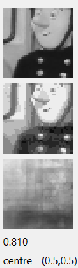
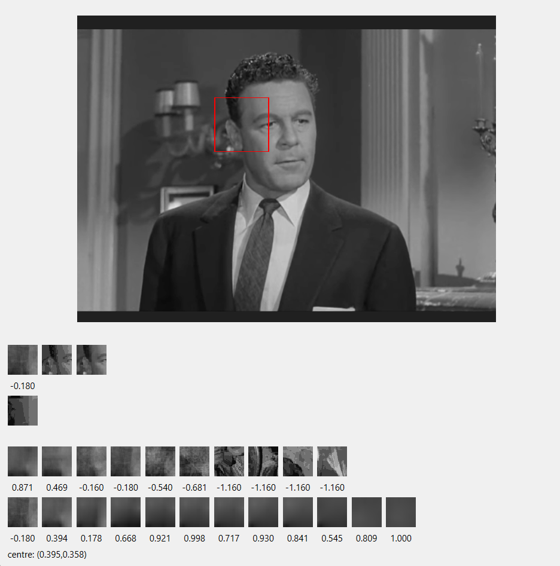

# WBOT02 - Qt WOTBOT 

In [TBOT01](https://github.com/caiks/TBOT01#readme), [TBOT02](https://github.com/caiks/TBOT02#readme) and [TBOT03](https://github.com/caiks/TBOT03#readme) we investigated real-time *modelling* of a Turtlebot, a small wheeled robot with a lidar. We experimented with it by running various controllers in the [turtlebot3 house](http://emanual.robotis.com/docs/en/platform/turtlebot3/simulation/#3-turtlebot3-house) simulated in the [Gazebo](http://gazebosim.org/) virtual environment. Now we shall take a step in a different direction - Wotbot will focus on real-time *modelling* of vision, hearing and speech implemented in a smartphone. That is, Wotbot will be a robot with a head, rather than a body, at least in its initial versions.

`TBOT01` was the semi-static preparatory step - it (1) acquired experience, (2) modelled, and (3) acted in three different stages. The *model* was trained using the *inducers* and *conditioners* implemented in the [AlignmentRepaC repository](https://github.com/caiks/AlignmentRepaC). The AlignmentRepaC repository is a fast C++ implementation of some of the *practicable inducers* described in the paper *The Theory and Practice of Induction by Alignment* at https://greenlake.co.uk/. The AlignmentRepaC repository was tested on the MNIST handwritten digits dataset in  [NISTC](https://github.com/caiks/NISTC#readme). `TBOT01` was able to use its statically learned *model* to find its way around the turtlebot house faster than chance.

In `TBOT02` we implemented fully dynamic *modelling* - instead of acquiring *history*, *modelling*, and *applying model* separately, these tasks are done concurrently. The active functionality was implemented in the [AlignmentActive repository](https://github.com/caiks/AlignmentActive), which depends on the [AlignmentRepaC repository](https://github.com/caiks/AlignmentRepaC). `TBOT02` demonstrated that active *modelling* was no worse than static *induced modelling*, although not as good as static *conditional modelling* (where there is an available label). `TBOT02` also showed that active *modelling* can process *events* in real-time with moderate compute and limited memory requirements, while maintaining high *model likelihoods*. The active framework can concurrently manage multiple active *models* structured in different *levels*. Higher *levels* can include time-wise *underlying* and reflexive *frames*. Active *histories* also allow the temporal analysis of past *events* and *slice* transistions; thus *slice* topologies can provide a mechanism for exploration and control.

In `TBOT03` we sought to improve *modelling* performance by searching for *model likelihood* in the *slice* topology as an indicator of potential new *model*. In 'interest' mode the turtlebot acted to move towards the *slice* with the greatest *size* per parent *slice size* of its surrounding *slices*. That is, it tended to move towards *on-diagonal slices*. In 'unusual' mode the turtlebot acted to move towards the *slice* with the least *size* per parent *slice size*. That is, it moved instead towards far *off-diagonal slices*. 
We were able to demonstrate that deliberately searching for interesting or unusual *slices*, rather than acting to attain a labelled goal, can accelerate *model* growth, at least in the case of limited active *history size*. 

The turtlebot house and other simulated environments are hugely simplified models of the real world, however accurate the physics. In fact, the turtlebot house was so simplified that, even with added furniture to help the turtlebot distinguish between rooms, the lidar sensor did not carry enough *alignments* to remove the location ambiguities. Ironically, the *slice* topology of `TBOT03` was now so complete and connected that it did not accidentally miss any of the wormholes or inconsistent mappings to its physical space. In fact, the navigation performance of `TBOT03` is far worse than chance!

Given these location ambiguities, it seems unlikely that a complex limbed robot with camera vision would have an environment in a simulated virtual world that is rich enough to enable a later transition to real world embodiment. On the other hand, if we attempt to develop active *models* using real robots instead of virtual ones, we are presented with very difficult technical challenges. So, to make progress, we shall move directly to the real world but initially without locomotion or manipulation. To do this we shall use the existing technologies of cameras, microphones and speakers in smartphones and laptops. It will be up to the user to carry wotbot around and point it in the general direction of something interesting.

In this repository, `WBOT02` has a *substrate* derived from images sourced from a camera, a video or a screen-grab. A typical RGB image from one of these sources has thousands to millions of pixels with the colour of each pixel encoded in 24 bits. In order to allow for practicable action *induction*, the wotbot *substrate* has only 40x40 *variables* each with a *valency* of 10 *values*. To reduce the image we choose a centre (a pixel coordinate) and a scale (e.g. 1.0, 0.5, 0.25 ...) so that only a portion of the image is captured - something like the saccades of the human eye. Where a *variable* corresponds to a rectangle of pixels, an average pixel value is calculated. The Red-Green-Blue colour is converted to a 256 grey-scale by taking the maximum of the red, green or blue components (the 'value' of Hue-Saturation-Value). The 256 *valency* is then reduced to 10 by calculating the deciles or by simply dividing into regular intervals. 

We can compare this process of reduction to the case of the MNIST handwritten digits dataset described in [Haskell analysis](https://greenlake.co.uk/pages/dataset_NIST) or [Python analysis](https://greenlake.co.uk/pages/dataset_python_NIST). There the images were already centered and scaled and reduced to 28x28 pixel *variables* of 256 *values*. We then only had to bucket the *variables*; in that case 2 *values* was sufficient.

We can see that, compared to MNIST, wotbot images have a huge potential *volume* (the number of pixels times `2^24`). Reducing them to the *substrate* *reduces* the *volume* (`40x40x10`) but now the wotbot has to choose the centre and the scale of the sample, so the action space goes from nothing to at least the number of pixels times the cardinality of a set of scales. In addition, there are many more *alignments* within the real images than there are within the MNIST handwritten digit images - a randomly chosen focus and scale in a real image is likely to view a random jumble of partially obscured objects, or areas of some object larger than the frame, or objects as if seen from a great distance. If the frame has low entropy, such as a piece of sky or a dark corner of a room, there might not be any identifiable objects at all, only textures or, at the lowest entropies, pure uniformity. In these cases, there will be few *alignments* at this focus and scale. Even with a frame that contains, say, a face that is reasonably centered and cropped, a set of similar faces slightly translated or seen at different distances is likely to yield lower *alignments* because there is no convolution. That is, the same object viewed with slightly different fixation points will produce multiple *slices* and will dilute the *slice sizes* accordingly. Choosing exactly the same point of view for similar images will find a single *slice* much more quickly. This is where we can take advantage of the key idea of *likelihood*-accelerated *model* growth - by selecting the most *likely* foci for attention the active *inducer* can spend its time on the parts and resolutions of the images which will yield the greatest *alignments*. In general, the most *likely* focus will present the object so that it fits the frame nicely, but to some degree the exact choice will be somewhat arbitrary - so long as the same choice is used repeatedly, the *events* will be in the same *slice*. 

In the case of the turtlebot of `TBOT03` we searched the *slice* topology to choose an action which we hoped would transition to a high *likelihood* next *slice*. In the case of wotbot, there may well be a use later on for temporal *likelihoods*, especially in higher *levels*, but to begin with in `WBOT02` we will merely scan the current image to find the best place for the focus - the current *event* will be taken from the scanned frame with the highest *likelihood*. Of course, if the scene is changing rapidly, the new location may no longer be interesting, but it only need provide the starting location for the search in the scan of the next image, not the next *event* itself. If an interesting object is moving across the image slowly, wotbot should be able to track it until something else more interesting appears.

Although wotbot appears to be severely disadvantaged with respect to MNIST because of the need to saccade around the image, it does have an unlimited dataset to learn from - there are only 60,000 samples in MNIST. Active *models* are unlimited in size, so if the wotbot acts to use its compute resources efficiently by concentrating on interesting parts of the images, it has the potential to produce interesting *models*.

The wotbot [WBOT01 repository](https://github.com/caiks/WBOT01) was essentially a copy of the turtlebot [TBOT03 repository](https://github.com/caiks/TBOT03) without the turtlebot specific functionality. It depends on the [Robot Operating System](https://www.ros.org/), but for a robot that is missing locomotion and manipulation at this stage, ROS adds unnecessary complexity.

`WBOT02` is implemented instead with the [Qt](https://www.qt.io) framework. This allows for the same code to be used on multiple platforms and for cross-compilation to develop android apps. Although `WBOT02` does not really require the interface design tools in Qt Creator (because the GUI is relatively simple with little user interaction), Qt is useful in that it encapsulates the camera, video and screen-grab functionality in a single framework, which of course would otherwise require separate development for each platform. The library's [QImage](https://doc.qt.io/qt-6.2/qimage.html), [QPixmap](https://doc.qt.io/qt-6.2/qpixmap.html) and [QPainter](https://doc.qt.io/qt-6.2/qpainter.html) classes make the image manipulation straightforward. Note that the Qt thread functionality will not be used - [AlignmentActive repository](https://github.com/caiks/AlignmentActive) is based on [std::thread](https://en.cppreference.com/w/cpp/thread/thread).

## Sections

[Download, build and run in Windows](#main_Windows)

[Download, build and run in Ubuntu](#main_Ubuntu)

[Discussion](#Discussion)

<a name="main_Windows"></a>

## Download, build and run in Windows

This repository is based on the 6.2.4 version of [Qt](https://www.qt.io). The installation on Windows 11 is as follows. [Download](https://www.qt.io/download) the installer `C:\Qt\MaintenanceTool.exe`, and run it. Install Qt Creator and the `Desktop Qt 6.2.4 MSVC2019 64bit` kit. (Note that the default `Desktop Qt6.2.4 MinGW 64-bit` kit, which is GCC for Windows, may not have camera or screen grab functionality.) Check the various examples build and run ok.

Now install the [AlignmentActive repository](https://github.com/caiks/AlignmentActive), the [AlignmentRepaC repository](https://github.com/caiks/AlignmentRepaC) and the underlying repositories. Create a directory,

```
mkdir C:\caiks

```
Then use use [Github Desktop](https://desktop.github.com/), for example, to clone the following repositories to the `C:\caiks` directory -
```
https://github.com/Tencent/rapidjson.git
https://github.com/caiks/AlignmentC.git
https://github.com/caiks/AlignmentRepaC.git
https://github.com/caiks/AlignmentActive.git
```
Then clone the [WBOT02 repository](https://github.com/caiks/WBOT02) -
```
https://github.com/caiks/WBOT02.git
```
Then clone the [WBOT02 workspace repository](https://github.com/caiks/WBOT02_ws) -
```
https://github.com/caiks/WBOT02_ws.git
```
The WBOT02 executable can be built and run in Qt Creator by opening the `WBOT02` project in `C:\caiks\WBOT02` and building the Release configuration. Then in Qt Creator go to `Projects/WBOT02/Desktop_Qt_6_2_4_MSVC2019_64bit/Run` and set the `Command line arguments` to `hello`. Then run and check that `hello` appears in the `Application Output` window. To test `actor001` can grab the screen, set the `Command line arguments` to `actor001`. The `actor001` window should open on the left hand side of the screen and capture a rectangle on the right hand side of the screen.

The build can also be done from the command line, but in version 6.2.4 of Qt we must first set the necessary environment variables from Qt Creator. In Qt Creator go to `Projects/WBOT02/Desktop_Qt_6_2_4_MSVC2019_64bit/Build/Details` and hit `Open Terminal` to create a shell, then run `cmake` - 
```
"C:\Qt\Tools\CMake_64\bin\cmake.exe" -DCMAKE_PREFIX_PATH=C:\Qt\6.2.4\msvc2019_64 -S C:/caiks/WBOT02 -B C:/caiks/build-WBOT02-Desktop_Qt_6_2_4_MSVC2019_64bit-Release

```
Then the executable can be built -
```
cd /d C:\caiks\build-WBOT02-Desktop_Qt_6_2_4_MSVC2019_64bit-Release
"C:\Qt\Tools\CMake_64\bin\cmake.exe" --build C:/caiks/build-WBOT02-Desktop_Qt_6_2_4_MSVC2019_64bit-Release --target all

```
Finally the executable can be tested -
```
cd /d C:\caiks\WBOT02_ws
"C:\caiks\build-WBOT02-Desktop_Qt_6_2_4_MSVC2019_64bit-Release\WBOT02.exe" hello > WBOT02.txt

```
Note that standard output does not echo to the shell but must be redirected to a file. Check that `C:\caiks\WBOT02_ws\WBOT02.txt` contains the word `hello`.

To test `actor001` can grab the screen, run the following -
```
cd /d C:\caiks\WBOT02_ws
"C:\caiks\build-WBOT02-Desktop_Qt_6_2_4_MSVC2019_64bit-Release\WBOT02.exe" actor001

```
The `actor001` window should open on the left hand side of the screen and capture a rectangle on the right hand side of the screen.


<a name="main_Ubuntu"></a>

## Download, build and run in Ubuntu

This repository is based on the 6.2.4 version of [Qt](https://www.qt.io). The installation on Ubuntu 22.04 is as follows:

First install the developer tools,
```
sudo apt update -y
sudo apt install -y git g++ cmake build-essential xorg libgl1-mesa-dev
sudo apt install -y qt6-base-dev qt6-base-dev-tools qt6-multimedia-dev

```
If running in the cloud, reboot the machine and reconnect, e.g. with `ssh -X`, and then test that the X server is running, e.g. with `xeyes`.

Now install the [AlignmentActive repository](https://github.com/caiks/AlignmentActive), the [AlignmentRepaC repository](https://github.com/caiks/AlignmentRepaC) and the underlying repositories, 
```
git clone https://github.com/Tencent/rapidjson.git
git clone https://github.com/caiks/AlignmentC.git
git clone https://github.com/caiks/AlignmentRepaC.git
git clone https://github.com/caiks/AlignmentActive.git

```
Then clone the [WBOT02 repository](https://github.com/caiks/WBOT02) and the [WBOT02 workspace repository](https://github.com/caiks/WBOT02_ws) -
```
git clone https://github.com/caiks/WBOT02.git
git clone https://github.com/caiks/WBOT02_ws.git

```
Then make the release build,
```
mkdir AlignmentC_build AlignmentRepaC_build AlignmentActive_build WBOT02_build
cd WBOT02_build
cmake -DCMAKE_BUILD_TYPE=RELEASE ../WBOT02
make
cd ~/WBOT02_ws
ln -s ../WBOT02_build/WBOT02 WBOT02

```
Then test the executable runs,
```
cd ~/WBOT02_ws
./WBOT02 hello

```
To test `actor001` can grab the screen, run the following,
```
cd ~/WBOT02_ws
./WBOT02 actor001

```
This [tool](https://nicolargo.github.io/glances/) is useful for monitoring the system during *modelling* runs -
```
sudo apt install -y glances

```
To obtain the YouTube videos discussed in connection with `actor003` below, install `yt-dlp`,
```
sudo add-apt-repository ppa:yt-dlp/stable
sudo apt update -y
sudo apt install -y yt-dlp  

```
To test, run the following,
```
yt-dlp https://www.youtube.com/watch?v=Y5dylh2aOiw

```
which should produce something like
```
[download] Destination: Amazing Physics Toys_Gadgets 1 [Y5dylh2aOiw].f303.webm
[download] 100% of 124.60MiB in 00:28
[download] Destination: Amazing Physics Toys_Gadgets 1 [Y5dylh2aOiw].f251.webm
[download] 100% of 7.84MiB in 00:01
[Merger] Merging formats into "Amazing Physics Toys_Gadgets 1 [Y5dylh2aOiw].webm"
```

<a name = "Discussion"></a>

## Discussion

Now let us investigate various wotbot modes and active structures. 

[Actor node](#Actor)

[Conclusion](#Conclusion)


<a name = "Actor"></a>

### Actor node

`WBOT02` has a `main` routine that examines the first command line argument and chooses its procedure accordingly. We discuss each of the procedures in the sections below -

#### screen001 and screen002

In `screen001` we test the screen grab functionality. We check to see how long it takes to (i) grab the pixmap, (ii) convert it to an image and (iii) read every pixel of the image. This is the typical output -
```
09:05:05: Starting C:\caiks\build-WBOT02-Desktop_Qt_6_2_4_MSVC2019_64bit-Release\WBOT02.exe screen001...
auto pixmap = screen->grabWindow(0)	0.0549396s
auto image = pixmap.toImage()	6e-07s
image.format(): 4
image.depth(): 32
image.width(): 1920
image.height(): 1080
image.dotsPerMeterX(): 3780
image.dotsPerMeterY(): 3780
auto colour = image.pixel(QPoint(0,0))
colour: ff033db8
qAlpha(colour): 255
qRed(colour): 3
qGreen(colour): 61
qBlue(colour): 184
qGray(colour): 60
(qRed(colour)+qGreen(colour)+qBlue(colour))/3: 82
total: 1214020541
average per pixel:195	0.0014735s
09:05:05: C:\caiks\build-WBOT02-Desktop_Qt_6_2_4_MSVC2019_64bit-Release\WBOT02.exe exited with code 0
```
On a Windows 11 laptop, the grab of the entire screen typically takes 30-50 ms, which limits the FPS to a maximum of 20. The processing of the image is much faster, around 1-2 ms.

In `screen002` we demonstrate that grabbing a rectangle rather than the entire screen is quicker. Here we open a Qt application, `Win002`. At fixed intervals the application grabs a rectangle, displays the captured imaged, calculates the average intensity, `(R + G + B)/3`, and produces some statistics -  


The command line is parsed as `screen002 <interval in ms> <x coord> <y coord> <width> <height>`. This example has a rectangle of `800x600` -
```
10:35:37: Starting C:\caiks\build-WBOT02-Desktop_Qt_6_2_4_MSVC2019_64bit-Release\WBOT02.exe screen002 250 700 50 800 600...
application.exec(): pixmap.devicePixelRatio(): 1.25
captured	0.0598737s
image.format(): 4
image.depth(): 32
image.width(): 1000
image.height(): 750
image.dotsPerMeterX(): 3780
image.dotsPerMeterY(): 3780
auto colour = image.pixel(QPoint(0,0))
colour: ff034abf
qAlpha(colour): 255
qRed(colour): 3
qGreen(colour): 74
qBlue(colour): 191
qGray(colour): 67
(qRed(colour)+qGreen(colour)+qBlue(colour))/3: 89
average:220	0.0015486s
imaged	0.0063075s
captured	0.0337352s
average:212	0.0014052s
imaged	0.0023709s
captured	0.0215182s
average:212	0.00143s
imaged	0.0023704s
captured	0.0215584s
average:212	0.0011383s
imaged	0.0022505s
...
captured	0.0279223s
average:246	0.0008471s
imaged	0.0024594s
0
10:35:47: C:\caiks\build-WBOT02-Desktop_Qt_6_2_4_MSVC2019_64bit-Release\WBOT02.exe exited with code 0
```
Capturing the smaller image of around a quarter of the area takes around half of the time, around 20 -25 ms.

#### camera001

`camera001` is similar to `screen002`, except that a camera image is captured instead of a rectangle of the screen. Also the process is asynchronous - the `capture` method of a `QImageCapture` is called and when the image is available the `imageCaptured` callback processes the image -


```
09:10:56: Starting C:\caiks\build-WBOT02-Desktop_Qt_6_2_4_MSVC2019_64bit-Release\WBOT02.exe camera001 250...
QMediaDevices::videoInputs().count(): 1
application.exec(): capturing ...
captured	0.0100075s
image.format(): 4
image.depth(): 32
image.width(): 1280
image.height(): 720
image.dotsPerMeterX(): 3780
image.dotsPerMeterY(): 3780
auto colour = image.pixel(QPoint(0,0))
colour: ffa6a6a2
qAlpha(colour): 255
qRed(colour): 166
qGreen(colour): 166
qBlue(colour): 162
qGray(colour): 165
(qRed(colour)+qGreen(colour)+qBlue(colour))/3: 164
average:148	0.0012667s
imaged	0.0047368s
capturing ...
captured	0.023265s
average:147	0.0008s
imaged	0.0008467s
capturing ...
captured	0.0116363s
average:154	0.000817s
imaged	0.0007428s
capturing ...
captured	0.0165489s
average:161	0.0007532s
imaged	0.0007316s
...
capturing ...
captured	0.012549s
average:149	0.0007616s
imaged	0.0006978s
capturing ...
captured	0.0283564s
average:162	0.000711s
imaged	0.000911s
0
09:11:03: C:\caiks\build-WBOT02-Desktop_Qt_6_2_4_MSVC2019_64bit-Release\WBOT02.exe exited with code 0
```
In this case the capture takes around 10 -30 ms.

#### video001 and video002

We made a couple of experiments with capturing frames from videos, `video001` and `video002`. The intention was to use the playlist of youtube videos from the [Kinetics dataset](https://www.deepmind.com/open-source/kinetics), which are a set of categorised videos of activities. Many of the videos, however, were filmed with quite a low resolution and so it is difficult to ensure that low scale frames are such that the cells are not all highly interpolated in any particular video. That is, many of the videos are very blurry at smaller scales. The capture process itself and automating a playlist were both difficult tasks too. For `actor001` and `actor002` we concentrated on grabbing videos from the screen and obtaining the videos from high resolution sources. Later on, in `actor003`, we successfully automated learning from a playlist of videos to allow headless *modelling* in the cloud.

<a name="Records_and_representations"></a>

#### Records and representations

Now let us consider scaled and centered average brightness records and their representations. The `Record` class is defined in `dev.h`. It represents a rectangular frame of a part or the whole of an image. It is defined by horizontal and vertical lengths or scales (fractions of 1) and a centre coordinate (a pair of fractions of 1). It consists of a two dimensional array of cells of integral value between 0 (dark) and 255 (light). It has persistence methods and a method to convert it to an *event*, i.e. a `HistoryRepa` of *size* 1 of a *substrate* consisting of (i) *variables* for each cell of a given cell *valency*, plus (ii) a scale *variable* of a given scale *valency*. 

`Record` has a constructor that creates a zeroed (black) array of cells. Another constructor creates a greyscale array of cells from a rectangular frame within a given image. Where an individual cell corresponds to a rectangle of pixels, an average pixel value is calculated. The value of the cell is the Hue-Saturation-Value calculation of lightness, i.e. the maximum of the red, green and blue values. 

The `valent` method reduces the *valency* of a record by sorting the *values* and calculating quantiles, with special handling of 0 (black) to deal with the case of a frame that overlaps with the boundaries of the given image. The `valentFixed` method reduces the *valency* of a record by simply dividing it into regular intervals.

The `image` method converts the record to an image with each cell generating a square of size `multiplier` pixels in the resultant image. The pixels are coloured grey with a lightness that depends on the cell's *value* as a proportion of the *valency*.

The following is a test of the `Record` persistence -
```
09:25:52: Starting C:\caiks\build-WBOT02-Desktop_Qt_6_2_4_MSVC2019_64bit-Release\WBOT02.exe records...
rr
(0.9,0.8,0.7,0.7,3,2,[0,1,2,3,4,5])
(0.1,0.2,0.3,0.3,2,1,[6,7])

recordListsPersistent(rr, out)
rr2 = persistentsRecordList(in)
rr2
(0.9,0.8,0.7,0.7,3,2,[0,1,2,3,4,5])
(0.1,0.2,0.3,0.3,2,1,[6,7])

(0.9,0.8,0.7,0.7,3,2,[0,1,2,3,4,5])
(0.1,0.2,0.3,0.3,2,1,[6,7])

09:25:52: C:\caiks\build-WBOT02-Desktop_Qt_6_2_4_MSVC2019_64bit-Release\WBOT02.exe exited with code 0
```

The `Representation` class is also defined in `dev.h`. It represents the summation of a number of records, so it has a count of the number of records added, along with the array of integral cells. It also has an `image` method which converts the representation to an image with each cell generating a square of size `multiplier` pixels in the resultant image. This time the pixels are coloured grey with a lightness that depends on the average *value* as a proportion of the *valency*. So a representation can image a *slice* of *events*.

`Representation` also has persistence methods. These are needed to persist the map between *slices* and representations that is needed to visualise a *model*. The following is a test of the `Representation` persistence -
```
15:46:25: Starting C:\caiks\build-WBOT02-Desktop_Qt_6_2_4_MSVC2019_64bit-Release\WBOT02.exe representations...
r1: (0.9,0.8,3,2,[0,1,2,3,4,5])
r2: (0.1,0.2,2,1,[6,7])
rr
(1,(0.9,0.8,3,2,[0,1,2,3,4,5]))
(2,(0.1,0.2,2,1,[6,7]))

sliceRepresentationUMapsPersistent(rr, out)
rr2 = persistentsSliceRepresentationUMap(in)
rr2
(1,(0.9,0.8,3,2,[0,1,2,3,4,5]))
(2,(0.1,0.2,2,1,[6,7]))

15:46:25: C:\caiks\build-WBOT02-Desktop_Qt_6_2_4_MSVC2019_64bit-Release\WBOT02.exe exited with code 0
```

#### screen003 and screen004

`screen003` is similar to `screen002` but adds records. The `screen003` capture procedure grabs the screen rectangle in the same way as `screen002`, but then creates records from the image. There is a record for each of 5 scales, which default to `[1.0, 0.5, 0.25, 0.125, 0.0625]`, all sharing the same centre. Each of these records has a *valency* of 256. For each of these greyscale records we create another bucketed record using the `valent` method, defaulting to a *valency* of 10. These two sets of records are converted to images with a `multiplier` of 3 and then arranged in two rows of descending scales below the grabbed image. The bottom row has the lower *valency* and these are what the wotbot will eventually see. Here is an example -

```
15:51:41: Starting C:\caiks\build-WBOT02-Desktop_Qt_6_2_4_MSVC2019_64bit-Release\WBOT02.exe screen003 250 791 244 728 410...
application.exec(): 0
15:58:51: C:\caiks\build-WBOT02-Desktop_Qt_6_2_4_MSVC2019_64bit-Release\WBOT02.exe exited with code 0
```


The user can use the mouse to change the centre -


Notice that frames that exceed the grabbed image's boundary are filled in with black. This can be seen in the full scale image on the left.

`screen003` and `screen004` differ merely in how they are parameterised. Underneath they both use `Win005`. `screen003` expects its arguments on the command line, e.g.
```
screen003 250 791 244 728 410
```
`screen004` parses a JSON file in the manner of `TBOT03`, e.g.
```
screen004 actor.json
```
where actor.json is, for example,
```
{
	"interval" : 250,
	"scales" : [1.0, 0.5, 0.25, 0.125]
}
```

<a name = "actor001"></a>

#### actor001 description

`actor001` is the first version of the wotbot that uses the [active framework](https://github.com/caiks/AlignmentActive) to do dynamic *modelling*. Initially the focus is at fixed positions within the image; later we add a certain amount of randomisation. These experiments are similar to those of the random modes of [`TBOT03`](https://github.com/caiks/TBOT03#Random_modes_10_12).

`actor001` is implemented in `Win006`. The GUI is similar to `Win005`, except that there is now an additional row of images at the bottom. These are the representations of the *slices* to which the records of the second row belong. The *slices* *likelihoods* are shown below the *slice* representations. For example, `model001`, which has scales `[1.0, 0.5, 0.25, 0.125]`, produces the following -


The user can use the mouse to change the centre, or use the arrow keys (and space to return to the middle) -


In addition to the active, `Win006` has a *slice*-representation map which enables the third row of images. This map is persistent - when the window is destroyed the map is written along with the active.

The `Win006` constructor begins by parsing the given JSON file. Most of the parameters configure the active structure or logging; these are copied from turtlebot. The rest are specific to wotbot. In addition to the interval, screen grab, centre and scale list parameters of `screen004`, there is an offset list. These are relative offsets from the centre applied to each frame. We can then take multiple frames of the same scale from each act cycle image. In this example we have five quarter scale frames, one at the centre and the others arranged at the points of the compass -
```
{
...
	"scales" : [0.25, 0.25, 0.25, 0.25, 0.25],
	"offsets" : [[-0.125,0.0],[0.0,-0.125],[0.0,0.0],[0.0,0.125],[0.125,0.0]],
...
}
```

The constructor then creates the dynamic parts of the GUI. There are four `QLabel`s for each scale/offset - three are for the images of the *event* records and *slice* representations, and the fourth is for the *likelihood* statistic.

The constructor then creates the active structure. In this case, the structure consists of a single active with cumulative *slice size* and topology. The active has a single underlying `HistoryRepa`, which is updated by *events* generated from the frame records. That is, the *substrate* is just the record cells and a scale *variable*.

If `model_initial` is set, the *slice*-representation map and the active are loaded from their respective files.

Having constructed the actor a separate thread is started to run the active induce at regular intervals, if the `no_induce` flag is not set. Lastly, the constructor starts a `QTimer` to run the `Win006::act` callback.

The `Win006` destructor is called when the user closes the window. It writes the *slice*-representation map to a `.rep` file. It then signals the induce to terminate and waits for the induce thread to finish. It then dumps the active. After deleting the widgets it quits.

`Win006::act` is called at regular intervals according to the `interval` parameter. In the example *models* below, the interval is usually 40 ms, or 25 FPS. The act time is calculated and subtracted from the next pause so that there are regular intervals; the actors can then be considered continuous when we later come to consider temporal *levels* and *slice* topologies. If the act time exceeds the interval, the act is run again immediately with an optional warning. If the number of records taken (the length of the scale list) is four or more, i.e. over 100 records per second, then we often see act warnings and lagging induce, depending on the available compute. So, to prevent the induction lags, later versions of the actor will have to consider either having fewer *events* per second, or introducing discontinuities, i.e. having occasional large pauses between consecutive acts.

`Win006::act` first checks to see if the terminate flag is set. Then, if `event_maximum` if set, it checks to see if the event id exceeds it. In either case, it stops acting.

Next, `act` grabs the screen rectangle in the same way as defined in `Win005`. The records are then created from the image in the same way too, except that now we can optionally define a random offset which is applied to the centre before the frame offsets are added. In this case the parameterisation would be, for example,
```
{
...
	"scales" : [0.25, 0.25, 0.25, 0.25, 0.25],
	"offsets" : [[-0.125,0.0],[0.0,-0.125],[0.0,0.0],[0.0,0.125],[0.125,0.0]],
	"random_centreX" : 0.0625,
	"random_centreY" : 0.0625,
...
}
```
If the random offset is not set, the records are always taken from the same fixed points of the image. If we are grabbing images at the rate of 25 FPS and the action in the images is fairly static, then we can expect a lot of duplicated *events*. This will often make the *slice* representations identical or almost identical to frames taken at the same fixed locations when, say, we are browsing the *model* later on. Also, if the images are grabbed from a series of short videos with the same opening and closing sequences, the same *events* may well be additionally scaled by the number of videos in the series. If the random offset is set, however, the *events* are much less likely to be identical and so the *slice* representations are generally much more blurry and generalised, especially near the root of the *model*.

Next, an *event* is generated from each of the bucketed records and the active is updated. After the updates, the *likelihood* potentials of the *slices* of the new *events* are calculated from the *slice size* and the parent *slice size* according to this measure: `(ln(slice_size) - ln(parent_size) + ln(WMAX)) / ln(WMAX)`. Values close to one are highly expectedly *likely* or interesting. Values close to zero have low *likelihood*. Values around minus one or less are highly unexpectedly *likely* or unusual. With wotbot we will be mainly interested in high positive *likelihoods*. The induce threshold defaults to 200 and `WMAX` defaults to 18, so a zero *likelihood* implies around 11 *events* in the *slice*. A *likelihood* of 0.75 implies around 97 *events*. 

If the `no_induce` flag is not set, the representations of the *slices* of the new *events* are then obtained from the *slice*-representation map and the new *events* are added to them. The *model* is then checked to see if any new *fuds* have been added since the last act; if so, the representations of the new children *slices* are calculated. These two procedures should ensure that the leaf *slices* of the *model* always have the correct representations.

The remainder of `Win006::act` is as for `Win005::act` - the labels are updated with their latest images and statistics, and the `QTimer` set for the next act.

#### actor001 models

Now let us consider some of the *models* obtained by `actor001`. In order to make them comparable, we have trained them on the first few hours of the [Fireman Sam videos](https://www.bbc.co.uk/iplayer/episode/p08phyzv/fireman-sam-series-1-1-kite?seriesId=b00kr5w3). Fireman Sam is an animated character for children's television from the BBC. The programmes consists of around 51 episodes of about 10 minutes. In the early series the characters are animated plasticine; in later series CGI is used. The indoor scenes are generally fairly simple, in the early series at least, but outdoor scenes and later indoor scenes are more complex. The lighting is fairly even and primary colours are used a great deal - again, especially in the early series.

The default coordinates and rectangle for the screen grab may be checked by running with the following command line arguments and `actor.json` file -
```
actor001 actor.json
```
where actor.json is, for example,
```
{
	"interval" : 250,
	"scales" : [1.0, 0.5, 0.25, 0.125],
	"summary_active" : true
}
```
The browser's position should be arranged on the right hand side of the screen so that, for example, if the actor is started with the first film paused at 20 seconds, the capture looks like this - 


We can observe *induction* taking place in real-time by restarting the actor and then watching the representations in the third row. The four frames of different scales are recorded from a constant image centered at a single fixed point (0.5,0.5). So there are only four unique *events* during the whole session.

Initially, all *events* are in *slice* 0 and so there is no *likelihood*. The *slice* 0 representation is just an average of the four scales, showing part of the mirror on the left and a faint image of part of Sam on the right from the full scale frame. The `induceThresholdInitial` defaults to 1000 *events*. In this example there are 16 *events* per second, so the first *fud* is *induced* after around a minute, followed shortly after by two or three more. We observe the representations change as the new leaf *slices* are created for each *fud*. This is the screenshot afterwards -


We can see that the representations are now identical to the *event* records for each scale, and each has the same *likelihood* of 0.76. This is because the *model* is complete - each scale is now in a separate leaf *slice*. Although the *likelihood* is high, these leaf *slices* will not produce children *fuds* because all of their *histograms* are *singletons* which have no *alignments*. 

If we examine the logs we can see that the evolution of the *model* is not always exactly the same. In this example there are four *fuds* -
```
05:24:08: Starting C:\caiks\build-WBOT02-Desktop_Qt_6_2_4_MSVC2019_64bit-Release\WBOT02.exe actor001 actor.json...
actor	status: started
application.exec(): model	induce summary	slice: 0	diagonal: 40.4438	fud cardinality: 1	model cardinality: 7	fuds per threshold: 0.189394
model	induce summary	slice: 131072	diagonal: 39.8886	fud cardinality: 2	model cardinality: 41	fuds per threshold: 0.359712
model	induce summary	slice: 131073	diagonal: 39.9336	fud cardinality: 3	model cardinality: 62	fuds per threshold: 0.520833
model	induce summary	slice: 131075	diagonal: 10.2801	fud cardinality: 4	model cardinality: 74	fuds per threshold: 0.671141
0
actor	status: finished
05:25:27: C:\caiks\build-WBOT02-Desktop_Qt_6_2_4_MSVC2019_64bit-Release\WBOT02.exe exited with code 0
```
In this, there are only three *fuds* -
```
05:29:28: Starting C:\caiks\build-WBOT02-Desktop_Qt_6_2_4_MSVC2019_64bit-Release\WBOT02.exe actor001 actor.json...
actor	status: started
application.exec(): model	induce summary	slice: 0	diagonal: 40.4874	fud cardinality: 1	model cardinality: 25	fuds per threshold: 0.185874
model	induce summary	slice: 131072	diagonal: 39.838	fud cardinality: 2	model cardinality: 32	fuds per threshold: 0.364964
model	induce summary	slice: 131073	diagonal: 39.875	fud cardinality: 3	model cardinality: 39	fuds per threshold: 0.535714
0
actor	status: finished
05:31:00: C:\caiks\build-WBOT02-Desktop_Qt_6_2_4_MSVC2019_64bit-Release\WBOT02.exe exited with code 0
```
If we set the `induceThresholdInitial` to 200 and increase the `interval`, we can snapshot the intermediate *models*, 
```
{
	"interval" : 1000,
	"induceThresholdInitial" : 200,
	"scales" : [1.0, 0.5, 0.25, 0.125],
	"summary_active" : true
}
```
For example, after one *fud* the two largest scale frames and the two smallest scale frames have been separated into two *slices* -


Clearly the *induction* has correctly grouped the frames together in two pairs by similarity.

The *diagonal* of the first *fud* is a little lower (38.0 instead of 40.4) because of the smaller initial *slice* -
```
16:08:22: Starting C:\caiks\build-WBOT02-Desktop_Qt_6_2_4_MSVC2019_64bit-Release\WBOT02.exe actor001 actor.json...
actor	status: started
application.exec(): model	induce summary	slice: 0	diagonal: 38.0308	fud cardinality: 1	model cardinality: 10	fuds per threshold: 0.980392
0
actor	status: finished
16:09:35: C:\caiks\build-WBOT02-Desktop_Qt_6_2_4_MSVC2019_64bit-Release\WBOT02.exe exited with code 0
```
Now let us consider *models* created from first two hours of the Fireman Sam videos. In *model* 1 we will run with the same four scales centered at the same fixed point (0.5,0.5), and grabbed at a rate of 25 FPS. This is the definition of [`model001.json`](https://github.com/caiks/WBOT02_ws/blob/main/model001.json) -
```
{
	"model" : "model001",
	"interval" : 40,
	"scales" : [1.0, 0.5, 0.25, 0.125],
	"event_maximum" : 720000,
	"logging_action" : true,
	"logging_action_factor" : 1000,
	"warning_action" : true,
	"summary_active" : true
}
```
Start the films from the beginning of the first episode and run the following -
```
cd /d C:\caiks\WBOT02_ws
"C:\caiks\build-WBOT02-Desktop_Qt_6_2_4_MSVC2019_64bit-Release\WBOT02.exe" actor001 model001.json > model001.log

```
An example of the log is [model001.log](https://github.com/caiks/WBOT02_ws/blob/main/model001.log). The active will stop updating after 720,000 *events*, or approximately 2 hours. Note that the induce may be lagging, so wait until there are no more *fuds* being added by checking the log before quitting the application. When the application closes there are two files written to the `WBOT02_ws` directory - the active file, `model001.ac`, and the *slice*-representation map file, `model001.rep`. Both files are large, which is why we have not added them to the `WBOT02_ws` repository.

Now we can browse *model* 1 by setting the `no_induce` flag in `actor.json` -
```
{
	"model_initial" : "model001",
	"interval" : 1000,
	"scales" : [1.0, 0.5, 0.25, 0.125],
	"no_induce" : true,
	"logging_action_slice" : true
}
```
and then running with the following command line arguments -
```
actor001 actor.json
```
If we pause at 20 seconds of the first film as before, we see that the four representations are no longer exact copies of the records -


The first three representations are close to their corresponding records. All have high *likelihoods*. 

We can navigate around using the mouse or the arrow keys. The space bar will re-center the focus. We can easily navigate to areas of low *likelihoods*, for example if we hit the up arrow several times to (0.5,0.425) we have -


Of course, having a low *likelihood*, by the measure given above, does not mean that a *slice's fud* is *unlikely* - the representations still show the areas of light and dark to some degree - but only that the *slice* has perhaps less potential for future *model* than *on-diagonal slices*.

We may wonder why a small shift to the focus pushes us off the *diagonal*. The reason is probably that the place where we stopped is in the opening sequence of the Fireman Sam episodes, at least in the first series, so the *events* obtained are duplicated ten or so times. In addition, the scene pauses briefly while Sam looks at himself in the mirror, increasing the number of identical *events*. The frames that we have manually selected just a few pixels away from the fixed point of (0.5,0.5) are unlikely to have occurred at any other time during the two hours of running, and so their *slices* consist of just a few similar, but not identical, *events*. The smaller *counts* decrease the chances of the *slices* being on the *diagonal*. Although the scenes are only slightly translated, the *events* are completely different. This is because there is no notion of locality or convolution in the *substrate* - the 'distance' between any two *variables* has no meaning except to our eyes.

This reminds us of the vastness of the *volume* of the *substrate* compared to the compute resources available - we will have to manage the focus to go to exactly the same few hotspots relative to common scenes such as, say, faces or hands. We will also have to find the correct scale so that the object in question is always seen such that the *alignments* are maximised. That is, we must adjust for the  perspectival projection of a three dimensional object onto a plane. By scanning the image or searching the *slice* topology for the most *likely* foci and scales, we can accelerate *model* growth. The aim of the remaining `actor001` *models* is to examine the difference between fixed points of view and randomised points of view, for various scales, before we go on to consider *likelihood* based searches in `actor002`.

This table summarises the results from the `actor001` *models* -

model|scales|frame position|events|fuds|fuds per size per thrshld|median diagonal|max diagonal|lagging fuds
---|---|---|---|---|---|---|---|---
model001|1.0, 0.5, 0.25, 0.125|centred|720,000|2817|0.7825|31.8063|41.4185|66
model005|1.0|1 centred|180,000|684|0.761591|33.4245|41.2544|0
model006|0.5|1 centred|180,000|697|0.775099|31.6855|41.1768|0
model007|0.25|1 centred|180,000|698|0.776233|31.458|40.8568|0
model003|0.5|1 centred, 4 offset|720,000|2762|0.767222|31.5374|41.7331|602
model004|0.5|1 centred, 4 offset, randomised|720,000|2951|0.819722|25.9151|41.3706|413
model002|0.25|1 centred, 4 offset|720,000|2807|0.779722|30.9492|41.6394|630
model008|0.25|1 centred, 4 offset, randomised|720,000|2730|0.758333|25.8088|38.3436|305

*Model* 1 is the only *model* with varying scales. In order to determine which scale had the most *alignments* we ran the first three scales separately, in *models* 5, 6 and 7. We can see that no scale has any noticeable advantage, with the *fuds* per *size* per threshold fairly constant amongst all of them at around 0.77. The median and maximum *diagonals* are similar too. 

The configuration for these three *models* is very similar. For example, `model005.json` -
```
{
	"model" : "model005",
	"interval" : 40,
	"scales" : [1.0],
	"event_maximum" : 180000,
	"logging_action" : true,
	"logging_action_factor" : 1000,
	"warning_action" : true,
	"summary_active" : true
}
```
And -
```
cd /d C:\caiks\WBOT02_ws
"C:\caiks\build-WBOT02-Desktop_Qt_6_2_4_MSVC2019_64bit-Release\WBOT02.exe" actor001 model005.json > model005.log

```
The remaining *models* have five frames, each with the same scale - a central frame and four frames at the points of the compass. In *models* 3 and 4 we compare the effect of fixed centres to randomised ones for half scale frames. In *models* 2 and 8 we do the same for quarter scale frames. We can see that for half scale the randomisation appears to increase the *model* a little (0.82 versus 0.77), but for quarter scale the randomisation appears to decrease the *model* a little (0.76 versus 0.78). There does not seem to be any very large quantitative differences.

Let us consider if there are qualitative differences between fixed and randomised for the half scale by comparing *models* 3 and 4. This is the configuration of `model003.json` -
```
{
	"model" : "model003",
	"interval" : 40,
	"scales" : [0.5, 0.5, 0.5, 0.5, 0.5],
	"offsets" : [[-0.25,0.0],[0.0,-0.25],[0.0,0.0],[0.0,0.25],[0.25,0.0]],
	"event_maximum" : 720000,
	"logging_action" : true,
	"logging_action_factor" : 1000,
	"warning_action" : true,
	"summary_active" : true
}
```
And -
```
cd /d C:\caiks\WBOT02_ws
"C:\caiks\build-WBOT02-Desktop_Qt_6_2_4_MSVC2019_64bit-Release\WBOT02.exe" actor001 model003.json > model003.log

```
We can browse the *model* by pausing the first film at 20 seconds and running `actor001 actor.json` with `actor.json` -
```
{
	"model_initial" : "model003",
	"interval" : 100,
	"scales" : [0.5],
	"no_induce" : true
}
```
At the centre we see an image very similar to that of the half scale frame from *model* 1, as we would expect -


If we display *model* 3 and *model* 1 side by side, we can easily see this -

  

The *likelihoods* are both high as we would expect. 

If we move upwards by the same short distance as before to (0.5,0.425) we obtain the following -

  

Here both *model* 3 and *model* 1 have low *likelihoods*. They are both far *off-diagonal* because they have seen few similar *events* at their fixed points.

The configuration of *model* 4 is very similar to *model* 3, but additionally has the random parameters; `model004.json` -
```
{
	"model" : "model004",
	"interval" : 40,
	"scales" : [0.5, 0.5, 0.5, 0.5, 0.5],
	"offsets" : [[-0.25,0.0],[0.0,-0.25],[0.0,0.0],[0.0,0.25],[0.25,0.0]],
	"random_centreX" : 0.125,
	"random_centreY" : 0.125,
	"event_maximum" : 720000,
	"logging_action" : true,
	"logging_action_factor" : 1000,
	"warning_action" : true,
	"summary_active" : true
}
```
And -
```
cd /d C:\caiks\WBOT02_ws
"C:\caiks\build-WBOT02-Desktop_Qt_6_2_4_MSVC2019_64bit-Release\WBOT02.exe" actor001 model004.json > model004.log

```
Now let us browse *model* 4 with `actor.json` -
```
{
	"model_initial" : "model004",
	"interval" : 100,
	"scales" : [0.5],
	"no_induce" : true
}
```
Let us compare all three *models* at (0.5,0.5) -

   

The randomised case has a very low *likelihood* when compared to the fixed cases. This is as we would expect since there will be few, if any, identical *events* in the randomised case where the centre is not a fixed point.

Compare the randomised case to the fixed for the translated centre (0.5,0.425) -

   

In this case it so happens that the randomised *likelihood* is very high. The representation is blurry, but the light and dark areas resemble the record fairly closely. Note that it is just chance that this happens to be a hotspot in the randomised *model* - if we navigate elsewhere, there are plenty of low  *likelihood* places nearby.

Neither the randomised nor the fixed methods perform very well where the frame is rarely seen. Let us see if frequently seen objects, such as Sam's face, improve things.

If we pause the first episode at 4 minutes 20 seconds, long after the opening sequence, *model* 4 does not have a hotspot at (0.5,0.5) -

 

If we navigate around Sam's face with *model* 4 we find that all of the representations consist of blurry areas of light and dark when they have high *likelihoods*. For example,

 

None of the representations look very much like his face. This suggests that randomised *modelling* would need much longer runs to attain, say, two darker areas for the pupils of the eyes. A limited active *history* is likely to preclude ever obtaining even a basic *model* of faces, unless special methods are used to accelerate *model* growth.

If we repeat for *model* 3 we have a high *likelihood* hotspot at (0.5,0.5) -

 

The representation is possibly less blurry than for the *model* 4 hotspot, but still does not look like a face.

We can perhaps tentatively conclude that frequently seen frames are more likely to have high *likelihood* hotspots nearby, in varying degrees of *decomposition*, than frames containing the intervals between objects (such as the edge of the mirror above), or with jumbles of rarely seen objects. To find out, `actor002` will actively scan for hotspots and will show the siblings and ancestor *slice* representations. 

None of the *models* with only one frame (5, 6 and 7) have induce lags. There is a small lag in *model* 1 with four frames, and large lags in *models* 3, 4, 2 and 8 with five frames. The *models* that lagged the most may have slightly better *models* because of the larger *slices*. The lagging is mainly a problem, however, because the *model* is out of date, and so it will be important to avoid lags when we come to *likelihood* search in `actor002`. Eventually  in `actor003` we will run the image capture from video, and the active update and induce will be done synchronously, thus avoiding lags altogether.

Note that the `actor001` *models* were all subject to a bug in the record `valent` bucketing which meant that the first *value* was too infrequent and the last *value* was too frequent. Thus the *valency* was more like 9 than 10.  Qualitatively, however, the *models* still seem to work quite well. The `actor002` *models* were all corrected nonetheless.

#### actor002 and actor003 description

In `actor001` the fixed position *models* had many identical *events* in a *slice* from the repetition of the opening introduction sequence and the closing credit sequence, and from pauses in the action. Some *slices* might even be identical to a single *event*. We would like to compare these *models* to those created in random or other modes. To see what is going on in a *model*, the `actor002` GUI displays the representations and *likelihoods* of the ancestors and siblings of the current centre's *slice*. It can also optionally display some example *events* from the *slice*.

This ability to 'browse' the *model* enables us to make qualitative estimates of how generic the *model* is. Of course we do not want it to be too generic - the *model* would never become large enough to be useful in the compute time available without a solution to the problem of *model* duplication due to translation. So we need to explore modes that focus the search on hot spots and hot scales. These are rather like the fixed points, in that the *slices* will be more specialised, but also like the random points because the hotspots initially have a certain degree of arbitrariness about them.

`actor002` was developed to both create *models* and browse them, but the event loop architecture of a GUI means that the callbacks must remain short and so the active induce must be done in a separate thread. This can cause the *model* to lag behind the *events* depending on the act mode and the active induce parameterisation. Dealing with the lags and interruptions tends to make it difficult to reproduce experiments - especially as the *event* capture is by screen grab. In addition, occasional prompts to continue from the BBC website used for the Fireman Sam videos meant that a motion detector was required to pause the active when the action stops. The Windows O/S that was used for development was a desktop O/S rather than a server O/S so there there were problems arising from the operating system's scheduling of long running processes. Ultimately wotbot will comprise a client-server architecture with the sensors and actuators on the client, e.g. a mobile phone, and the active system running on a server machine. 
 
To that end `actor003` dispenses with the interactive *model* browser parts of the GUI. In fact, it can be run without a GUI at all, if monitoring is not needed. The *models* generated by `actor003` can be browsed in `actor002` because the active structure is the same. Also, `actor003` captures the *events* from a list of videos on the local filesystem, rather than requiring a user to start and stop the streaming videos in the grabbed screen area. The capture, act, update and induce all are designed to run synchronously, i.e. the media is paused so that the captures are regular regardless of the induce time. (Although, depending on whether the underlying video library can seek within a video, Qt sometimes runs the media player ayschronously in a separate thread. In that case, the intervals between *events* will be less regular. Even so, we can expect the *model* to be more reproducible with this method.)  Also, `actor003` can run on a server O/S and so the compute intensive scanning modes described below can be implemented on a much larger machine than is typical for a desktop.

`actor002` uses `actor001` as a template and much of it has not changed. `actor002` is implemented in `Win007`.  As in `actor001`, the GUI shows the captured image in the top half of the window. Depending on mode, it overlays bounding boxes around the areas of the records selected for active update. 
 
Note that in the examples below we often use mode 4. In this mode we scan the area within the largest box (in grey) and choose the frame with the longest *slice* path (which is also called 'actual *likelihood*'). This frame, highlighted in white or red, is where the centre is set. The other frames shown, if any, are the frames with the next longest *slice* paths. They are highlighted in grey or magenta. This mode, which will be described in detail in the discussion of *models* below, snaps the focus to the best hotspot within the scan area and so it generally produces a *slice* with many ancestors and in which the examples are very similar.
 
Also, many of the images are from *models* generated in `actor003` which relies on a list of videos. The videos we used were a selection of black and white videos downloaded from YouTube. In general we used Film Noir videos. These have many scenes of characters talking, and so faces, heads and shoulders are very frequent. Note that the actors in these films were usually white which means that  *models* that depend on brightness and not edge detection will perform poorly in cases where there is a more diverse range of ethnicities. 
 
The bottom part of the GUI is now given over to browsing. To enable it, set `interactive` in the configuration. For example, run the following -

```
actor002 actor.json

```
with `actor.json` -

```
{
	"interval" : 250,
	"x" : 870,
	"width" : 560,
	"model_initial" : "model013",
	"mode" : "mode004",
	"event_size" : 5,
	"threads" : 6,
	"valency_factor" : 3,
	"scale" : 0.177,
	"range_centreX" : 0.236,
	"range_centreY" :0.177,
	"interactive" : true,
	"disable_update" : true,
	"summary_active" : false,
	"logging_action" : false,
	"warning_action" : false
}
```
(Note that if there is no description here of a configuration parameter, the code can be examined in `win007.cpp` and `win008.cpp`.) Here is an example from Fireman Sam captured in the opening sequence of the first episode -
 
 

Now `actor002` differs from `actor001`; instead of the array of representations for all of the scales that we see in `actor001`, we are able to see more details of the position that the current fixed scale *slice* has within the *model*. 

The first row shows, from right to left, (i) the greyscale record of the frame at the current centre and scale (highlighted in a white bounding box above), (ii) the bucketed or regular interval *valency* record, and (iii) the representation and *likelihood* of the record's *slice*. In general, depending on the length of its *model* path and its *likelihood*, the representation of the *slice* will resemble the greyscale record in terms of its light and dark regions. 

In the second row the sibling *slice* representations and their *likelihoods* are shown in descending order of *likelihood* or, equivalently, *slice size*. If there are too many siblings, the number of missing siblings is shown at the right. Note that the current *slice* is not necessarily the most *likely*  of the siblings, so it might not be the first in the sequence. Note also, that there are usually two or more siblings that are *on-diagonal* (i.e. with high *likelihoods*), with the others far *off-diagonal*  (i.e. with low *likelihoods*). If the mode is scanning for potential *likelihood*, the *slice* will usually be at the beginning of the siblings. 

The third row shows the ancestor *slices*, with the current *slice* shown first, then its parent, grandparent, great-grandparent, et cetera to the root *slice*. If there are too many ancestors the number of missing ancestors is shown at the right.  If all of the ancestors are visible, the sequence shows from right to left the increasing specialisation of the *slice* along its path through the *model*, from the most general at the root, which is the average of all *events*, to the *slice* itself at the leaf.

The user can limit the path lengths of the *slices* by adding `length_maximum` parameter. This allows browsing near the root *fud*. For example, in this case the parameter is set to 1 -

 

<a name="model013"></a>
 
To show a selection of example *events* from the current *slice*, set `interactive_examples` in the configuration. (We can also set `multiplier` to 1 to show smaller images of the example *events*.) For example, `actor.json` -
```
{
	"interval" : 250,
	"x" : 870,
	"width" : 560,
	"model_initial" : "model013",
	"mode" : "mode004",
	"event_size" : 5,
	"threads" : 6,
	"valency_factor" : 3,
	"scale" : 0.177,
	"range_centreX" : 0.236,
	"range_centreY" :0.177,
	"interactive" : true,
	"interactive_examples" : true,
	"multiplier" : 1,
	"label_size" : 16,
	"disable_update" : true,
	"summary_active" : false,
	"logging_action" : false,
	"warning_action" : false
}
```
 

The examples row is inserted between the top row and the siblings row. There are as many example representations as can be fitted in the available images (defined by `label_size` in the configuration). If the *slice* has more *events* than the available images, they are taken at regular intervals from the *slice*.

In the Fireman Sam example above we can see the *slice* representation matches the greyscale record only very roughly.

There are two *on-diagonal* siblings in this case, with a third somewhat off the *diagonal*. The current *slice* has the largest *likelihood*. *On-diagonal* siblings usually resemble each other except for where the *derived alignment* of their *fud* forks the divergence. The *on-diagonal* siblings are usually still very generalised, depending on the length of their path, while the *off-diagonal* siblings look like the ghostly mixtures of the few *events* they contain.

In the Fireman Sam example above we can see that the examples vary a lot, but they all have darker areas at the top right. Only two look like eyes but neither are at quite the correct position.
 
We can examine the same image with the same *model* but using the `valentFixed` algorithm instead. For example, `actor.json` -
```
{
	"interval" : 250,
	"x" : 870,
	"width" : 560,
	"model_initial" : "model013",
	"event_size" : 1,
	"threads" : 6,
	"valency_fixed" : true,
	"scale" : 0.177,
	"interactive" : true,
	"interactive_examples" : true,
	"multiplier" : 1,
	"label_size" : 16,
	"disable_update" : true,
	"summary_active" : false,
	"logging_action" : false,
	"warning_action" : false
}
```
 

We introduced the `valentFixed` algorithm when we switched from Fireman Sam to Film Noir (see *model* 25 and after, below). The *slice* path length is now somewhat shorter. We can see from that the examples above that the *slice* has matched the darker area in the top right correctly, although not as well as the `valent` algorithm on which this *model* was trained.

In this scene from 'Citizen Kane' the mode 4 focus has found a hotspot just above the woman's left eye using *model* 41 -

 

Some of the examples also look like foreheads just above an eye, and the *slice* path length is 20, so the classification is quite specialised and finds a lot of similar images. (Note that the very high *likelihoods* of some of the ancestor *slices* may be because of a side-effect of mode 4 that ignores *on-diagonal* siblings. This behaviour is altered in modes 6 and 7, described below, in order to restore the balance of the *models*.)

The fixed intervals of the `valentFixed` algorithm produce better results with Film Noir videos because of the high contrast used by the cinematographers. The bucketing of the `valent` method tended to magnify small variations in low contrast areas of background or textures. This caused the *modelling* to be distracted away from interesting foreground objects.

<a name="interactive_entropies"></a>

The `valentFixed` algorithm was a step forward but we found that the *models* were still tending to be very interested in the infinite variations of black that are a feature of Film Noir. Later *models* (47 onward) set a minimum value for the entropy of the record in order to exclude slightly varying areas of background, especially dark corners of interiors or light areas of sky. In order to judge what entropy level to use we can show the entropy of the record in the GUI by setting `interactive_entropies` in the configuration, e.g.

 

Here we have added the entropy below the second and third records in the top row, and below each of the example records in the second row. The entropies are not to be confused with the *likelihoods* underneath the representations elsewhere. In this example, the entropies are all quite high. The highest is grey-scale record (third in the top row) at 4.188. This is as expected because of its *valency* of 256, which is much greater than the 10-*valent* *substrate*. The entropies also help us distinguish between very similar but not identical *events*, such as the five examples on the right.

The `actor002` browser can operate without snapping to a hotspot by not specifying a mode in the configuration. For example, `actor.json` -
```
{
	"interval" : 250,
	"x" : 870,
	"width" : 560,
	"model_initial" : "model036",
	"mode" : "mode004",
	"event_size" : 1,
	"threads" : 6,
	"valency_fixed" : true,
	"scale" : 0.177,
	"range_centreX" : 0.04425,
	"range_centreY" :0.04425,
	"interactive" : true,
	"interactive_examples" : true,
	"multiplier" : 1,
	"label_size" : 16,
	"disable_update" : true,
	"summary_active" : false,
	"logging_action" : false,
	"warning_action" : false
}
```
 

As in `actor001`, the user can use the mouse to change the centre, or use the arrow keys (and space to return to the middle). The frame at the centre is highlighted with a red or white rectangle. In the example above, which uses *model* 55, we show a *slice* with a *decomposition* path of length 20, but we can easily move off the hotspot. For example, to the left the next *slice* is 

 

Now the path length is only 6. The *slice* is *off-diagonal* with only 2 examples which bear little resemblence to each other.

To the right it is 

 

Here the path is longer at 8 and the *slice* is *on-diagonal* with plenty of examples, some of which include faces. This *slice* and the one to the left share the same 5 ancestors from the root. So they are quite closely related to each other in the *model*.

Above it is 

 

It shares 4 ancestors with the previous two *slices*. It is *off-diagonal* with no examples.

And below it is

 

The final *slice* shares only 2 ancestors with the previous *slices*. So it is least related. It is *off-diagonal* with only one example.

Clearly in this case the browser allows us to demonstrate that the hotspot is quite isolated and the surrounding *model* far less developed. By searching for hotspots, the *model* has a higher growth rate and longer paths to the point at which features are beginning to be classified together. By browsing we can judge how well classified the *slices* are, and whether the configuration of the current *substrate*, active and mode is in practice reducing the *volume*. 

There are numerous snapshots of the `actor002` browser in various modes for different *models* in the `images` subdirectory of the [WBOT02 repository](https://github.com/caiks/WBOT02/tree/main/images).

Most of the *models* discussed in this section have been created using `actor003` in non-interactive mode (`"gui" : false`). Let us consider *model* 55 for example. The configuration file is 
`model055.json` -
```
{
	"model" : "model055",
	"video_sources" : [
		"videos/No Man's Woman (1955) [oLiwhrvkMEU].webm",
...
		"videos/Twelve O'Clock High 1949  Gregory Peck, Hugh Marlowe & Dean Jagger [OMh4h2_ts68].webm"],
	"interval" : 250,
	"playback_rate" : 3.0,
	"retry_media" : true,
	"checkpointing" : true,
	"mode" : "mode006",
	"unique_records" : 333,
	"entropy_minimum" : 1.2,
	"valency_fixed" : true,
	"event_size" : 5,
	"threads" : 7,
	"activeSize" : 1000000,
	"induceThreadCount" : 7,
	"induceParameters.diagonalMin" : 12.0,
	"scale" : 0.177,
	"range_centreX" : 0.236,
	"range_centreY" :0.177,
	"event_maximum" : 3000000,
	"gui" : false,
	"logging_event" : true,
	"logging_event_factor" : 1000,
	"summary_active" : true,
	"logging_action" : true,
	"logging_action_factor" : 10000000
}
```
The command line runs `actor003` with the `model055.json` configuration file. The output is directed into a log file `model055.log` -
```
cd ~/WBOT02_ws
./WBOT02 actor003 model055.json >>model055.log 2>&1

```
We can tail the log file to monitor progress -
```
cd ~/WBOT02_ws
tail -f model055.log

```
In the cases where the active *history* was 1m *events* or less, the *models* were usually run on a Windows laptop with 8 logical processors and 8GB of memory running Ubuntu 22 under WSL. For active configurations requiring more *history* the *models* were usually run in the cloud.

If the *history* is too large to run in the `actor002` browser it can be *resized*, for example -
```
cd ~/WBOT02_ws
./WBOT02 resize_tidy model048 model048c 1000000
model: model048
model_new: model048c
tidy: true
size: 1000000
model048        load    file name: model048.ac  time 569.765s
stage: 1
ok: true
stage: 2
ok: true
stage: 3
ok: true
model048c       dump    file name: model048c.ac time 2.10195s
stage: 4
ok: true
```
Note that the *resize* assumes no overflow and only the initial *events* are copied. Of course, many of the example *events* will be lost in the cut and so the browser occasionally has no examples at all for some *slices* while browsing.

`actor002` is implemented in `Win007` and `actor003` is implemented in `Win008`. Both are similar to `actor001` which is implemented in `Win006`.

Like the `Win006` constructor, the `Win007` and `Win008` constructors begin by parsing the given JSON file. Most of the parameters of `Win006` are included and are described in [actor001 description](#actor001) above. There are new parameters for (i) checkpointing, (ii) video and media, (iii) tiling and scanning, and (iv) motion detection, unique records and minimum entropy.
 
The constructor then creates the dynamic parts of the GUI, but for `Win008` these consist only of labels for the the centre, event id, the *fud* cardinality and the failed *slice* count. 
 
The constructor then creates the active structure and the *slice*-representation map. This is the same as for `Win006`. In `Win008` if there is an initial *model* it is induced so that *slices* over the threshold are brought up to date.

After this point `Win007` and `Win008` diverge somewhat.

As in `Win006`, the `Win007` constructor then starts a separate active induce thread. Lastly the constructor sets a timer for `Win007::act`. The main thread will call `Win007::act` at regular intervals. `Win007::act` runs the mode and active update. This means that sometimes the active induce thread can lag behind the updates with more than one *slice* over the threshold ready for *induction*. The number of lagging *slices* is shown in the GUI.

`Win007::act` itself is similar to the `Win006::act` method described in [actor001 description](#actor001) above. In addition it has a motion detector, e.g. `"motion_detection_threshold" : 25`. If there is no change in the image after `motion_detection_threshold` images then the image is rejected.

`Win007::act` also differs from `Win006::act` in that `Win006::act` has a single mode whereas `Win007::act` has several. The `mode001` of `Win007::act` is the same as `Win006::act`. After processing the modes, if the update is not disabled (`disable_update`),  `Win007::act` updates the active and the representations. Finally `Win007::act` updates the logs.

The `Win007` destructor is the same as for `Win006`. It writes the *slice*-representation map to a `.rep` file. It then signals the induce to terminate and waits for the induce thread to finish. It then dumps the active. After deleting the widgets it quits.

Having constructed the active, the `Win008` constructor starts the `QMediaPlayer` if a video or video list is specified. Eventually the sequence of callbacks calls `Win008::capture`. If no video or video list is specified, a timer is set to call `Win008::capture` directly. 

Usually `actor003` runs with a video or video list. A single video can be specified, e.g. `"video_source" : "videos/pp--33Lscn6sk.mp4"`. Alternatively a list of videos can be specified, e.g.
```
	"video_sources" : [
		"videos/No Man's Woman (1955) [oLiwhrvkMEU].webm",
		"videos/Pickup On South Street 1953 .E ab bn cr cs e f k sp tk [AmgEytYLH7A].webm",
		"videos/Scarlet Street  (1945) Edward G. Robinson [RRLwI2xk__c].webm",
		"videos/Temptation (1946) [A8yruBUND0Y].webm",
		"videos/The 27th Day REMASTERED _ Full Movie _ Gene Barry _ Valerie French _ George Voskovec [YMmUzchdAtk].webm",
		"videos/The Alfred Hitchcock Hour - 'One of the Family' (1965) Lilia Skala, Kathryn Hays, Jeremy Slate [sMCedRBOYbQ].webm",
		"videos/THE ALFRED HITCHCOCK HOUR - 'WHAT REALLY HAPPENED' Anne Francis Guest Stars 1-11-1963. [YT PREMIER]. [kdIQAXvSr4Q].webm",
		"videos/The Flame (1947) [-89gDgAed7k].webm",
		"videos/The Stranger (1946)  Edward G. Robinson [yGShhuuuiJ0].webm",
		"videos/The Woman In The Window 1944 [wOQeqcPocsQ].webm"],
```
If the actor reaches the end of the video list, it starts again from the beginning.

The `Win008` destructor is called when the user closes the window or, more usually, when the maximum event has been exceeded. The destructor calls the `dump` method which writes the *slice*-representation map to a `.rep` file and then dumps the active. 

The `Win008::capture` method first obtains either the media player's current image or the screen grab image. It then calls the `Win008::act` method which processes the image according to the mode. The `capture` then updates the GUI and sets a timer with the the interval specified in the parameters, e.g. `"interval" : 250`. If the act mode is quick the interval is usually 40ms i.e. 25 FPS. For the long running scan modes the interval is usually 250ms i.e. 4 FPS.

The `Win008::act` method's task is to process the image with the mode and to choose the next centre (the 'action') accordingly. Having checked that the actor is not terminating and that the maximum event (`event_maximum`) is not exceeded, `act` runs the mode logic, if a mode is specified. The modes will be discussed in the [*model* discussion below](#actor003_models). Then, if the update is not disabled (`disable_update`), the active is first updated and then induced. `actor003` is synchronous and so there are no lags. The `act`, however, can sometimes take several seconds if it induces, so `actor003` is not suitable for realtime processing unless the update is disabled.

Next, the `Win008::act` method updates the representations. Then, if `checkpointing` is set and the `checkpoint_interval` (default: 100,000 *events*) is exceeded, a representations and active dump is done by calling `Win008::dump`. Finally `Win008::act` updates the logs.

The `QMediaPlayer` wraps various different video decoder implementations and sometimes it hangs or crashes. Hence the need for checkpointing intermediate dumps. If the media player fails before the normal termination, then actor can be restarted with the same JSON configuration plus an initial *model*, e.g. `"model_initial" : "model059"` and optionally an index for the place to start at in the video list, e.g. `"video_index" : 4`. The next video index is written to the log whenever a new video starts. Look for the `next video index` before the last successful checkpoint, e.g.
```
actor	source	file:videos/Shield For Murder (1954) [5NGRKhD2A_Y].webm
actor	next video index: 4
actor	seekable: false	duration: 4897761
actor	event id: 2845797	time 0.0739202s
...
model059	induce summary	slice: 324776	diagonal: 31.447	fud cardinality: 16365	model cardinality: 304905	fuds per threshold: 3.273
actor	checkpointing
model059	dump	file name: model059.ac	time 46.3447s
actor	dump	file name: model059.rep	time 81.7794s
actor	event id: 2900046
```

#### Model analysis tools

<a name="view_active_concise"></a>

##### view_active_concise

We can dump some of the statistics of an active given a *model*, for example 

```
cd ~/WBOT02_ws
./WBOT02 view_active_concise model055

model: model055
concise: true
model055        load    file name: model055.ac  time 7.30521s
ok: true
activeA.name: model055
activeA.underlyingEventUpdateds: {3000000}
activeA.historySize: 1000000
activeA.historyOverflow: true
activeA.historyEvent: 1
sizeA: 1000000
activeA.historyEvent: 1
activeA.continousIs: true
activeA.continousHistoryEventsEvent: {(1,2000001)}
activeA.historySliceCachingIs: true
activeA.historySliceCumulativeIs: true
activeA.historySlicesSize.size(): 121515
activeA.historySlicesLength.size(): 136555
activeA.historySlicesSlicesSizeNext.size(): 100697
activeA.historySlicesSliceSetPrev.size(): 100823
lengthsDist: {(2,18),(3,38),(4,117),(5,226),(6,425),(7,799),(8,1400),(9,2462),(10,3947),(11,6201),(12,9102),(13,12446),(14,15461),(15,17272),(16,16489),(17,13755),(18,10150),(19,6317),(20,3282),(21,1282),(22,238),(23,42),(24,36)}
lengthsCount: 121505
lengthsMean: 14.7936
lengthsDeviation: 2.9219
lengthsSkewness: -0.397247
lengthsKurtosisExcess: 0.274909
lengthsHyperSkewness: -4.06495
hr->dimension: 1601
hr->size: 1000000
activeA.underlyingSlicesParent.size(): 0
activeA.bits: 16
activeA.var: 340480
activeA.varSlice: 398718
activeA.induceThreshold: 200
activeA.induceVarExclusions: {}
activeA.historySparse->size: 1000000
activeA.underlyingSlicesParent.size(): 0
activeA.historySlicesSetEvent.size(): 38337
activeA.induceSlices: {}
activeA.induceSliceFailsSize: {}
activeA.frameUnderlyings: []
activeA.frameHistorys: []
activeA.decomp->fuds.size(): 15050
activeA.decomp->fudRepasSize: 280416
(double)activeA.decomp->fuds.size() * activeA.induceThreshold / sizeA: 3.01
activeA.decomp: true
```
In this case the `activeA.historySize` is 1m, but the latest *event* id (`activeA.underlyingEventUpdateds`) is 3m, so the active is well into overflow.

`activeA.decomp->fuds.size()` shows the number of *fuds* in the *model*. The growth rate `activeA.decomp->fuds.size() * activeA.induceThreshold / sizeA` is shown as 3.01 here, but of course, this is a fraction of the *history size* so the growth rate is really only 1.00 when calculated per *event*. See the discussion below on *model* logs for analysis of growth rates before and after overflow.

The path length statistics of the *model* itself are summarised in this section -
```
lengthsDist: {(2,18),(3,38),(4,117),(5,226),(6,425),(7,799),(8,1400),(9,2462),(10,3947),(11,6201),(12,9102),(13,12446),(14,15461),(15,17272),(16,16489),(17,13755),(18,10150),(19,6317),(20,3282),(21,1282),(22,238),(23,42),(24,36)}
lengthsCount: 121505
lengthsMean: 14.7936
lengthsDeviation: 2.9219
lengthsSkewness: -0.397247
lengthsKurtosisExcess: 0.274909
lengthsHyperSkewness: -4.06495
```
`lengthsCount` is the number of leaf *slices*, including *slices* with no *events*. It is equal to the *model partition* cardinality. (`activeA.historySlicesSetEvent.size()` is the number of leaf *slices* with *events* in the active *history*.)

`lengthsDist` shows the distribution of the lengths of the paths of the leaf *slices*. The modal length is 15 for *model* 55 above. The maximum length is 24.

`lengthsMean` is mean path length. In this case it is 14.8, very similar to the modal length. The `lengthsDeviation` is the standard deviation and the remaining statistics are the higher moments. In the example above, the hyper-skew is quite high suggesting a slight preponderance of short paths, but otherwise the path length distribution is fairly normal.

<a name="view_decomp"></a>

##### view_decomp

We are usually concerned to see that the *model decompositions* are well balanced so that they are good *classifications* with the maximium degree of abstraction along the *slice* paths, i.e. such that each *fud* is highly *diagonalised*. We also wish to be sure that *alignments* do not simply disappear with additional *history*, i.e. they are not temporary. We can check both by looking at the *likelihoods* or, equivalently in this case, *sizes* of sibling *slices* in descending order. If the children are unbalanced there will be a single large *slice* followed by small *slices*. If the *alignment* has disappeared, all of the children *slices* will have similar *sizes* and *likelihoods* around zero. We can get the information we need with the following, for example

```
cd ~/WBOT02_ws
./WBOT02 view_decomp model055 5 18

model055	load	file name: model055.ac	time 4.9587s
stage: 1
ok: true
stage: 2
ok: true
0, 0, 0, 4	(0.809, 131074)		(0.632, 131072)		(0.0692, 131073)		(-0.563, 131075)	
1, 1, 131074, 8	(0.74, 131078)		(0.545, 131076)		(0.533, 131082)		(-3.73, 131077)		(-3.97, 131081)		(-3.97, 131080)		(-3.97, 131079)		(-inf, 131083)	
2, 2, 131082, 4	(0.877, 131085)		(0.524, 131086)		(-0.0562, 131084)		(-inf, 131087)	
3, 3, 131086, 6	(0.831, 131091)		(0.67, 131089)		(-1.21, 131088)		(-2.65, 131092)		(-3.03, 131090)		(-inf, 131093)	
4, 4, 131091, 5	(0.805, 131094)		(0.708, 131097)		(-2.62, 131096)		(-2.62, 131095)		(-inf, 131098)	
...
13876, 3, 141020, 5	(0.502, 322316)		(0.369, 322318)		(0.285, 322319)		(-0.861, 322317)		(-inf, 322320)	
14936, 4, 285028, 7	(0.628, 397678)		(0.456, 397683)		(-0.309, 397680)		(-0.472, 397679)		(-0.649, 397682)		(-1.03, 397681)		(-inf, 397684)	
stage: 3
ok: true
```
Here we dump the children *slice likelihoods* of all *fuds* where the child *slice* path length is less than or equal to 5. The *likelihood* is calculated with a `wmax` of 18 in this case. (If no `wmax` parameter is set the children cardinality is used.) The details of each *fud* is output on a single line. The first field is the *fud* id. The second is the parent *slice* path length. The third is the parent *slice* id. The fourth is the children cardinality. Then the *slice*-*likelihood* pairs are output in descending order of *likelihood*. In the example above for *model* 55 the root *fud* has two *on-diagonal* children *slices* with the remainder *off-diagonal*. So the root remains highly *aligned*. In fact most *fuds* are highly *aligned*.

To simplify the examination, the following inserts an extra initial field with the first sibling's *likelihood* -
```
cd ~/WBOT02_ws
./WBOT02 view_decomp model055 5 18 flip

model055        load    file name: model055.ac  time 12.4087s
stage: 1
ok: true
stage: 2
ok: true
0.809; 0, 0, 0, 4       (0.809, 131074)         (0.632, 131072)         (0.0692, 131073)                (-0.563, 131075)
0.74; 1, 1, 131074, 8   (0.74, 131078)          (0.545, 131076)         (0.533, 131082)         (-3.73, 131077)         (-3.97, 131081)         (-3.97, 131080)         (-3.97, 131079)             (-inf, 131083)
0.877; 2, 2, 131082, 4  (0.877, 131085)         (0.524, 131086)         (-0.0562, 131084)               (-inf, 131087)
0.831; 3, 3, 131086, 6  (0.831, 131091)         (0.67, 131089)          (-1.21, 131088)         (-2.65, 131092)         (-3.03, 131090)         (-inf, 131093)
0.805; 4, 4, 131091, 5  (0.805, 131094)         (0.708, 131097)         (-2.62, 131096)         (-2.62, 131095)         (-inf, 131098)
...
```
The lines can then be sorted numerically using an editor such as `notepad++`. Sort the lines descending to find lopsided -

```
1; 173, 1, 131073, 8    (1, 132563)             (-1.62, 132557)         (-2.85, 132561)         (-2.85, 132559)         (-2.99, 132560)         (-3.23, 132562)         (-3.23, 132558)             (-inf, 132564)
0.999; 3643, 4, 156792, 9       (0.999, 163093)         (-1.48, 163095)         (-1.57, 163097)         (-1.65, 163100)         (-2.42, 163094)         (-2.9, 163099)          (-2.9, 163098)              (-2.9, 163096)          (-inf, 163101)
0.998; 104, 4, 131735, 7        (0.998, 131946)         (-0.904, 131951)                (-1.64, 131950)         (-1.75, 131947)         (-2.37, 131948)         (-2.85, 131949)    (-inf, 131952)
0.998; 770, 3, 131084, 11       (0.998, 137901)         (-0.793, 137892)                (-1.97, 137898)         (-2.21, 137894)         (-2.45, 137900)         (-2.45, 137899)    (-2.45, 137897)          (-2.45, 137896)         (-2.45, 137895)         (-2.45, 137893)         (-inf, 137902)
...
```
In this example, around a quarter of *fuds* are quite lopsided. (In this case the mode used, `size-potential tiled actual-potential` (6), might well be unbalanced near the root because of the hotspot search.)

Sort ascending to find disappearing *alignments* -
```
0.502; 13876, 3, 141020, 5      (0.502, 322316)         (0.369, 322318)         (0.285, 322319)         (-0.861, 322317)                (-inf, 322320)
0.628; 14936, 4, 285028, 7      (0.628, 397678)         (0.456, 397683)         (-0.309, 397680)                (-0.472, 397679)                (-0.649, 397682)                (-1.03, 397681)             (-inf, 397684)
0.705; 7, 1, 131072, 5  (0.705, 131119)         (0.608, 131121)         (0.524, 131122)         (-2.81, 131120)         (-inf, 131123)
0.74; 1, 1, 131074, 8   (0.74, 131078)          (0.545, 131076)         (0.533, 131082)         (-3.73, 131077)         (-3.97, 131081)         (-3.97, 131080)         (-3.97, 131079)             (-inf, 131083)
...
```
In this case the *alignments* seem to be persistent. There are only rare cases where the trailing sibling is not empty. 

##### Model logs

The logs of the *models* of the `actor003` runs can be analysed too. For example, *model* 55 -

`model055.log` -
```
qt.qpa.plugin: Could not find the Qt platform plugin "wayland" in ""
actor	status: initialised
actor	source	file:videos/No Man's Woman (1955) [oLiwhrvkMEU].webm
actor	next video index: 1
actor	seekable: false	duration: 4206721
actor	position	120075
actor	captured	0.005404s
actor	updated	0.026004s
model055	induce summary	slice: 0	diagonal: 35.7622	fud cardinality: 1	model cardinality: 19	fuds per threshold: 1
model055	induce summary	slice: 131074	diagonal: 33.121	fud cardinality: 2	model cardinality: 36	fuds per threshold: 1.25
model055	induce summary	slice: 131082	diagonal: 35.1616	fud cardinality: 3	model cardinality: 51	fuds per threshold: 1.34831
model055	induce summary	slice: 131086	diagonal: 33.5801	fud cardinality: 4	model cardinality: 75	fuds per threshold: 1.35593
model055	induce summary	slice: 131091	diagonal: 33.2048	fud cardinality: 5	model cardinality: 90	fuds per threshold: 1.38889
...
```
Depending on the JSON configuration, the log file can record the *fud diagonals*. If we do some regular expression manipulation and sort by *diagonal* we can obtain the minimum, median and maximum -
```
14.9695	fud cardinality: 8696	model cardinality: 159563	fuds per threshold: 1.7392
15.2501	fud cardinality: 12652	model cardinality: 234991	fuds per threshold: 2.5304
...
27.5866	fud cardinality: 717	model cardinality: 12803	fuds per threshold: 1.50505
...
40.7378	fud cardinality: 14011	model cardinality: 260910	fuds per threshold: 2.8022
41.1601	fud cardinality: 16	model cardinality: 269	fuds per threshold: 1.39373
```
<a name="growth_rates"></a>
Also, the log file can give us the *model* growth rates (in *fuds* per *size* per threshold) at different stages -
```
actor	event id: 999216	time 0.0880728s
model055	induce summary	slice: 194695	diagonal: 21.6981	fud cardinality: 7444	model cardinality: 136041	fuds per threshold: 1.48942
model055	induce summary	slice: 166348	diagonal: 34.4661	fud cardinality: 7445	model cardinality: 136067	fuds per threshold: 1.48938
actor	checkpointing
model055	dump	file name: model055.ac	time 114.645s
actor	dump	file name: model055.rep	time 64.1691s
actor	event id: 1000031
...
actor	event id: 1499006	time 0.0705724s
model055	induce summary	slice: 268220	diagonal: 27.9756	fud cardinality: 10138	model cardinality: 187385	fuds per threshold: 2.0276
model055	induce summary	slice: 192568	diagonal: 20.7197	fud cardinality: 10139	model cardinality: 187404	fuds per threshold: 2.0278
model055	induce summary	slice: 171878	diagonal: 29.8202	fud cardinality: 10140	model cardinality: 187422	fuds per threshold: 2.028
actor	event id: 1500009	time 0.0624675s
actor	checkpointing
model055	dump	file name: model055.ac	time 117.756s
actor	dump	file name: model055.rep	time 11.6039s
actor	event id: 1500039
...
```
In this case overflow occurs after 1m *events*. If we assume that the number of *slices* at or near the *induce* threshold decreases in inverse proportion to the *event* cardinality after overflow, the expected *fud* cardinality will be proportional to the integral, i.e. the natural logarithm, of the *event* cardinality. In this case the growth runs slightly behind -

million-events|actual fuds|1+ln(million-events)|expected fuds|difference|difference percent
---|---|---|---|---|---
1|7445|1.000|7445|0|0.00%
1.5|10140|1.405|10464|-324|-3.09%
2|12145|1.693|12605|-460|-3.65%
2.5|13711|1.916|14267|-556|-3.90%
3|15050|2.099|15624|-574|-3.67%

<a name="generate_contour"></a>

##### generate_contour

Useful though it is to compare the statistics of different *models* it is also desirable to have qualitative comparisons. One way to do this is to *apply* a *model* to test images. The `generate_contour009` tool scans an image to obtain the *slice* at each pixel step. From this we can generate further images to obtain information about how the *model* is behaving at each location of the given image.

For example, we ran `generate_contour009` configured with `contour.json`,
```
cd ~/WBOT02_ws
./WBOT02 generate_contour009 contour.json

```
where `contour.json` is
```
{
	"model" : "model055",
	"threads" : 8,
	"valency_fixed" : true,
	"entropy_minimum" : 1.2,
	"scale" : 0.177,
	"range_centreX" : 0.786,
	"range_centreY" :0.425,
	"input_file" : "contour005.png",
	"length_file" : "contour005_055_minent_length.png",
	"likelihood_file" : "contour005_055_minent_likelihood.png",
	"position_file" : "contour005_055_minent_position.png",
	"length_position_file" : "contour005_055_minent_len_position.png",
	"representation_file" : "contour005_055_minent_representation.png"
}
```
The input images and contour images for many of the *models* is in the [WBOT02_ws repository](https://github.com/caiks/WBOT02_ws).

In this example, the input image is 

 

First let us examine the `length_file` -

 

Here we show the lengths of the *slice* path in the *decomposition* at each point with the brightness of the pixel in proportion to the length as a fraction of the maximum length. So the bright locations may be thought of as hotspots where the *model* is particularly specialised. In this case we can see hotspots around the edges of the man's face and shoulders. In the example above we restrict the generated image only to those regions where the frame entropy is not less than the minimim of 1.2. We can generate the image without the minimum entropy -

 

We can still see hotspots around the face, but these are less prominent than hotspots in low entropy regions. (In this case *model* 55 was run with the minimum entropy restriction in place to increase the frequency of more interesting images such as facial features, which would otherwise be ignored in favour of dark corners or cloudy skies.) 

The *likelihoods* at each point are also generated in the `likelihood_file` -

 

This image is less useful in characterising the *model*, but indicates where the *model* could develop next if *modelling* were to continue.

In order to see how closely related the *slices* are in the *decomposition* tree, we ordered the *slice* paths by *size-slice* pair and generated a colour depending on where the current *slice* appears in the ordered list. *Slices* that are closely related have similar colours using this method. The degree of similarity varies with the distance between hues. In this example the generated `position_file` is 

 

This image clearly shows the parts which the *model* considers similar. For example, the areas around the eyes, nose and mouth are closely related. The path lengths and positions can be combined into a joint image in the `length_position_file` -

 

Without the minimum entropy restriction the `length_position_file` is 

 

Finally the `generate_contour009` tool can generate a new image based on the *slice* representations in `representation_file` -

 

The representations overlap, so they are displayed with the representations of *slices* with the longest paths and *likelihoods* shown last. In this way the representations image is the closest to how the *model* 'sees' the given image.

We can compare the representations image to one for *model* 58 which at half the scale of *model* 55 -

 

Clearly the smaller scale *model* captures smaller features more closely.

<a name="actor003_models"></a>

#### actor002 and actor003 models

Now let us consider some of the *models* obtained by `actor002` and `actor003`. Unlike the `actor001` *models* we have varied both the training data and the *modelling* modes and configurations. Later on we will be experimenting with different *substrates* and active structures. There is a gradual accumulation of understanding with each new experiment. So the order of the *models*, which is roughly given by the *model* number, is not necessarily the order in which the issues are presented below. Later information raised questions about earlier experiments and suggested refinements thereof. This also means that it is sometimes difficult to make hard and fast conclusions, even if there is a definite sense of progress.

Note that a selection of screenshots and contour maps are included in the discussion below, but this is only a subset of the images available in the [WBOT02 repository images subdirectory](images) and the [WBOT02 workspace repository](https://github.com/caiks/WBOT02_ws).

##### Scales

The scales in `actor001` were integral powers of a half, `(1/2)^x`, i.e. 1.0, 0.5, 0.25 and 0.125. In the following we expand the set of scales to half-integral powers of a half, i.e. 1.0, 0.707, 0.5, 0.354, 0.25, 0.177, 0.125, 0.088 and 0.0625 (= 1/16). At the smallest scale of 1/16th, a 30 pixel frame size corresponds to a 480 pixel image height. 

We considered a set of scales based on perspectival ratios at fixed distances. The length of the image on the retina of the height of a distant object would be proportional to the inverse tangent of the inverse distance, `atan(1/x)`. (For large distances, the inverse distance, `1/x`, is a close approximation.) When compared to powers of a half, `(1/2)^x`, however, the two measures diverge at larger distances. The complexity of a scene might be said to be in proportion to the area of a frame, rather than the length of its side, so directors of films perhaps do not place the actors at random distances, but have larger intervals at further distances. Also, to represent a uniform coverage of random distances would require many more intervals, and therefore proportionally more compute. For these reasons, we use scales of powers of a half. This table shows the distances equivalent to the half-integral powers of a half measure -

scale|2^(-x/2)|1/tan(2^(-x/2))
---|---|---
1|0.7071|1.2
2|0.5000|1.8
3|0.3536|2.7
4|0.2500|3.9
5|0.1768|5.6
6|0.1250|8.0
7|0.0884|11.3
8|0.0625|16.0

<a name="Model_table"></a>

##### Model table

This summarises the *model* results for both `actor002` and `actor003` -

model|scales|mode|mode id|valency|domain|events|fuds|fuds per event per thrshld (at 1m)|mean length|std dev length|max length|multiplier|notes
---|---|---|---|---|---|---|---|---|---|---|---|---|---
model010|0.5|4 randomised|1|bucketed|Fireman Sam|720,000|2,567|0.713|6.82|1.83|12|3.16|25 FPS
model011|0.354|4 randomised|1|bucketed|Fireman Sam|720,000|2,699|0.75|7.22|1.91|12|2.99|
model012|0.25|4 randomised|1|bucketed|Fireman Sam|720,000|2,664|0.74|7.23|1.91|12|2.98|
model014|0.25|4 randomised|1|bucketed|Fireman Sam|720,000|492|0.683|5.4|1.61|9|3.15|1000 threshold
model013|0.177|4 randomised|1|bucketed|Fireman Sam|720,000|2,719|0.755|7.19|1.91|13|3.00|
model036|0.177|4 randomised|1|fixed|12 B&W videos|500,000|1,931|0.772|7.2|2|17|2.86|
model052|0.177|4 randomised|1|fixed|48 B&W videos|500,000|1,887|0.753|6.7|1.64|11|3.08|30s unique, 12.0 min diagonal, 1.2 min entropy
model053|0.177|4 randomised|1|fixed|48 B&W videos|500,000|1,910|0.764|6.6|1.58|11|3.14|30s unique, 12.0 min diagonal, 1.2 min entropy
model015|0.177|4 potential|2|bucketed|Fireman Sam|720,000|4,131|1.148|9.49|1.72|14|2.40|20 randomised
model019|0.177|4 potential|2|bucketed|Fireman Sam|1,000,000|5,738|1.148|9.81|1.76|15|2.42|20 randomised
model038|0.177|4 potential|2|fixed|12 B&W videos|500,000|2,488|0.995|9.04|2.12|18|2.37|20 randomised
model016|0.177|4 actual-potential|3|bucketed|Fireman Sam|720,000|3,014|0.838|10.13|1.87|14|2.21|20 randomised
model018|0.177|4 actual-potential|3|bucketed|Fireman Sam|1,000,000|4,194|0.839|10.48|1.88|15|2.22|20 randomised
model060|0.177|5 actual-potential|3|fixed|48 B&W videos|1,000,000|4,550|0.91|16|2.87|22|1.69|2000 randomised, 30s unique, 12.0 min diagonal, 1.2 min entropy
model017|0.177|10 scanned actual-potential|3,4|bucketed|Fireman Sam|1,000,000|4,397|0.88|11.58|2.83|20|2.06|4 FPS
model020|0.177|10 scanned actual-potential|2,4|bucketed|Fireman Sam|1,000,000|5,526|1.106|10.76|2.75|19|2.23|
model021|0.177|10 scanned actual-potential|4|bucketed|Fireman Sam|720,000|3,389|0.942|13.83|2.83|21|1.80|
model022|0.177|10 scanned actual-potential|4|bucketed|Fireman Sam|1,000,000|4,729|0.946|14.41|2.87|22|1.80|
model023|0.177|10 scanned actual-potential|4|bucketed|Fireman Sam|1,300,000|5,488|0.845 (0.946)|14.66|2.89|22|1.80|
model024|0.177|10 scanned actual-potential|4|bucketed|Fireman Sam|1,700,000|6,172|0.726 (0.946)|14.84|2.9|22|1.80|
model025|0.177|10 scanned actual-potential|4|fixed|Film Noir|865,170|5,283|1.221|18.73|7.35|50|1.58|
model027|0.177|10 scanned actual-potential|4|bucketed|Film Noir|759,760|3,757|0.989|14.14|3.13|24|1.79|
model028|0.177|10 scanned actual-potential|4|bucketed|Film Noir|659,550|3,203|0.971|14.84|3.14|27|1.72|
model029|0.177|5 scanned potential tiled actual-potential|5|bucketed|Film Noir|526,345|3,386|1.287|13.49|2.6|23|1.83|
model030|0.177|5 scanned potential tiled actual-potential|5|fixed|Film Noir|527,045|3,816|1.448|15.56|3.74|31|1.70|
model031|0.177|5 scanned potential tiled actual-potential|5|fixed|Film Noir|452,255|3,197|1.414|14.62|3.73|32|1.74|12.0 min diagonal
model034|0.177|5 scanned potential tiled actual-potential|5|fixed|10 B&W videos|527,045|3,846|1.459|15.17|4.4|35|1.72|first actor003 model
model035|0.177|5 scanned potential tiled actual-potential|5|fixed|14 B&W videos|1,000,000|7,069|1.414|15.92|3.5|35|1.74|
model037|0.177|5 scanned potential tiled actual-potential|1,5|fixed|12 B&W videos|1,000,000|6,033|1.207|12.6|5.11|35|2.00|two modes at 7 and 15
model039|0.177|5 scanned potential tiled actual-potential|5|fixed|12 B&W videos|1,000,000|7,214|1.443|16.42|5.4|46|1.72|30s unique
model040|0.177|5 scanned potential tiled actual-potential|5|fixed|12 B&W videos|2,000,000|12,262|1.226 (1.443)|17.77|6.01|54|1.70|30s unique
model041|0.177|5 scanned potential tiled actual-potential|5|fixed|12 B&W videos|2,656,962|14,079|1.060 (1.443)|18.3|6.61|62|1.69|30s unique
model045|0.177|5 scanned potential tiled actual-potential|5|fixed 5-valent|48 B&W videos|2,656,963|34,557|1.300 (1.643)|20.2|5.09|44|1.68|30s unique, 12.0 min diagonal, 100 threshold
model046|0.177|5 scanned potential tiled actual-potential|5|fixed|48 B&W videos|2,656,965|13,432|1.011 (1.406)|16.8|4.49|36|1.76|30s unique, 12.0 min diagonal
model047|0.177|5 scanned potential tiled actual-potential|5|fixed|48 B&W videos|2,656,963|13,688|1.030 (1.364)|15.9|3.07|25|1.82|30s unique, 12.0 min diagonal, 1.2 min entropy
model048|0.177|5 scanned potential tiled actual-potential|5|fixed 5-valent|48 B&W videos|2,656,965|38,124|1.434|18.9|3.43|30|1.75|30s unique, 12.0 min diagonal, 100 threshold, 0.8 min entropy, no overflow
model049|0.177|5 scanned potential tiled actual-potential|5|fixed|48 B&W videos|2,656,964|36,146|1.36|16.7|2.87|28|1.87|30s unique, 12.0 min diagonal, 100 threshold, 1.2 min entropy, no overflow
model050|0.177|5 scanned potential tiled actual-potential|5|fixed|48 B&W videos|2,656,962|16,980|1.278|15.3|2.78|23|1.89|30s unique, 12.0 min diagonal, 1.2 min entropy, no overflow
model051|0.177|5 scanned potential tiled actual-potential|5|fixed|48 B&W videos|2,656,963|8,079|1.216|15.1|2.94|23|1.81|30s unique, 12.0 min diagonal, 400 threshold, 1.2 min entropy, no overflow
model054|0.177|5 scanned potential tiled actual-potential|5|fixed|48 B&W videos|3,000,065|12,390|0.826 (1.294)|15.5|2.9|24|1.84|30s unique, 12.0 min diagonal, 1.2 min entropy
model055|0.177|5 scanned size-potential tiled actual-potential|6|fixed|48 B&W videos|3,000,000|15,050|1.003 (1.489)|14.8|2.92|24|1.92|30s unique, 12.0 min diagonal, 1.2 min entropy
model056|0.177|5 scanned size-potential tiled actual-potential|6|fixed 5-valent|48 B&W videos|3,000,000|34,859|1.162 (1.643)|19.7|4.02|32|1.70|30s unique, 12.0 min diagonal, 0.8 min entropy
model057|0.354|5 scanned size-potential tiled actual-potential|6|fixed|48 B&W videos|3,000,000|15,433|1.003 (1.480)|15.5|3.21|25|1.86|30s unique, 12.0 min diagonal, 1.2 min entropy
model058|0.088|5 scanned size-potential tiled actual-potential|6|fixed|48 B&W videos|3,000,000|13,999|0.933 (1.447)|15.4|2.97|25|1.86|30s unique, 12.0 min diagonal, 1.2 min entropy
model059|0.177|5 scanned active-size-potential tiled actual-potential|7|fixed|48 B&W videos|3,000,000|16,735|1.116 (1.501)|15.2|2.77|23|1.90|30s unique, 12.0 min diagonal, 1.2 min entropy

The table above does not show the median and maximum *diagonals*. The median *diagonals* for the actor 2 and actor 3 *models* were consistently around 23-27, and the maximum *diagonals* were consistently around 37-39.

In general, the *model* growth rate (*fuds* per *event* per threshold) is the quantitative guide for development, but other *model* statistics - path length mean, standard deviation and higher moments, and path length maximum - help us to judge whether the *model* is well balanced or distorted. See the *model* tool [view_active_concise](#view_active_concise) above. 

In addition, we have also added a 'multiplier' measure. If we consider the *model* size `s` to vary exponentially with the path length `l`, we can solve for the base multiplier `m` at each step such that `m = exp(ln(s*ln(m))/l)`, which, for the sizes we are interested in, can be approximated `m = exp(ln(s)/l)`. *Models* with low multiplier tend to be long and narrow - their modes tend to add *events* to *on-diagonal slices*, meaning that there are fewer children *fuds*.

We can also gain some understanding of the structure using *model* tool [view_decomp](#view_decomp). 

Qualitative measures such as how well the *slices* capture, say, eyes or mouths, are harder to judge. In the examples below we include screenshots of the browser, but the selection is always vulnerable to subjective biases. 

Intermediate between the quantitative and qualitative are the contour images. See [generate_contour](#generate_contour) above.

<a name="Random_models"></a>

##### Random models

*Models* 10-14 run in `mode001` which is the pure random mode of [`actor001`](#actor001). `event_size` *events* are taken from each image with the frame centres randomly chosen in a area +/- `random_centreX` and  +/- `random_centreY` about the centre of the image `(0.5,0.5)`. The frame's scale is fixed by the `scale` parameter, which defaults to 0.5. The *model* scales used are successive half-integral powers of half from *model* 10 with a scale of 0.5 to *model* 13 with a scale of 0.177. A record is constructed and bucketed by decile for the frame. See [Records and representations](#Records_and_representations) above for details. 

*Models* 10-14 all ran until the `event_maximum` of 720,000 *events* was reached so that the *model* growth rates could be compared. 

*Model* 10 runs in `actor002` grabbing the screen from first 2 hours of 
[Fireman Sam](https://www.bbc.co.uk/iplayer/episode/p08phyzv/fireman-sam-series-1-1-kite?seriesId=b00kr5w3) with configuration `model010.json` -
```
{
	"model" : "model010",
	"interval" : 40,
	"mode" : "mode001",
	"event_size" : 4,
	"random_centreX" : 0.41,
	"random_centreY" : 0.25,
	"event_maximum" : 720000,
	"lag_threshold" : 5,
	"motion_detection_threshold" : 25,
	"logging_event" : true,
	"logging_event_factor" : 1000,
	"warning_action" : false,
	"summary_active" : true
}
```
We can browse in `actor002` with the following `actor.json` -
```
{
	"interval" : 250,
	"x" : 870,
	"width" : 560,
	"model_initial" : "model010",
	"interactive" : true,
	"interactive_examples" : true,
	"multiplier" : 1,
	"label_size" : 16,
	"disable_update" : true
}
```
 

The *slices* do not yet capture features. The examples are only related by their areas of light and dark. Browsing around suggests that near the root *slices* the representations mainly have a light centre and tend to be *classified* by the arrangement of brightness around the periphery of the frame.

This is the configuration for *model* 13, `model013.json` -
```
{
	"model" : "model013",
	"interval" : 40,
	"mode" : "mode001",
	"scale" : 0.177,
	"event_size" : 4,
	"random_centreX" : 0.549,
	"random_centreY" : 0.412,
	"event_maximum" : 720000,
	"lag_threshold" : 5,
	"motion_detection_threshold" : 25,
	"logging_event" : true,
	"logging_event_factor" : 1000,
	"warning_action" : false,
	"summary_active" : true
}
```
Screenshots from *model* 13 are included in the discussion of [interactive browsing](#model013), above, for example -

 

As can be seen in the [table](#Model_table) above, *models* 10, 11, 12 and 13 differ in their scales but all have similar growth rates, means and deviations. So it seems that, from a statistical point of view, these small *models*, of mean *decomposition* path length of only around 7, are fairly scale invariant. Possibly this is because common foreground features are at varying distances, but a more likely reason is that the *models* are still at an early stage of distinguishing between only very general distributions of light and dark. 

The path length statistics of *model* 13, for example, show that the random mode *model* path lengths are almost normally distributed -
```
lengthsDist: {(2,42),(3,498),(4,1431),(5,2634),(6,4336),(7,4216),(8,4247),(9,3352),(10,2037),(11,733),(12,119),(13,12)}
lengthsCount: 23657
lengthsMean: 7.19284
lengthsDeviation: 1.91787
lengthsSkewness: -0.00739362
lengthsKurtosisExcess: -0.50628
lengthsHyperSkewness: -0.0498156
```

*Model* 14 has the same scale and configuration as *model* 12 except for a higher threshold of 1000 instead of the default of 200, `model014.json` -
```
{
	"model" : "model014",
	"interval" : 40,
	"mode" : "mode001",
	"induceThreshold" : 1000,
	"scale" : 0.25,
	"event_size" : 4,
	"random_centreX" : 0.5,
	"random_centreY" : 0.375,
	"event_maximum" : 720000,
	"lag_threshold" : 5,
	"motion_detection_threshold" : 25,
	"logging_event" : true,
	"logging_event_factor" : 1000,
	"warning_action" : false,
	"summary_active" : true
}
```
The growth rate declines slightly from 0.740 to 0.683, so we proceeded with the default threshold.

In order to see if there is some qualitative difference between *models* 10 to 13, we would like to try to judge if *likely* locations are clustered for different images. That is, we want to show the various measures of *likelihood* density over an image. See [generate_contour](#generate_contour) above for a description of how we did this.

Given this image -

 

The path length, or actual *likelihood*, image for *model* 10 is rather random looking -

 

The *likelihood*, which is also called potential *likelihood*, image for *model* 10 is no less random looking - 

 

The path length image for *model* 11 shows signs of structure -

 

*Model* 12 has more structure still -

 

<a name="contour001_013_length"></a>

The path length image for *model* 13 is beginning to show the outline of Sam's hat and of the mirror behind -

 

This is the *likelihood* image for *model* 13 - 

 

The combined path length and *slice* position image for *model* 13 clearly shows that a *model* is forming -

 

(Note that the complex *modelling* of some rather uniform background areas is probably exaggerated by the bucketing done by the `Record::valent` function.)

We can clearly see that the *likelihoods*, whether actual or potential, are beginning to cluster into hotspots. That is, there are certain locations where the *model* is most developed and it is these areas that we should concentrate on. Most of the *models* that follow are at the same scale of 0.177. 

It seems, however, that the *likelihood* landscape is fragmented and discrete rather than smooth. So the term 'contour map', which suggests gradients and local maxima and minima, may be something of a misnomer. This suggests that iterative 'golf ball' optima searches are unlikely to be very useful and that a brute force scanning approach will be necessary. Whatever the local behaviour, the *likelihood* maps above do give a qualitative clue as to the direction we should take.

The implied representation for *model* 13, by contrast, shows that the *model* is still at a very general stage -

 

Note that the *slice* representations do not merge very smoothly. This is probably because the `Record::valent` method, which buckets brightnesses into quantiles, tends to exaggerate contrasts.

To examine the difference between the `Record::valent` quantile method and the  `Record::valentFixed` regular interval method, *model* 36 was run in random mode 1 in `actor003` with 12 Film Noir videos using the following configuration, `model036.json` -
```
{
	"model" : "model036",
	"video_sources" : [
		"videos/No Man's Woman (1955) [oLiwhrvkMEU].webm",
...
		"videos/The Woman In The Window 1944 [wOQeqcPocsQ].webm"],
	"interval" : 250,
	"playback_rate" : 3.0,
	"mode" : "mode001",
	"valency_fixed" : true,
	"event_size" : 4,
	"threads" : 7,
	"induceThreadCount" : 7,
	"scale" : 0.177,
	"random_centreX" : 0.549,
	"random_centreY" : 0.412,
	"event_maximum" : 500000,
	"gui" : false,
	"logging_event" : true,
	"logging_event_factor" : 1000,
	"summary_active" : true,
	"logging_action" : true,
	"logging_action_factor" : 20
}
```
The growth rate of 0.772 is a little higher than *model* 13. The mean path length and deviation happen to be very similar, but there are only 500,000 *events* instead of 720,000 *events*. The multiplier at each step is 3.00 for *model* 13 but reduces a little to 2.86 for *model* 36. These are the statistics -
```
lengthsDist: {(2,30),(3,298),(4,962),(5,1887),(6,2469),(7,2607),(8,2616),(9,2328),(10,1177),(11,386),(12,78),(13,53),(14,23),(15,22),(16,4),(17,5)}
lengthsCount: 14945
lengthsMean: 7.2012
lengthsDeviation: 1.99541
lengthsSkewness: 0.1987
lengthsKurtosisExcess: 0.14558
lengthsHyperSkewness: 3.80436
```
The hyper-skew is considerably higher and the maximum path length is also higher. These statistics, along with the lower multiplier, suggest that the *model* is narrower and longer than *model* 13. This difference is possibly because of the higher frequency of low entropy frames and especially very dark frames. These are more likely to be in *on-diagonal slices* in fairly specialised parts of the *model*. We can see this qualitatively if we examine how this image from Citizen Kane,

 

appears to *model* 36 -

<a name="contour004_036_len_position"></a>

 

We can see that darker areas of the original image are *modelled* together in the areas coloured yellow in this case. Also these dark areas are brighter in the contour map signifying longer paths.

*Model* 52 has mostly the same configuration as *model* 36, but in addition we added some constraints on the selection of *events*.

If `unique_records` is set to an non-zero integer, e.g. `"unique_records" : 333`, the list of previous records are compared for uniqueness. That is, in this example the current record must be unique amongst the previous 333 records in order for it not to be rejected. The idea is to prevent pauses in the action or relatively still areas of background from causing the *slices* to fill up with only a few distinct *events*. 

If `entropy_minimum` is set to some non-zero positive real number, e.g. `"entropy_minimum" : 1.2`, records with lower entropies will be rejected. See also the discussion about [browsing entropies](#interactive_entropies) above. Note that the `entropy_minimum` functionality is only used after *model* 47, when it was noticed that interesting features such as faces were being ignored in favour of the dark corners so common in Film Noir.

*Model* 52 also constrains the minimum *diagonal* to be 12.0. This number was choosen to be at the minimum of the distribution of *diagonals*. The idea is to avoid the mostly small *alignments* that are caused purely by the *shuffled histogram*.

*Model* 52 was run in random mode 1 in `actor003` with 48 Film Noir videos using the following configuration, `model052.json` -
```
{
	"model" : "model052",
	"video_sources" : [
		"videos/No Man's Woman (1955) [oLiwhrvkMEU].webm",
...
		"videos/Twelve O'Clock High 1949  Gregory Peck, Hugh Marlowe & Dean Jagger [OMh4h2_ts68].webm"],
	"interval" : 250,
	"playback_rate" : 3.0,
	"retry_media" : true,
	"checkpointing" : true,
	"mode" : "mode001",
	"unique_records" : 333,
	"entropy_minimum" : 1.2,
	"valency_fixed" : true,
	"event_size" : 4,
	"threads" : 7,
	"activeSize" : 500000,
	"induceThreadCount" : 7,
	"induceParameters.diagonalMin" : 12.0,
	"scale" : 0.177,
	"random_centreX" : 0.548,
	"random_centreY" : 0.411,
	"event_maximum" : 500000,
	"gui" : false,
	"logging_event" : true,
	"logging_event_factor" : 1000,
	"summary_active" : true,
	"logging_action" : true,
	"logging_action_factor" : 100
}
```
These are the path length statistics -
```
lengthsDist: {(2,1),(3,229),(4,935),(5,2844),(6,3238),(7,3214),(8,2549),(9,1720),(10,585),(11,76)}
lengthsCount: 15391
lengthsMean: 6.70086
lengthsDeviation: 1.63718
lengthsSkewness: 0.124128
lengthsKurtosisExcess: -0.572394
lengthsHyperSkewness: 0.68236
```
The growth rate of 0.753 is more in line with *model* 13 which was trained on the Fireman Sam videos rather than the Film Noir videos. The *slice* step multiplier is now 3.08, also close to *model* 13. The hyper-skew is smaller than that of *model* 36, suggesting that the *model* is now much more normal. The darker areas are still *modelled* together (in blue and turquoise in this case), but the brightness of the contour map is more even. This suggests that there are fewer very long *slice* paths - 

 

*Model* 53 is a re-run to *model* 52 to see how sensitive the *model* is to randomness. The growth rate is slightly higher, but the mean path length is slightly lower, so the multiplier is highly higher at 3.13. These are the statistics -
```
lengthsDist: {(2,20),(3,227),(4,1131),(5,2560),(6,3530),(7,3284),(8,2702),(9,1665),(10,328),(11,44)}
lengthsCount: 15491
lengthsMean: 6.62178
lengthsDeviation: 1.58436
lengthsSkewness: 0.0174681
lengthsKurtosisExcess: -0.522234
lengthsHyperSkewness: 0.0158004
```
We can see that the hyper-skew is very small now suggesting that *model* 53 is even more normal than *model* 52. This is the contour map -

 

The colouring of the *model* in the position map is different from *model* 52, but these two *models* are certainly more similar to each other than they are to *model* 36, so clearly the extra constraints are important for the Film Noir fixed *valency* experiments. 

We can also see this if we browse the two *models* at the root with the added configuration `"length_maximum" : 1` in `actor002` - the initial randomness has produced somewhat different outcomes. In *model* 52, there are three *on-diagonal* siblings -

<a name="root_fud_browse"></a>

 

In *model* 53, there are four *on-diagonal* siblings, with more lopsidedness -
 
 

If we browse *model* 36, however, we can see that without the minimum entropy constraint there are much greater contrasts between its three *on-diagonal* siblings -

 

That is, even at the root of the *decomposition*, we can see that the minimum entropy *models* resemble each other more than they resemble *model* 36.

The position maps for *models* 52 and 52 show a certain amount of repetition or echoing of the head and neck *modelling* with translations of the same order of magnitude as the frame. This is probably due to *slices* on different sides of a feature being only distantly related to each other, i.e. the shared common ancestor is near the root. Gradual transitions of relatedness give way to a sudden distancing at a certain boundary as can be seen in the change in hue. This is probably because the common ancestor's children *slices* have differing gross brightness distribution. 

Browsing the root *fud* children *slices* also gives us a clue as to what might explain the quite sharp dull outlines that formed in the length map when we came to the scale used by *model* 13 [above](#contour001_013_length). We can conjecture that the lines occur where the coincidence of the point-like concentration of the root *fud's* *underlying*, which is so evident in some of the *off-diagonal* sibling representations, push the *model* briefly *off-diagonal* into *slices* with low *size*. That is, the root *fud* does not appear to have its *underlying* scattered throughout the frame, but concentrated at the highest *alignments*,

 

So, as we move across the boundaries between highly related *slices* we sometimes come across these *off-diagonal slices* which are likely to be in shorter paths. The infrequency of *events* in these *slices* means that the gradients of the map are steep and only briefly discontinuous. 

Note that a two *level model* would be less likely to have its ultimate *underlying* concentrated in one region. Its *alignments* would be more global - distributed between regions across the frame. We will consider two *level models* later in the discussion.

Although our experiments with scales, the bucketing of *values* and with the minimum entropy, etc, are making some progress, we are still far short of a perfect *model* as can be seen by the representation of *model* 53 -

<a name="contour004_053_representation"></a>

 

The growth rate of around 0.75 *fuds* per *size* per threshold is well below the theoretical maximum of 2.0 for a perfectly efficient *classification* of *events* over a *bivalent diagonalised decomposition*. So, as well as larger *models*, we would like modes with higher growth rates. 

In addition to higher growth rates, we would like to avoid duplication within the *model* of slightly translated but fairly similar regions around hotspots. That is, we would like to see very localised hotspots with very long path lengths at the hotspot itself and very short path lengths nearby and in-between. In this way we will avoid 'wasting' *history* on endlessly duplicated but poorly resolved features. In the path length maps for the random mode *models* above, the brightness is fairly uniform with small variations. We would like to see more of a constellation of point-like instensities. In a sense, this is the opposite to convolution - instead of weighting every location equally, we focus on a handful of places that carry the most information, thereby shrinking the vast *substrate volume*.

<a name="Potential_filtered_random_models"></a>

##### Potential filtered random models

In order to focus the growth in hotspots, one option is to take a large set of frames from random locations and filter them for high *likelihood* before adding them as *events*. In `mode002`, for each record of a `scan_size` set of random frames we *apply* the current *model* to determine the *slice*. Then we calculate the potential *likelihood* from the *slice size* and the parent *slice size* according to this measure: `(ln(slice_size) - ln(parent_size) + ln(WMAX)) / ln(WMAX)`. The top `event_size` records then become *events*. 

*Model* 15 runs in `actor002` grabbing the screen from first 2 hours of 
[Fireman Sam](https://www.bbc.co.uk/iplayer/episode/p08phyzv/fireman-sam-series-1-1-kite?seriesId=b00kr5w3) with configuration `model015.json` -
```
{
	"model" : "model015",
	"interval" : 40,
	"mode" : "mode002",
	"scale" : 0.177,
	"event_size" : 4,
	"scan_size" : 20,
	"random_centreX" : 0.549,
	"random_centreY" : 0.412,
	"event_maximum" : 720001,
	"lag_threshold" : 5,
	"motion_detection_threshold" : 25,
	"logging_event" : true,
	"logging_event_factor" : 1005,
	"warning_action" : true,
	"summary_active" : true
}
```
The configuration is the same as for *model* 13 apart from the mode. The growth rate, as can been seen in the [table](#Model_table) above, has increased considerably from 0.755 to 1.148 *fuds* per *size* per threshold. The mean path length has increased from 7.19 to 9.49 *slices*. The multiplier at each step is 2.40 for *model* 15 compared to 3.00 for *model* 13. This reduction is becase the preferential selection of larger *slices* in the potential *likelihood* mode tends to choose *on-diagonal slices*, thus producing fewer children *fuds*.

The path length statistics for *model* 15 are as follows -
```
lengthsCount: 35184
lengthsMean: 9.49196
lengthsDeviation: 1.72428
lengthsSkewness: -0.588466
lengthsKurtosisExcess: 0.62416
lengthsHyperSkewness: -6.49092
```
Compared to *model* 13, the kurtosis has turned positive, suggesting fatter tails. There is also a large negative hyper-skew, which suggests that the overall longer mean is partly at the expense of more very short paths.

Qualitatively, the path length image appears to have sharpened constrasts -

 

This is the combined length and position image -

 

We can also look at another image,

 

and compare *model* 13,

 

to *model* 15,

 

Here again the contour contrasts have increased. Parts that were dull seem to be duller still - even completely ignored. Similarly, parts that were bright are now brighter still. That is, mode 2 potential *likelihood* appears to increase the path length in certain interesting places. Given that the overall *model* is larger, these increases do not necessarily come at a cost of decreases elsewhere, but the dull areas and the hyper-skew statistic suggest that there are relative decreases at least.

*Model* 19 starts with initial *model* 15 and carries on until 1 million *events*,  `model019.json` -
```
{
	"model" : "model019",
	"interval" : 40,
	"model_initial" : "model015",
	"mode" : "mode002",
	"scale" : 0.177,
	"event_size" : 4,
	"scan_size" : 20,
	"random_centreX" : 0.549,
	"random_centreY" : 0.412,
	"event_maximum" : 1000000,
	"lag_threshold" : 5,
	"motion_detection_threshold" : 25,
	"interactive" : false,
	"logging_event" : true,
	"logging_event_factor" : 1000,
	"summary_active" : true,
	"logging_action" : false,
	"warning_action" : false
}
```
As can be seen from the [table](#Model_table) above, the growth rate remains the same with the *fuds* increasing from 4131 to 5738. The mean path length increases from 9.49 to 9.81 *slices*. The multiplier at each step for *model* 15 is 2.40. If this were to continue for *model* 19 the expected path length would be 9.86. The actual increase is to 9.81, which implies the multiplier has increased to 2.42 overall. This increase in the multiplier would suggest that the *alignments* of later *slices* have decreased slightly. The median *diagonal* of *model* 15 is 25.75, but the median *diagonal* of *model* 19 is actually slightly larger at 25.85, so rather than the *alignments* decreasing it may be that the *model* has become slightly more normally distributed with fewer very short paths. This is suggested by the higher moments -
```
lengthsCount: 48730
lengthsMean: 9.81016
lengthsDeviation: 1.76252
lengthsSkewness: -0.580769
lengthsKurtosisExcess: 0.568218
lengthsHyperSkewness: -6.29521
```

In the same way that we ran *model* 36 to see the effect of the `Record::valentFixed` regular interval method compared to the quantile `Record::valent` method of random mode *model* 13, we have also run *model* 38 in potential *likelihood* mode 2 with fixed *valency* to see the effect compared to *model* 15. It was run in `actor003` with 12 Film Noir videos using the following configuration, `model038.json` -
```
{
	"model" : "model038",
	"video_sources" : [
		"videos/No Man's Woman (1955) [oLiwhrvkMEU].webm",
...
		"videos/The Woman In The Window 1944 [wOQeqcPocsQ].webm"],
	"interval" : 250,
	"playback_rate" : 3.0,
	"mode" : "mode002",
	"valency_fixed" : true,
	"event_size" : 4,
	"scan_size" : 20,
	"threads" : 7,
	"induceThreadCount" : 7,
	"scale" : 0.177,
	"random_centreX" : 0.549,
	"random_centreY" : 0.412,
	"event_maximum" : 500000,
	"gui" : false,
	"logging_event" : true,
	"logging_event_factor" : 1000,
	"summary_active" : true,
	"logging_action" : true,
	"logging_action_factor" : 20
}
```
The growth rate of 0.995 is a lower than *model* 15, but the multiplier at 2.37 is very similar. The path length statistics for *model* 38 are as follows -
```
lengthsDist: {(1,4),(2,28),(3,95),(4,274),(5,545),(6,1095),(7,2139),(8,3213),(9,3518),(10,3326),(11,2406),(12,1338),(13,536),(14,181),(15,63),(16,17),(17,8),(18,12)}
lengthsCount: 18798
lengthsMean: 9.03969
lengthsDeviation: 2.12513
lengthsSkewness: -0.0742126
lengthsKurtosisExcess: 0.337508
lengthsHyperSkewness: -0.0980822
```
The *model* appears to be much more normal than *model* 15, resembling the normal random mode *models* 52 and 53, which were also fixed *valency* but required extra constraints. It seems that the filtering of *events* in the potential *likelihood* mode is less susceptible to low entropy frames when using the fixed *valency* method, while still increasing the concentration of hotspots. The similar multiplier, at least, suggests that we can expect the hotspots to be more concentrated than [random mode *model* 36](#contour004_036_len_position) - 

<a name="Actual-contour004_038_len_position"></a>

 

This does seem to be the case. The smaller range of hues suggests that the concentration is narrowing and lengthening the *model* by removing *off-diagonal* siblings.

<a name="Actual-potential_filtered_random_models"></a>

##### Actual-potential filtered random models

`mode003` is very similar to `mode002`. Instead of sorting the randomly chosen records by *likelihood* alone, they are sorted first by *slice* path length and then by *likelihood*. This is called actual-potential *likelihood*. We expect that the *model* will be smaller, but that the average path lengths will be longer and possibly the contour map will have more contrast and better resolved hotspots.

*Model* 16 runs in `actor002` grabbing the screen from first 2 hours of 
[Fireman Sam](https://www.bbc.co.uk/iplayer/episode/p08phyzv/fireman-sam-series-1-1-kite?seriesId=b00kr5w3) with configuration `model016.json` -
```
{
	"model" : "model016",
	"interval" : 40,
	"mode" : "mode003",
	"scale" : 0.177,
	"event_size" : 4,
	"scan_size" : 20,
	"random_centreX" : 0.549,
	"random_centreY" : 0.412,
	"event_maximum" : 720001,
	"lag_threshold" : 5,
	"motion_detection_threshold" : 25,
	"logging_event" : true,
	"logging_event_factor" : 999,
	"warning_action" : false,
	"summary_active" : true
}
```
The configuration is identical to *model* 15 except for the mode. The growth rate, as can been seen in the [table](#Model_table) above, has decreased, relative to potential *likelihood* *model* 15, to 0.838 *fuds* per *size* per threshold, but is is still higher than the 0.755 of random mode *model* 13. The mean path length, however, has increased to 10.13 *slices*, which implies a multiplier of 2.21, considerably less than the 2.40 of *model* 15. This, and the higher standard deviation and more negative hyper-skew, suggests that the *model* is narrower and longer -
```
lengthsCount: 25801
lengthsMean: 10.1378
lengthsDeviation: 1.86794
lengthsSkewness: -0.669883
lengthsKurtosisExcess: 0.677749
lengthsHyperSkewness: -7.46805
```
Qualitatively, the constrasts in the path length image have increased again -

 

and

 

It seems that selecting for longer paths does concentrate the *model* into hotspots, especially along edges such as around Sam's ear. The improvement, however, is partly at the cost of smaller *models* because of the reduced growth rate.

*Model* 18 starts with initial *model* 16 and carries on until 1 million *events*,  `model018.json` -
```
{
	"model" : "model018",
	"interval" : 40,
	"model_initial" : "model016",
	"mode" : "mode003",
	"scale" : 0.177,
	"event_size" : 4,
	"scan_size" : 20,
	"random_centreX" : 0.549,
	"random_centreY" : 0.412,
	"event_maximum" : 1000000,
	"lag_threshold" : 5,
	"motion_detection_threshold" : 25,
	"interactive" : false,
	"logging_event" : true,
	"logging_event_factor" : 1000,
	"summary_active" : true,
	"logging_action" : false,
	"warning_action" : false
}
```
The growth rate and multiplier are almost the same as for *model* 16. Again, the statistics show that *model* 18 is slightly more normal.

Again, to test fixed *valency* we made another experiment in *model* 60 but with the extra constraints of minimum entropy, minimum *diagonal* and unique frames. More importantly than that, we strengthened the filtering from a factor of 5 to 1 to 400 to 1. This was in order to see if actual-potential *likelihood* mode 3 could run as efficiently as the scanning modes, [discussed below](#Scanned_models). It ran with 48 Film Noir videos using the following configuration, `model060.json` -
```
{
	"model" : "model060",
	"video_sources" : [
		"videos/No Man's Woman (1955) [oLiwhrvkMEU].webm",
...
		"videos/Twelve O'Clock High 1949  Gregory Peck, Hugh Marlowe & Dean Jagger [OMh4h2_ts68].webm"],
	"interval" : 100,
	"playback_rate" : 3.0,
	"retry_media" : true,
	"checkpointing" : true,
	"video_index" : 0,
	"mode" : "mode003",
	"unique_records" : 333,
	"entropy_minimum" : 1.2,
	"valency_fixed" : true,
	"activeSize" : 1000000,
	"induceParameters.diagonalMin" : 12.0,
	"scale" : 0.177,
	"event_size" : 5,
	"scan_size" : 2000,
	"random_centreX" : 0.549,
	"random_centreY" : 0.412,
	"event_maximum" : 3000000,
	"gui" : false,
	"logging_event" : true,
	"logging_event_factor" : 1000,
	"summary_active" : true,
	"logging_action" : true,
	"logging_action_factor" : 10000000
}
```
*Model* 60 has a higher growth rate than *model* 16 and has a much lower multiplier of only 1.69. These are the statistics -
```
lengthsDist: {(1,9),(2,10),(3,41),(4,49),(5,80),(6,136),(7,187),(8,227),(9,432),(10,608),(11,864),(12,1510),(13,1979),(14,2933),(15,4189),(16,5364),(17,6043),(18,5798),(19,4369),(20,1911),(21,433),(22,91)}
lengthsCount: 37263
lengthsMean: 16.0253
lengthsDeviation: 2.86887
lengthsSkewness: -1.07932
lengthsKurtosisExcess: 1.79519
lengthsHyperSkewness: -13.4868
```
Kurtosis is higher and hyper-skew is highly negative. The very low multiplier and the non-normal *model* suggests that we can expect the hotspots to be very concentrated - 

 

This is indeed the case. The representation also looks considerably better than the representation for random *model* 53 [above](#contour004_053_representation) -

 

Even so, the hotspots are now so widely spaced that the *model* is perhaps not rich enough to capture frequent features that are not the topmost frequent. If we compare the *model* position maps without the length brightness, we can see that random mode *model* 53,

 

seems to be somewhat more complex than actual-potential *likelihood* mode *model* 60 -

 

As in the case of potential *likelihood* *model* 38 [above](#Actual-contour004_038_len_position), the smaller range of hues suggests that the concentration is narrowing and lengthening the *model*. In the case of actual-potential *likelihood* mode, some of the removed *model* will be simple spatial translations as well as *off-diagonal* siblings. Perhaps, however, we are going too far and are also beginning to remove some interesting detail.

<a name="Scanned_models"></a>

##### Scanned models

The very high filter ratio of the actual-potential *likelihood* mode (3) *model* 60 of 1 to 400 reduces the *decomposition* path step multiplier to the smallest seen so far (1.69). This suggests that in the limit a complete scan of the all of the frames within the random range would yield us the smallest possible multiplier but still have high *model* growth. In other words, we will systematically search for the best locations for wotbot's attention.

The implementation of the scanned actual-potential *likelihood* mode (4) was based on the implementation of the [generate_contour](#generate_contour) functionality described above. Mode 4 first takes a record equal to the entire scanning area from the given image. Then the current *model* is *applied* to each *substrate* sub-record of the scan record in order to determine the *slice* of that frame and thence the actual-potential *likelihood* pair. Then the list of frames is sorted and the topmost are taken for *events*. To avoid a cluster of frames around the most *likely* hotspot, the selection is constrained such that the centres of the frames are at least a certain fixed fraction of a frame apart from each other. The `separation` parameter defines this distance. It defaults to half of a frame. The set of topmost frames are highlighted if the GUI is visible. The top frame's centre then becomes the centre for the next scan. 

This process is highly compute intensive so the work is split into threads. The time taken depends on the configuration. Larger scans may require processing in the cloud.

*Model* 25 runs in `actor002`, grabbing the screen. It was started around 2 minutes into this [youtube Film Noir video list](https://www.youtube.com/watch?v=wOQeqcPocsQ&list=PLuxkWJnOMvb1idkvh5ovFAopTXu4PhOjV&index=3). This is the configuration for *model* 25 -
```
{
	"model" : "model025",
	"interval" : 125,
	"x" : 870,
	"width" : 560,
	"mode" : "mode004",
	"valency_fixed" : true,
	"event_size" : 10,
	"threads" : 6,
	"scale" : 0.177,
	"range_centreX" : 0.236,
	"range_centreY" :0.177,
	"event_maximum" : 1000000,
	"lag_threshold" : 3,
	"motion_detection_threshold" : 25,
	"interactive" : false,
	"logging_event" : true,
	"logging_event_factor" : 1000,
	"summary_active" : true,
	"logging_action" : false,
	"warning_action" : false
}
```
The scan consists of `106 * 80 = 8,480` *model applications*. Of these, the top 10 actual-potential *likelihood* *slices* are selected for *modelling*. The factor of 840 to 1 is more than twice that of the non-scanned *model* 60, but the scan area is more localised to the centre, so the *model* is more path dependent on the action as the centre moves around.

The results for various configurations can be seen in the [table](#Model_table) above. All mode 4 *models* use the quantile *valency* (or 'bucketed') `Record::valent` method except for *model* 25 which uses the fixed *valency*  `Record::valentFixed` method. The bucketed results have multipliers of around 1.8, which is considerably lower than the bucketed non-scanned actual-potential *likelihood* mode (3) *model* multipliers of around 2.2. (Note that *models* 17 and 20 have initial *models* in non-scanned actual-potential *likelihood* mode and potential *likelihood* mode respectively, and so have intermediate multipliers.) The fixed *model* 25 also has a lower multiplier of 1.58 compared to 1.69 for *model* 60, although note that *model* 25 does not have the minimum entropy constraint. 

*Models* 21 to 24 are a series of experiments with bucketed *valency* that were trained on the Fireman Sam videos. Their configurations are all the same apart from increasing `event_maximum`. The active *history size* is 1 million *events*. Neither *models* 21 nor 22 overflow; their growth rates are very similar at 0.942 and 0.946 respectively. Both *models* 23 and 24 overflow; their growth rates decline somewhat faster than expected -

million-events|actual fuds|1+ln(million-events)|expected fuds|difference|difference percent
---|---|---|---|---|---
1|4729|1.000|4729|0|0.00%
1.3|5488|1.262|5970|-482|-8.07%
1.7|6172|1.531|7238|-1066|-14.73%

See the [discussion above](#growth_rates). The multipliers of all four *models* remain constant at 1.80. This suggests that there remains more *alignments* still to be found even on the longest paths.

The scanned actual-potential *likelihood* mode (4) growth rates tend to be similar to those of the non-scanned actual-potential *likelihood* mode (3) *models* with the exception of *model* 25 which has the highest growth rate so far of 1.221 as well as the lowest multiplier. These are the *slice* path length statistics -
```
lengthsDist: {(1,6),(2,13),(3,23),(4,42),(5,105),(6,152),(7,285),(8,409),(9,626),(10,994),(11,1306),(12,1673),(13,1963),(14,1948),(15,2081),(16,1991),(17,1829),(18,1579),(19,1483),(20,1332),(21,1131),(22,938),(23,892),(24,782),(25,739),(26,607),(27,585),(28,572),(29,492),(30,428),(31,456),(32,375),(33,301),(34,288),(35,323),(36,260),(37,173),(38,144),(39,95),(40,64),(41,41),(42,60),(43,12),(44,6),(45,8),(46,3),(47,3),(48,7),(49,3),(50,3)}
lengthsCount: 29631
lengthsMean: 18.7286
lengthsDeviation: 7.35214
lengthsSkewness: 0.81324
lengthsKurtosisExcess: 0.306415
lengthsHyperSkewness: 6.05574
```
The mean path length has jumped to 18.7 with a modal length considerably less at 15, but with a maximum length of 50 - by far the highest seen by this stage. These statistics are confirmed by a high deviation and large positive skew. Looking at the length map suggests, however, that much of the *model* is concentrated on the dark regions -

 

Like *model* 60, *model* 25 does not appear to be as detailed in high entropy areas as random mode *models* -

 

Possibly adding the unique frame and minimum entropy constraints would make the *model* more representative of below maximum frequency features by removing the emphasis on very long paths. The hyper-skew, however, might go from very positive to very negative, and the *model* would probably be no more normal than *model* 60.

<a name="Tiled_scanned_models"></a>

##### Tiled scanned models

In order to make a more balanced *model* able to capture frequent features, we introduce the idea of tiling. We will still scan a range much larger than a single frame but, rather than finding the top hotspots in the whole scan area, we will choose a top hotspot per tile where a tile defaults to a square of width equal to a half of a frame. Once we have identified each tile's hotspot we use mode 2 potential *likelihood* to select the topmost of these hotspots for *modelling*. In this way we expect the growth will be higher than for scanned actual-potential *likelihood* mode (4), but the multiplier will be similar or a little higher and the *model* will be more normally distributed. The *bivalent* or *trivalent diagonals* often seen in *induction* (e.g. these [root *fuds*](#root_fud_browse)) suggests an ideal multiplier of around 2, which is below random mode but above scanned potential *likelihood* mode. Too small a multiplier suggests frequent siblings are being ignored. Too high a multiplier will dent growth and so produce smaller *models*. Tiling modes aim to solve the convolution problem but without excessive focus on very frequent features nor excessive negligence of moderately infrequent features.

This desire for a balance between reducing the convolution *volume* and having good representations by regularly spacing hotspots is the reason the tiles default to half a frame - the region around the hotspot will then be of the same magnitude as the scale of the features that can be captured by a frame. 

The experiments in tiled scanned modes carries on the guadualist approach of previous experiments; they usually consist of small changes in the configuration to see what quantitative and qualitative differences there are.

<!-- TODO 

29 has highest growth rate so far, multiplier at 1.83 similar to bucketed models 21 - 24

29 vs 30 - bucketed vs fixed  - compare multiplier and growth 

30 vs 31 - added min diagonal reduced growth, little effect on multiplier

the resultant videos are often run in mode 4 scan for demo purposes with a small scan area of one tile for snapping manual browsing to a feature

Probably want a multiplier around 2 ie both on-diagonal, as well as regular spaced hotspots. 

performance challenge

Model 34 onwards - TODO

first `actor003` model 

Model 39 onwards - TODO

Scanning models run in parallel threads. decent demo of scanning

effect of overflow on the modelling rate

The min entropy models never have failed slices (47 onward). Unique events may reduce the fails. The max path length is much shorter once min entropy is introduced. This suggests that there are still many potential alignments still to be found even on the longest paths.

Model 23 fuds per events per threshold = 0.845, so has declined from 0.946. If had continued at original rate would have been 6137 fuds, i.e. running at about half the growth rate, at 0.506 fuds/sz/thrshld or 53% of non-overflow rate. The path lengths have not changed much, not half the diff between model 720k (model 17) and 1000k (model 22). So overflow has a large effect. Model 24 growth has declined again, at 0.342 fuds/sz/thrshld or only 36% of non-overflow rate. But note that later series of fireman Sam are CGI and have more colours but perhaps less contrast so often the focus is on the backgrounds rather than the characters or objects.

Could do a likelihood map of an image by scanning and colouring each pixel according to its likelihood, but manual navigation suggests that this would be a very jagged landscape - which poses a question mark over the golf ball approach to scanning. Is a gentle pressure enough to demonstrate intelligence - an ineffable quality which is considerably harder to show than faster model growth? Non likely versus likely modes. Golf ball approach does not work because there is no smooth gradient. Must scan.

contour discussion. do the generate_representation to see if there are noticeable qualitative differences between model 21 and 24 . contour comparisons. Compared to model 16 model 21 has very concentrated hotspots. If we manually move around nearby the model has very short paths.

evidence of interesting features. Browsing around model 27 with a small scan area suggests that the sky will still be interesting in mode 5, but of course filmakers do not focus on the sky very much, so much of the image will be interesting anyway and there is no bias for backgrounds particularly.

Statistics. I think it will be difficult to obtain a good measure of model quality. The higher moments of model 17 (scanned act-pot) are tending to more normal rather than fat RHS tails, which was the intuition. The actor will always be scanning, so much of the model is redundant. We can see this if we run model 17 in mode 4 without update - the slice's path is usually well over the mean length and often at the maximum length (18). But how do we get this 'typical' slice subset. Probably the main statistics are the maximum length and the deviation. Not much difference in the stats between random pot and random act-pot, so try running scanned act-pot over random pot, to see what might be a good fast initial model type.

the potential and actual-potential models demonstrate that the search for model growth can be achieved even without restricting the history size, which we were forced to do in TBOT03.

evidence of interesting features. The examples of interactive model 41 in `C:\caiks\WBOT02\images` suggest that lighting is very important as well as scale - so edge detection would be interesting. There are many faces in the examples, but it is rare that a frame is classified with a lot of examples that we would recognise as similar, e.g. actor002_model041_Film_Noir_010.png. Even then, there are many examples which are completely unrelated to faces or eyes. It is clear that the classification is good on broad areas of light and dark, but the model would have to be much larger I think before the facial features would be reliably classified together and even then they would probably be spread over slices that are far apart in the model because of lighting conditions. We can see that scale is very important too - compare actor002_model041_camera_001.png and actor002_model041_camera_002.png, where the images magnification is slightly different.

The very long paths are usually dark black, but there are plenty of hotspots around medium close up faces that are longer than the first mode of 17. There are lots of surfaces and body edges that have longer paths. (Increase the diagonal?) The face slices usually consist of many other non-face events, although it is hard to tell from the off-diagonal siblings. Essentially, the model is recognising faces, but they are buried amongst a lot of other alignments. The lighting of the image is important too - the siblings all have the same brightness. So we must consider edge detection and instantanous motion after multi-scale.

Duplicate removal. Can prevent exact duplicates if we use the motion detector hash for each event and then check the event against the current slice or the most recent slices. Or simply check against the list of the most recent events, so that duplicates are allowed after a suitable interval. Prefer to check the recent slices, but could use a long list of events. Events is easier - use a FIFO queue and a set. Could process before choosing topmost of the mode. First do the browser and get evidence that it is a problem. Duplicate removal. Surely the whole point of centering is to get a lot of similar frames quickly? Similar - but not the same. Removing duplicates might allow unusual events to get more attention. Count the duplicates.

Scanning. What we really want is local actual-potential and global potential. The actual-potential scan is really to center and scale the frame and so avoid duplicating model because of affine transformations. But we want global potential to maximise the modelling rate. Instead of mode 5 random-topology we could systematic tiling of local scans. That is, a mode 4 variation where we sort actual-potential for each tile and then choose the top tiles by potential. This would have all of the current performance problems, however, and does not allow for scaling. Of course, we did accidentally run model 27 without the valency_factor and this would be an easy change that would improve the modelling rate. There are a lot of parameters associated with random-topology searches too.

"We were able to demonstrate that deliberately searching for interesting or unusual slices, ... can accelerate model growth, at least in the case of limited active history size." Now with WBOT02 we have proved it without constraining size, although the search is a scan and then selection of likely centres.

"wotbot should be able to track it until something else more interesting appears" - put an example of a video and model of the wotbot tracking successfully. Use a model from actor 3, since more reproducible.

The models are still very blurry and so we must try to increase model detail but concentrated in areas interesting to us humans. These are not that much more interesting than clouds and backgrounds. With multi-scale, face hotspots will be more common and that might accelerate model growth there. Also if we have dynamics, the backgrounds will be more separated from heads and bodies - although that will geneally be the case anyway. Once attached to a head the small scan hotspot mode tends to follow it around - so there is a chance that we can parameterise the mode so that the model can be interested in the objects we are too.

model 46 -
```
lengthsDist: {(1,1),(2,17),(3,18),(4,31),(5,100),(6,228),(7,375),(8,661),(9,1205),(10,1973),(11,3334),(12,5220),(13,7381),(14,9115),(15,10368),(16,10740),(17,9662),(18,8370),(19,6331),(20,4626),(21,3394),(22,2374),(23,1874),(24,1811),(25,1556),(26,1399),(27,1106),(28,830),(29,652),(30,437),(31,280),(32,213),(33,106),(34,77),(35,54),(36,19)}
lengthsCount: 95938
lengthsMean: 16.8148
lengthsDeviation: 4.48833
lengthsSkewness: 0.768545
lengthsKurtosisExcess: 1.05939
lengthsHyperSkewness: 7.36744
```
model 47 -
```
lengthsDist: {(1,3),(2,12),(3,20),(4,60),(5,120),(6,236),(7,417),(8,839),(9,1317),(10,2339),(11,3604),(12,5775),(13,8134),(14,10667),(15,13343),(16,14043),(17,13979),(18,12387),(19,9497),(20,6270),(21,3264),(22,1587),(23,503),(24,169),(25,12)}
lengthsCount: 108597
lengthsMean: 15.856
lengthsDeviation: 3.06973
lengthsSkewness: -0.376717
lengthsKurtosisExcess: 0.249775
lengthsHyperSkewness: -3.94355
```

Noticeably different statistics between models without and with min entropy. Same mode, but lower deviation and max length and sign of skew has changed and smaller kurtosis - all suggest a more balanced stubbier tree, with more shorter paths (presumably lowish enrtropy/alignments) and fewer longer paths (but perhaps more interesting to us). No fails also suggests that all of the failed slices in the previous model where low entropy. All but 12 of the 1556 slices of length 25 or more were presumably also low entropy.

If model 47 had no overflow, it probably would have had 18,120 fuds at 1.364 fuds/sz/200. Compare this to 5-valent model 48 which had 38,124 fuds at 1.434 fuds/sz/100, or 19,062 equivalently. That is around double. If we assume that min entropies are equivalent, we can conclude that the valency does not have much effect on growth. This seems consistent with the diagonals.

model 47 -
```
lengthsDist: {(1,3),(2,12),(3,20),(4,60),(5,120),(6,236),(7,417),(8,839),(9,1317),(10,2339),(11,3604),(12,5775),(13,8134),(14,10667),(15,13343),(16,14043),(17,13979),(18,12387),(19,9497),(20,6270),(21,3264),(22,1587),(23,503),(24,169),(25,12)}
lengthsCount: 108597
lengthsMean: 15.856
lengthsDeviation: 3.06973
lengthsSkewness: -0.376717
lengthsKurtosisExcess: 0.249775
lengthsHyperSkewness: -3.94355
```

model 48 -
```
lengthsDist: {(1,2),(2,3),(3,12),(4,32),(5,49),(6,101),(7,190),(8,358),(9,633),(10,1105),(11,1933),(12,2950),(13,4553),(14,6566),(15,9351),(16,12512),(17,15831),(18,18657),(19,21069),(20,21341),(21,19216),(22,15614),(23,11678),(24,7486),(25,3789),(26,1728),(27,599),(28,121),(29,52),(30,10)}
lengthsCount: 177541
lengthsMean: 18.9173
lengthsDeviation: 3.43071
lengthsSkewness: -0.418654
lengthsKurtosisExcess: 0.262438
lengthsHyperSkewness: -4.25479
```
In spite of being twice the model, the leaf slices only increase from 108,597 to 177,541 slices, ie only 60% more. This is because the increase in model was not evenly distributed but concentrated, presumably on the hotspots.

Mode increases from 16 to 20 and the max from 25 to 30, and the mean from 15.9 to 18.9, so the statistics seem to similar as expected.

Model 49 is definitely less likely to focues on bodies and faces than model 48. Model 47 is not quite as good at faces and bodies as 48 but is better than 49. The higher frequencies of faces and bodies seems to be overshadowed by interesting background patterns. Even if model 50 is no better than model 49 we still seem to have a model that focuses prefereably on the things that interest us. With multi-scale and multi-level and perhaps dynamics we can perhaps increase the focus on human-interesting objects more intensely. README

describe the size-potential fix in modes 6 and 7, referenced above

two *level models*

-->

<a name = "Conclusion"></a>

### Conclusion

<!-- TODO 

Could do an RGB capture instead of HSV. After all, this is how HB do it. Have to balance resolution, valency and type and bucketing to maximise contrast

Expect that even with multi-scale and edge detection we will probably still need a temporal higher level slice topology search to make the wotbot behaviour resemble a human. Possibly we will also need audio. The reason is that the features that are interesting to us - moving lips, for example - are often buried on shorter paths along with unrelated events deep in the model.

The things that are interesting to humans and other animals are those that natural selection has chosen - other agents, ripe fruit, water, heights, insects, teeth, eyes, etc. The lowest levels are those which depend most on hardwiring eg edge detection for other animals, and stereoscopic vision for distance calculation. At higher levels emotions seem to control the goal choices as agents navigate through the active slice topologies. For wotbot to be interesting to users it must be interested in the same things users are, so let biology be our guide while remembering that the larger context is the inanimate such as is seen in autistic interest in backgrounds and arrangements rather than agents.

This behaviour is excellent in the sense that likelihood is a good indicator for future potential, but shows that we need less cluttered frames - the model is quite poor for new scenes. Wotbot needs to be able to be able to identify the different objects independently at smaller scales, while having the overall scene at larger scales too. Should we extend the substrate to allow one full scale frame plus a dynamic variable scale frame? Or should that be arranged in levels, i.e. the higher level has temporal and two underlyings - the full scale scene and the scanned variable scale frame.

Note on how the contour maps enables us to tell where the model is most concentrated for a given scene. Then we can know if our modelling mode and parameters are tending to produce models that are interested in areas that are also interesting to humans, i.e. socially significant areas such as faces.

-->
